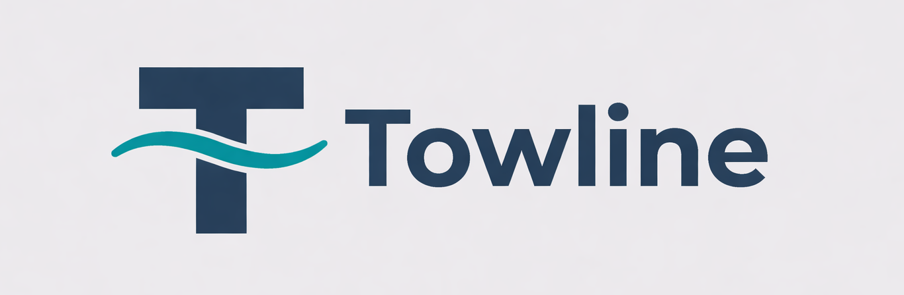

<p align="center">
  
  
  
  
</p>
<p align="center">
  
</p>

<p align="center">
  <strong>Context-engineered development workflow for Claude Code.</strong>
  <br />
  Build ambitious multi-phase software without quality degradation.
  <br />
  Works with any Claude Code plan. Shines on Max.
  <br />
  <br />
  <a href="#why-towline">Why Towline?</a> &bull;
  <a href="#getting-started">Getting Started</a> &bull;
  <a href="#commands">Commands</a> &bull;
  <a href="#how-it-works">How It Works</a> &bull;
  <a href="#configuration">Configuration</a> &bull;
  <a href="CONTRIBUTING.md">Contributing</a>
</p>

---

## The Problem

Claude Code is remarkably capable...until your context window fills up. As tokens accumulate during a long session, reasoning quality degrades, hallucinations increase, and the model starts losing track of earlier decisions. This is **context rot**, and it's the primary failure mode when building anything beyond a single-session project.

**Towline solves this.** It keeps your main orchestrator under ~15% context usage by delegating heavy work to fresh subagent contexts, each getting a clean 200k token window. All state lives on disk. Sessions are killable at any second without data loss. Whether you're on a free tier or Max 5x, wasted context means wasted budget, and context rot is the biggest source of waste.

## Why Towline?

Most AI coding tools treat context as infinite. They index your codebase, track your edits, and hope the model keeps up. That works for single-file changes. It falls apart when you're building something that takes days, spans dozens of files, and requires decisions made on Monday to still hold on Friday.

Towline takes a different approach: **structured context isolation**. Instead of stuffing everything into one session, it delegates each operation to a fresh subagent with a clean 200k token window and coordinates through files on disk.

<details>
<summary><strong>What sets it apart</strong></summary>

| Capability | IDE Assistants | Other Workflow Plugins | **Towline** |
|:-----------|:--------------:|:----------------------:|:-----------:|
| Context management | Indexing / tracking | Fresh subagent windows | Fresh 200k per agent + 15 lifecycle hooks enforcing budget |
| Multi-phase projects | No structure | Phase-based | Phase + wave + milestone with crash-safe checkpoints |
| Verification | Developer reviews diffs | Conversational UAT | Goal-backward: 3-layer checks against declared requirements |
| Quality enforcement | Manual | CLI commands in agent context | Lifecycle hooks at zero token cost (automatic, not opt-in) |
| Token efficiency | Uncontrolled | CLI toolkit loaded into every agent spawn | Zero agent-side overhead; hooks + CLI run outside context |
| Cost control | N/A | One-size-fits-all pipeline | Depth profiles + model profiles: 2 spawns or 6, your choice |
| State persistence | Lost on session end | File-based state | File-based + atomic writes + lockfile-protected mutations |
| Parallelism | Up to 8 agents (Cursor) | Sequential | Dependency-aware wave-based parallelism |
| Debugging | Ad-hoc | Ad-hoc agents on failure | Persistent hypothesis-driven sessions with evidence tracking |
| Testing | Varies | Minimal | 758 tests, 36 suites, Windows/macOS/Linux CI |
| Permissions | N/A | Often requires skip-permissions | Works within Claude Code's permission system |
| Dashboard | IDE-native | None | Web UI with live updates via SSE |
| Configurability | Opinionated | Limited | 12 config keys, 16+ feature toggles, depth/model profiles |

<details>
<summary>Key differentiators in detail</summary>

**Goal-backward verification.** After a phase is built, a dedicated read-only verifier agent checks your actual codebase against declared must-haves. It doesn't ask "did the tasks complete?" It asks "does the codebase now satisfy the requirements?" Three layers: existence (file exists), substance (not a stub), wiring (connected to the system).

**Lifecycle hooks.** Fifteen hook scripts fire on Claude Code events to enforce discipline automatically: commit format validation, plan structure checks, roadmap sync verification, context budget warnings before compaction, auto-chaining between workflow steps, subagent output validation, and session cleanup. No other tool polices itself this way.

**Wave-based parallelism.** Plans declare dependencies. Plans with no conflicts run in parallel (same wave); dependent plans wait. This isn't "throw 8 agents at it." It's structured, dependency-aware concurrent execution.

**Kill-safe state.** Every piece of project state lives in `.planning/` on disk. You can kill your terminal mid-build, reboot your machine, come back a week later, and `/dev:resume` picks up exactly where you left off. No session state to lose.

**Token-saving CLI.** A deterministic Node.js CLI handles mechanical operations (YAML parsing, state updates, must-have collection) so agents don't waste tokens on file parsing. Saves ~4,000-11,000 tokens per phase.

**Zero agent-side overhead.** Some workflow tools load their entire CLI toolkit into every agent spawn, consuming thousands of tokens before the agent even starts working. Towline's approach is different: `towline-tools.js` runs only in hook scripts as Node.js processes, never inside agent context. Agents get clean 200k windows with nothing but the task at hand. This structural advantage compounds across every spawn in every workflow.

**Lifecycle hooks, not CLI bloat.** Towline enforces workflow discipline through 15 Claude Code lifecycle hooks that fire automatically on events (commits, file writes, context compaction, agent spawns). Commit format validation, plan structure checks, dangerous command blocking, context budget warnings, all at zero orchestrator token cost. Other workflow tools embed these checks in CLI commands that agents must call explicitly, burning tokens for enforcement that should be free.

**Configurable cost.** Most workflow plugins run the same full pipeline regardless of task complexity. Towline's depth profiles (`quick` / `standard` / `comprehensive`) let you match agent spawn count to the task. A simple config change means 2 agent spawns instead of 6. Same workflow guarantees, fraction of the cost. Pair with model profiles (`budget` / `balanced` / `quality`) for compound savings.

**Systematic debugging.** `/dev:debug` provides hypothesis-driven investigation with persistent state across sessions. Each hypothesis is documented, tested, and recorded with evidence quality ratings. You can kill your terminal, come back days later, and resume exactly where you left off with every tested hypothesis and finding preserved. Most workflow tools have no dedicated debugging facility. They spawn ad-hoc agents on failures and hope for the best.

**Tested like infrastructure.** Towline ships with 758 tests in 36 suites, running on Windows, macOS, and Linux in CI. Every hook script, every CLI command, every state management function is tested. When a tool manages your project's git history and development state, you want it tested like infrastructure, not like a weekend project with a single test file.

**Works with permissions, not against them.** Towline integrates cleanly with Claude Code's permission system. You don't need `--dangerously-skip-permissions` or broad permission grants to use it effectively. Hook scripts handle enforcement; agents work within normal tool access boundaries.

**Real-time dashboard.** A built-in web UI (`/dev:dashboard`) shows project state, phase progress, todos, and plan details with live updates via Server-Sent Events. Browse your `.planning/` state visually instead of reading markdown files.

</details>
</details>

> **When to use Towline:** Multi-phase projects where quality matters. New features spanning 5+ files, large refactors, greenfield builds, anything that would take more than one Claude Code session to complete. Use `depth: quick` or `depth: standard` to control agent spawn count per phase.
>
> **When to skip it:** Single-file fixes, quick questions, one-off scripts. Use `/dev:quick` for atomic commits without full workflow overhead: single executor spawn, no research or verification agents.

<details>
<summary><strong>Towline on different Claude Code plans</strong></summary>

**Max 5x+ (recommended):** Full pipeline. Parallel research, multi-agent builds, comprehensive verification. Set `depth: comprehensive` for maximum thoroughness. Every token-saving feature (depth profiles, model profiles, CLI offloading) helps you do more within each usage window.

**Max:** Towline works great here. Use `depth: standard` (the default) for a balanced pipeline. The structured workflow prevents the rework cycles that burn through quota. Building it right the first time costs less than debugging a messy result.

**Pro / Free tiers:** Use `depth: quick` and lean on `/dev:quick` for most tasks: single executor spawn, atomic commits, state tracking. Skip `/dev:begin` (heavy) and instead manually create your `.planning/` structure with `/dev:setup`. Use `/dev:plan --skip-research` to plan without a research agent. Towline's file-based state and commit discipline are valuable at any tier, even when you can't afford multi-agent workflows.

**Key takeaway:** Towline's `depth` setting is the primary cost lever. Lower tiers should start with `quick` and step up selectively. Higher tiers can run `comprehensive` and let Towline's token management handle the efficiency.

</details>

---

## Getting Started

### Prerequisites

- [Claude Code](https://docs.anthropic.com/en/docs/claude-code) 2.1.45+ &nbsp;(`claude --version`)
- Node.js 18+

### Install

```bash
# From your terminal
claude plugin marketplace add SienkLogic/towline
claude plugin install dev@towline

# Or from inside a Claude Code session
/plugin marketplace add SienkLogic/towline
/plugin install dev@towline
```

All `/dev:*` commands are now available globally.

<details>
<summary><strong>Install scopes</strong></summary>

| Scope | Command | Effect |
|-------|---------|--------|
| **Global** (default) | `claude plugin install dev@towline` | Available in all projects |
| **Project only** | `claude plugin install dev@towline --scope local` | This project only, gitignored |
| **Team project** | `claude plugin install dev@towline --scope project` | Shared via git, teammates get prompted |

</details>

### Dashboard (Optional)

Towline ships with a companion web dashboard for browsing your project's planning state in a browser. To set it up:

```bash
# One-time install of dashboard dependencies
npm run dashboard:install

# Launch the dashboard for any project with a .planning/ directory
npm run dashboard -- --dir /path/to/your/project
# Opens at http://127.0.0.1:3000
```

Or run directly:

```bash
node dashboard/bin/cli.js --dir /path/to/your/project --port 3000
```

### Quick Start (Max / Max 5x)

Full pipeline with parallel research and multi-agent builds. Best experience.

```bash
cd your-project && claude
```
```
/dev:begin                # Towline asks about your project, researches the domain,
                          # scopes requirements, and generates a phased roadmap

/dev:plan 1               # Research + plan the first phase
/dev:build 1              # Build it with parallel agents, atomic commits
/dev:review 1             # Verify the codebase matches requirements
/dev:plan 2               # Repeat for next phase
```

That's the whole cycle. Everything lands in a `.planning/` directory. Kill your terminal anytime, `/dev:resume` picks up where you left off.

### Quick Start (Pro / Free)

Lighter workflow that still gives you structured state tracking and clean commits.

```bash
cd your-project && claude
```
```
/dev:setup                # Create .planning/ structure without the heavy research step
/dev:plan 1 --skip-research   # Plan without spawning a research agent
/dev:build 1              # Build it
/dev:quick                # For one-off tasks: single agent, atomic commit, lowest cost
```

Set `depth: quick` in `/dev:config` to reduce agent spawns across all workflows.

### Quick Reference

| What you want | Command |
|---------------|---------|
| Start a new project | `/dev:begin` (or `/dev:setup` for lightweight init) |
| Plan a phase | `/dev:plan 1` |
| Build a phase | `/dev:build 1` |
| Verify a phase | `/dev:review 1` |
| Do something quick | `/dev:quick` |
| See where you are | `/dev:status` |
| Resume after restart | `/dev:resume` |
| Auto-advance | `/dev:continue` |
| Change settings | `/dev:config` |

---

<details>
<summary><strong>Philosophy</strong></summary>

| Principle | What it means |
|-----------|---------------|
| **Context is Currency** | Main orchestrator stays under 15-20% usage. Heavy lifting happens in fresh subagent contexts via `Task()`. The `depth` setting controls how many agents each workflow spawns, from minimal (`quick`) to full pipeline (`comprehensive`). |
| **State > Memory** | If it isn't in `.planning/STATE.md`, it didn't happen. All project state lives on disk. |
| **Fan-Out / Fan-In** | Spawn parallel agents for throughput, aggregate results back. Three researchers beats one running three times. |
| **Trust but Verify** | A dedicated read-only verifier checks the actual codebase against requirements, not Claude's claims about it. |
| **Build Houses, Don't Swat Flies** | The structured workflow pays off for complex multi-phase work. For simple tasks, `/dev:quick` skips the ceremony. |

</details>

<details>
<summary><strong>Platform Alignment</strong></summary>

Towline is built on Claude Code's plugin API, not around it. As Claude Code evolves, Towline adopts native features rather than competing with them.

| Towline feature | If Claude Code adds native equivalent | Towline response |
|----------------|--------------------------------------|-----------------|
| File-based todos | Native task persistence | Migrate to thin wrapper |
| Context budget tracking | Improved context compression | Keep as safety net, defer to native |
| Auto-continue | Native workflow chaining | Adopt native, remove custom hook |
| Goal-backward verification | — | Durable Towline value (no native equivalent) |
| Wave-based parallelism | — | Durable Towline value (no native equivalent) |
| Depth profiles | — | Durable Towline value (no native equivalent) |

**Design principle:** Interface, don't replace. Features that Claude Code is likely to nativize are implemented as thin wrappers ready to migrate. Features that represent Towline's unique workflow layer (goal-backward verification, structured depth control, wave parallelism). That's where long-term investment goes.

</details>

---

## Commands

### Core Workflow

| Command | Description | Agents |
|---------|-------------|--------|
| `/dev:begin` | Start a new project: questioning, research, requirements, roadmap | 4-6 (quick: 2-3) |
| `/dev:plan <N>` | Plan a phase: research, plan creation, verification loop | 2-3 (quick: 1-2) |
| `/dev:build <N>` | Build a phase: parallel execution in waves, atomic commits | 2-4 (quick: 1-2) |
| `/dev:review <N>` | Verify a phase: automated 3-layer checks + conversational UAT | 1 |

<details>
<summary><strong>All commands</strong></summary>

### Planning & Discovery

| Command | Description |
|---------|-------------|
| `/dev:explore [topic]` | Explore ideas and think through approaches. No phase number needed. |
| `/dev:discuss <N>` | Talk through a phase before planning. Captures locked decisions. |
| `/dev:plan <N> --assumptions` | Surface Claude's assumptions before planning. Zero agent cost. |
| `/dev:plan <N> --skip-research` | Plan without the research step. Faster. |
| `/dev:plan <N> --gaps` | Create gap-closure plans from verification failures. |
| `/dev:plan add` | Append a new phase to the roadmap. |
| `/dev:plan insert <N>` | Insert a phase using decimal numbering (e.g., 3.1). |
| `/dev:plan remove <N>` | Remove a future phase and renumber. |

### Execution

| Command | Description |
|---------|-------------|
| `/dev:build <N> --gaps-only` | Execute only gap-closure plans. |
| `/dev:build <N> --team` | Use Agent Teams for inter-agent coordination. |
| `/dev:quick` | Quick ad-hoc task with atomic commit. Single executor spawn, lowest cost workflow. |
| `/dev:continue` | Execute the next logical step automatically. No prompts. |

### Verification & Debugging

| Command | Description |
|---------|-------------|
| `/dev:review <N> --auto-fix` | Auto-diagnose and create fix plans for verification failures. |
| `/dev:debug` | Systematic debugging with hypothesis testing and persistent state. |
| `/dev:scan` | Analyze an existing codebase (brownfield entry point). |

### Session & Project Management

| Command | Description |
|---------|-------------|
| `/dev:status` | Shows progress and suggests next action. |
| `/dev:health` | Check planning directory integrity. Find and fix corrupted state. |
| `/dev:pause` / `/dev:resume` | Save and restore session state across context resets. |
| `/dev:milestone new\|complete\|audit\|gaps` | Milestone lifecycle management. |
| `/dev:todo add\|list\|done` | Persistent file-based todos that survive across sessions. |
| `/dev:note` | Zero-friction idea capture. Append, list, or promote to todos. |
| `/dev:config` | Configure workflow settings interactively. |
| `/dev:import` | Import an external plan document into the Towline format. |
| `/dev:help` | Command reference and workflow guide. |

</details>

---

## How It Works

Towline is a **thin orchestrator** that delegates heavy work to fresh subagent contexts via `Task()`. Data flows through files on disk, not through messages.

```
Main Session (~15% context)
  │
  ├── Task(researcher)  ──▶  writes .planning/research/
  ├── Task(planner)     ──▶  writes PLAN.md files
  ├── Task(executor)    ──▶  builds code, creates commits
  ├── Task(executor)    ──▶  (parallel, same wave)
  └── Task(verifier)    ──▶  checks codebase against must-haves
```

<details>
<summary><strong>Key Concepts</strong></summary>

| Concept | Description |
|---------|-------------|
| **Context isolation** | Each subagent gets a fresh 200k context window. The orchestrator stays lean. |
| **Goal-backward verification** | The verifier checks codebase reality against must-have declarations, not task completion. |
| **Three-layer checks** | Every artifact is verified for existence, substantiveness (not a stub), and wiring (connected to the system). |
| **Atomic commits** | Each task produces one commit: `{type}({phase}-{plan}): description` |
| **Wave-based parallelism** | Plans in the same wave execute in parallel; waves execute sequentially. |
| **Persistent state** | All project state lives in `.planning/` and survives context resets, session kills, and crashes. |
| **Seeds** | `/dev:explore` can create seed files with trigger conditions that automatically inject into planning. |
| **CLI tooling** | Deterministic Node.js CLI offloads mechanical parsing from agents, saving ~4,000-11,000 tokens per phase. |

</details>

### Token-Saving CLI

Towline includes a Node.js CLI (`towline-tools.js`) that agents call to avoid wasting tokens on mechanical file parsing. Saves ~4,000-11,000 tokens per phase.

<details>
<summary>CLI commands</summary>

```bash
# Read-only commands
towline-tools.js state load                        # Full project state as JSON
towline-tools.js frontmatter <filepath>            # Parse any .md YAML frontmatter
towline-tools.js must-haves <phase>                # Collect all must-haves from phase plans
towline-tools.js phase-info <phase>                # Comprehensive single-phase status
towline-tools.js plan-index <phase>                # Plan inventory grouped by wave

# Mutation commands (atomic, lockfile-protected)
towline-tools.js state update <field> <value>      # Update STATE.md fields
towline-tools.js roadmap update-status <N> <status> # Update ROADMAP.md status column
towline-tools.js roadmap update-plans <N> <done> <total> # Update ROADMAP.md plans column
```

</details>

---

<details>
<summary><strong>Agents</strong> (10 specialized agents with configurable model profiles)</summary>

| Agent | Role | Default Model | Why |
|-------|------|---------------|-----|
| **Researcher** | Domain research, implementation approaches, synthesis | Sonnet | Source evaluation needs strong reasoning |
| **Planner** | Executable plans, roadmaps, wave assignment, must-have declarations | Inherit | Uses your session model |
| **Plan Checker** | Pre-execution plan quality validation across 10 dimensions | Sonnet | Analytical depth |
| **Executor** | Code implementation with atomic commits, TDD, self-verification | Inherit | Your most impactful spawn, inherits session model |
| **Verifier** | Goal-backward 3-layer verification (existence, substance, wiring) | Sonnet | Solid reasoning without Opus cost |
| **Integration Checker** | Cross-phase E2E flow and export/import verification | Sonnet | Cross-phase pattern matching |
| **Debugger** | Systematic hypothesis-based debugging with checkpoints | Inherit | Complex work, inherits session model |
| **Codebase Mapper** | Brownfield codebase analysis (tech, arch, quality, concerns) | Sonnet | Thorough analysis |
| **Synthesizer** | Multi-source research synthesis and contradiction resolution | **Haiku** | Mechanical aggregation, no deep reasoning needed |
| **General** | Lightweight Towline-aware agent for ad-hoc tasks | Inherit | Utility agent |

Use `/dev:config` to switch model profiles (`budget`, `balanced`, `quality`) across all agents at once.

</details>

---

<details>
<summary><strong>Project Structure</strong> (<code>.planning/</code> directory layout)</summary>

```
.planning/
├── PROJECT.md              # Project vision and scope
├── REQUIREMENTS.md         # Scoped requirements with REQ-IDs
├── ROADMAP.md              # Phase structure with status tracking
├── STATE.md                # Current position (auto-updated)
├── config.json             # Workflow preferences (12 top-level keys)
├── CONTEXT.md              # Locked decisions and constraints
├── phases/
│   ├── 01-foundation/
│   │   ├── 01-01-PLAN.md       # Executable plan with must-haves
│   │   ├── SUMMARY-01-01.md    # Execution results
│   │   └── VERIFICATION.md     # 3-layer verification report
│   └── 02-auth/
│       ├── ...
├── research/               # Phase research outputs
├── seeds/                  # Future-phase idea triggers
└── todos/
    ├── pending/            # Active todo items
    └── done/               # Completed todos
```

</details>

---

<details>
<summary><strong>Dashboard</strong> (web UI for browsing project state)</summary>

See [Dashboard setup](#dashboard-optional) for installation.

| Feature | Description |
|---------|-------------|
| **Overview** | Current phase, progress bar, all-phases table |
| **Phase Detail** | Plans with status badges, key files, commits, duration metrics |
| **Roadmap** | Full phase list with dependencies and color-coded status |
| **Todos** | Pending list with priority badges, create form, mark-as-done |
| **Live Updates** | File watcher + SSE broadcasts + HTMX in-place refresh |

**Tech:** Express 5.x, EJS, Pico.css v2, HTMX 2.0, gray-matter + marked, chokidar 5.x, Helmet.

```bash
npm run dashboard -- --dir /path/to/your/project
```

</details>

---

<details>
<summary><strong>Configuration</strong> (12 config keys, 16+ toggles)</summary>

Settings live in `.planning/config.json`. Run `/dev:config` to change them interactively.

> **Budget control:** The `depth` setting is the primary cost lever. `quick` skips optional agents, `standard` runs the core pipeline, `comprehensive` adds parallel research and always verifies. Pair with a model profile (`budget` / `balanced` / `quality`) to compound savings.

| Setting | Options | Default |
|---------|---------|---------|
| `depth` | `quick` (fewest spawns) · `standard` · `comprehensive` (most thorough) | `standard` |
| `context_strategy` | `aggressive` · `balanced` · `minimal` | `aggressive` |
| `mode` | `interactive` · `autonomous` | `interactive` |
| `parallelization.enabled` | `true` · `false` | `true` |
| `git.branching` | `none` · `phase` · `milestone` | `none` |
| `features.goal_verification` | `true` · `false` | `true` |
| `features.plan_checking` | `true` · `false` | `true` |
| `features.atomic_commits` | `true` · `false` | `true` |
| `features.auto_continue` | `true` · `false` | `false` |
| `features.auto_advance` | `true` · `false` | `false` |

12 top-level keys covering: depth & strategy, models, quality gates, parallelization, git workflow, and 10+ feature toggles.

</details>

---

<details>
<summary><strong>Hooks</strong> (15 lifecycle hooks, zero token cost)</summary>

| Hook Event | Script | Purpose |
|------------|--------|---------|
| `SessionStart` | `progress-tracker.js` | Inject project state into new sessions |
| `PostToolUse` (Write/Edit) | `post-write-dispatch.js` | Validate plan format, sync STATE/ROADMAP |
| `PostToolUse` (Write/Edit) | `post-write-quality.js` | Doc sprawl checks, skill workflow validation |
| `PostToolUse` (Task) | `check-subagent-output.js` | Validate agent output quality |
| `PostToolUse` (Write/Edit) | `suggest-compact.js` | Context budget warnings |
| `PostToolUse` (Read) | `track-context-budget.js` | Track reads for budget estimation |
| `PostToolUseFailure` | `log-tool-failure.js` | Log tool failures for diagnostics |
| `PreToolUse` (Bash) | `pre-bash-dispatch.js` | Commit validation, dangerous command checks |
| `PreToolUse` (Write/Edit) | `pre-write-dispatch.js` | Write guards and file protection |
| `PreCompact` | `context-budget-check.js` | Preserve STATE.md before compression |
| `Stop` | `auto-continue.js` | Chain next command when auto_continue enabled |
| `SubagentStart/Stop` | `log-subagent.js` | Track agent lifecycle, inject context |
| `SubagentStop` | `event-handler.js` | Auto-verification trigger |
| `TaskCompleted` | `task-completed.js` | Process task completion events |
| `SessionEnd` | `session-cleanup.js` | Clean up session state |

</details>

---

## Local Development

```bash
# Clone and install
git clone https://github.com/SienkLogic/towline.git
cd towline
npm install

# Run tests (758 tests, 36 suites)
npm test

# Lint
npm run lint

# Validate plugin structure
npm run validate

# Load locally for manual testing
claude --plugin-dir .
```

CI runs on Node 18/20/22 across Windows, macOS, and Linux. See [CONTRIBUTING.md](CONTRIBUTING.md) for guidelines.

---

## Stats

| Metric | Count |
|--------|-------|
| Skills (slash commands) | 21 |
| Specialized agents | 10 |
| Hook scripts | 28 |
| Tests | 758 |
| Test suites | 36 |
| Config toggles | 12 top-level keys |

---

## Acknowledgments

Towline was initially inspired by and built upon concepts from [get-shit-done](https://github.com/glittercowboy/get-shit-done) by [Lex Christopherson](https://github.com/glittercowboy), licensed under MIT. We took the foundation, had a different vision for where it should go, and built something with its own identity. See [ACKNOWLEDGMENTS](ACKNOWLEDGMENTS) for the original license.

## License

[MIT](LICENSE)
