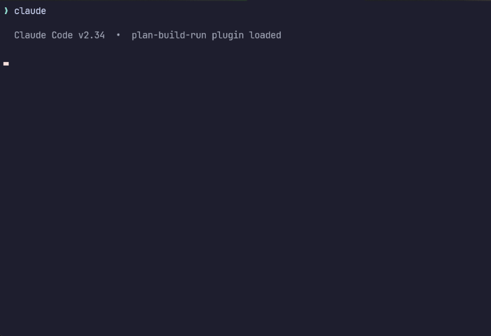

<p align="center">
  
</p>

<p align="center">
  <strong>Context-engineered development workflow for Claude Code, Cursor, and GitHub Copilot CLI.</strong>
  <br />
  Build ambitious multi-phase software without quality degradation.
  <br />
  Works with any Claude Code plan. Shines on Max. Now available for Cursor IDE and GitHub Copilot CLI.
  <br />
  <br />
  <a href="#why-plan-build-run">Why Plan-Build-Run?</a> &bull;
  <a href="#getting-started">Getting Started</a> &bull;
  <a href="#commands">Commands</a> &bull;
  <a href="#how-it-works">How It Works</a> &bull;
  <a href="https://github.com/SienkLogic/plan-build-run/wiki">Wiki</a> &bull;
  <a href=".github/CONTRIBUTING.md">Contributing</a>
</p>

<p align="center">
  <a href="https://github.com/SienkLogic/plan-build-run/actions"></a>
  <a href="#install"></a>
  <a href="https://github.com/SienkLogic/plan-build-run/wiki/Cursor-IDE"></a>
  <a href="https://github.com/SienkLogic/plan-build-run/wiki/Copilot-CLI"></a>
  
  <a href="LICENSE"></a>
  <a href="https://www.npmjs.com/package/@sienklogic/plan-build-run"></a>
  
</p>

---

## The Problem

Claude Code is remarkably capable...until your context window fills up. As tokens accumulate during a long session, reasoning quality degrades, hallucinations increase, and the model starts losing track of earlier decisions. This is **context rot**, and it's the primary failure mode when building anything beyond a single-session project.

**Plan-Build-Run solves this.** It keeps your main orchestrator under ~15% context usage by delegating heavy work to fresh subagent contexts, each getting a clean 200k token window. All state lives on disk. Sessions are killable at any second without data loss. Whether you're on a free tier or Max 5x, wasted context means wasted budget, and context rot is the biggest source of waste.

## Why Plan-Build-Run?

Most AI coding tools treat context as infinite. They index your codebase, track your edits, and hope the model keeps up. That works for single-file changes. It falls apart when you're building something that takes days, spans dozens of files, and requires decisions made on Monday to still hold on Friday.

Plan-Build-Run takes a different approach: **structured context isolation**. Instead of stuffing everything into one session, it delegates each operation to a fresh subagent with a clean 200k token window and coordinates through files on disk.

<p align="center">
  
</p>

Goal-backward verification, lifecycle hooks, wave-based parallelism, kill-safe state, and more. See **[What Sets It Apart](https://github.com/SienkLogic/plan-build-run/wiki/What-Sets-It-Apart)** for the full comparison and differentiators.

> **When to use Plan-Build-Run:** Multi-phase projects where quality matters. New features spanning 5+ files, large refactors, greenfield builds, anything that would take more than one Claude Code session to complete. Use `depth: quick` or `depth: standard` to control agent spawn count per phase.
>
> **When to skip it:** Single-file fixes, quick questions, one-off scripts. Use `/pbr:quick` for atomic commits without full workflow overhead: single executor spawn, no research or verification agents.

Works on every Claude Code plan. Use `depth: quick` on Free/Pro, `depth: standard` on Max, `depth: comprehensive` on Max 5x. See **[What Sets It Apart](https://github.com/SienkLogic/plan-build-run/wiki/What-Sets-It-Apart#plan-build-run-on-different-claude-code-plans)** for tier-specific guidance.

---

## Getting Started

### Prerequisites

- [Claude Code](https://docs.anthropic.com/en/docs/claude-code) 2.1.47+ &nbsp;(`claude --version`)
- Node.js 18+

### Install

```bash
# From your terminal
claude plugin marketplace add SienkLogic/plan-build-run
claude plugin install pbr@plan-build-run

# Or from inside a Claude Code session
/plugin marketplace add SienkLogic/plan-build-run
/plugin install pbr@plan-build-run
```

All `/pbr:*` commands are now available globally.

<details>
<summary><strong>Install scopes</strong></summary>

| Scope | Command | Effect |
|-------|---------|--------|
| **Global** (default) | `claude plugin install pbr@plan-build-run` | Available in all projects |
| **Project only** | `claude plugin install pbr@plan-build-run --scope local` | This project only, gitignored |
| **Team project** | `claude plugin install pbr@plan-build-run --scope project` | Shared via git, teammates get prompted |

</details>

<details>
<summary><strong>Install for Cursor IDE</strong></summary>

Plan-Build-Run also works in Cursor. The setup script symlinks rules and agents into your project's `.cursor/` directory.

**macOS / Linux:**
```bash
cd /path/to/your/project
bash /path/to/plan-build-run/plugins/cursor-pbr/setup.sh
```

**Windows (PowerShell):**
```powershell
cd C:\path\to\your\project
powershell -ExecutionPolicy Bypass -File C:\path\to\plan-build-run\plugins\cursor-pbr\setup.ps1
```

Both plugins share the same `.planning/` directory — start a project in Claude Code, continue in Cursor, or vice versa. See [`plugins/cursor-pbr/README.md`](plugins/cursor-pbr/README.md) for full details.

</details>

<details>
<summary><strong>Install for GitHub Copilot CLI</strong></summary>

Plan-Build-Run also works in GitHub Copilot CLI. The setup script installs PBR as a Copilot CLI plugin and symlinks agents into your project.

**macOS / Linux:**
```bash
cd /path/to/your/project
bash /path/to/plan-build-run/plugins/copilot-pbr/setup.sh
```

**Windows (PowerShell):**
```powershell
cd C:\path\to\your\project
powershell -ExecutionPolicy Bypass -File C:\path\to\plan-build-run\plugins\copilot-pbr\setup.ps1
```

All three plugins share the same `.planning/` directory — start in any tool, continue in another. See [`plugins/copilot-pbr/README.md`](plugins/copilot-pbr/README.md) for full details.

</details>

<details>
<summary><strong>Dashboard (Optional)</strong></summary>

Plan-Build-Run ships with a companion web dashboard for browsing your project's planning state in a browser.

```bash
# One-time install of dashboard dependencies
npm run dashboard:install

# Launch the dashboard (defaults to current directory)
npm run dashboard

# Or specify a project directory and port
npm run dashboard -- --dir /path/to/your/project --port 3000
```

Or launch it directly from a Claude Code, Cursor, or Copilot CLI session:
```
/pbr:dashboard
```

Opens at `http://127.0.0.1:3000` with live updates via SSE.

</details>

### Quick Start (Max / Max 5x)

Full pipeline with parallel research and multi-agent builds. Best experience.

```bash
cd your-project && claude
```
```
/pbr:begin                # Plan-Build-Run asks about your project, researches the domain,
                          # scopes requirements, and generates a phased roadmap

/pbr:plan 1               # Research + plan the first phase
/pbr:build 1              # Build it with parallel agents, atomic commits
/pbr:review 1             # Verify the codebase matches requirements
/pbr:plan 2               # Repeat for next phase
```

That's the whole cycle. Everything lands in a `.planning/` directory. Kill your terminal anytime, `/pbr:resume` picks up where you left off.

### Quick Start (Pro / Free)

Lighter workflow that still gives you structured state tracking and clean commits.

```bash
cd your-project && claude
```
```
/pbr:setup                # Create .planning/ structure without the heavy research step
/pbr:plan 1 --skip-research   # Plan without spawning a research agent
/pbr:build 1              # Build it
/pbr:quick                # For one-off tasks: single agent, atomic commit, lowest cost
```

Set `depth: quick` in `/pbr:config` to reduce agent spawns across all workflows.

### Quick Reference

| What you want | Command |
|---------------|---------|
| Start a new project | `/pbr:begin` (or `/pbr:setup` for lightweight init) |
| Plan a phase | `/pbr:plan 1` |
| Build a phase | `/pbr:build 1` |
| Verify a phase | `/pbr:review 1` |
| Do something quick | `/pbr:quick` |
| See where you are | `/pbr:status` |
| Resume after restart | `/pbr:resume` |
| Auto-advance | `/pbr:continue` |
| Change settings | `/pbr:config` |

---

## Commands

### Core Workflow

| Command | Description | Agents |
|---------|-------------|--------|
| `/pbr:begin` | Start a new project: questioning, research, requirements, roadmap | 4-6 (quick: 2-3) |
| `/pbr:plan <N>` | Plan a phase: research, plan creation, verification loop | 2-3 (quick: 1-2) |
| `/pbr:build <N>` | Build a phase: parallel execution in waves, atomic commits | 2-4 (quick: 1-2) |
| `/pbr:review <N>` | Verify a phase: automated 3-layer checks + conversational UAT | 1 |

See **[Commands](https://github.com/SienkLogic/plan-build-run/wiki/Commands)** for all 22 commands with flags, cost-by-depth tables, and detailed descriptions.

---

## How It Works

Plan-Build-Run is a **thin orchestrator** that delegates heavy work to fresh subagent contexts via `Task()`. Data flows through files on disk, not through messages.

```
Main Session (~15% context)
  │
  ├── Task(researcher)  ──▶  writes .planning/research/
  ├── Task(planner)     ──▶  writes PLAN.md files
  ├── Task(executor)    ──▶  builds code, creates commits
  ├── Task(executor)    ──▶  (parallel, same wave)
  └── Task(verifier)    ──▶  checks codebase against must-haves
```

See **[Architecture](https://github.com/SienkLogic/plan-build-run/wiki/Architecture)** for key concepts, the token-saving CLI, data flow details, and supporting directories.

---

## Deep Dive

| Topic | Description |
|-------|-------------|
| **[Agents](https://github.com/SienkLogic/plan-build-run/wiki/Agents)** | 10 specialized agents with configurable model profiles and file-based communication |
| **[Configuration](https://github.com/SienkLogic/plan-build-run/wiki/Configuration)** | 12 config keys, depth/model profiles, 16+ feature toggles |
| **[Hooks](https://github.com/SienkLogic/plan-build-run/wiki/Hooks)** | 15 lifecycle hooks that enforce discipline at zero token cost |
| **[Project Structure](https://github.com/SienkLogic/plan-build-run/wiki/Project-Structure)** | The `.planning/` directory layout, key files, and file ownership |
| **[Dashboard](https://github.com/SienkLogic/plan-build-run/wiki/Dashboard)** | Web UI with live updates for browsing project state |
| **[Cursor IDE](https://github.com/SienkLogic/plan-build-run/wiki/Cursor-IDE)** | Cursor plugin installation and cross-IDE workflow |
| **[Copilot CLI](https://github.com/SienkLogic/plan-build-run/wiki/Copilot-CLI)** | GitHub Copilot CLI plugin: installation, hooks, and differences |
| **[Philosophy](https://github.com/SienkLogic/plan-build-run/wiki/Philosophy)** | Design principles and platform alignment strategy |
| **[What Sets It Apart](https://github.com/SienkLogic/plan-build-run/wiki/What-Sets-It-Apart)** | Feature comparison and key differentiators |

---

## Local Development

```bash
# Clone and install
git clone https://github.com/SienkLogic/plan-build-run.git
cd plan-build-run
npm install

# Run tests (1213 tests, 44 suites)
npm test

# Lint
npm run lint

# Validate plugin structure
npm run validate

# Load locally for manual testing
claude --plugin-dir .
```

CI runs on Node 18/20/22 across Windows, macOS, and Linux. See [CONTRIBUTING.md](.github/CONTRIBUTING.md) for guidelines.

---

## Stats

| Metric | Count |
|--------|-------|
| Skills (slash commands) | 22 |
| Specialized agents | 10 |
| Hook scripts | 28 |
| Supported platforms | 3 (Claude Code, Cursor, Copilot CLI) |
| Tests | 1213 |
| Test suites | 44 |
| Config toggles | 12 top-level keys |

---

## License

[MIT](LICENSE)
