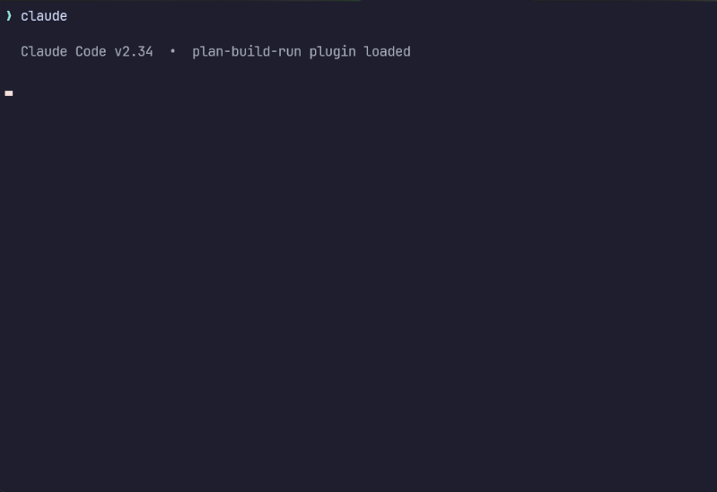

<p align="center">
  
</p>

<p align="center">
  <strong>Context-engineered development workflow for Claude Code, Cursor, GitHub Copilot CLI, OpenAI Codex, and OpenCode.</strong>
  <br />
  Build ambitious multi-phase software without quality degradation.
</p>

<p align="center">
  <a href="https://github.com/SienkLogic/plan-build-run/actions"></a>
  <a href="#install"></a>
  <a href="https://github.com/SienkLogic/plan-build-run/wiki/Cursor-IDE"></a>
  <a href="https://github.com/SienkLogic/plan-build-run/wiki/Copilot-CLI"></a>
  <br />
  <a href="https://www.npmjs.com/package/@sienklogic/plan-build-run"></a>
  
  <a href="https://github.com/SienkLogic/plan-build-run"></a>
  <a href="LICENSE"></a>
</p>

<p align="center">
  <a href="#the-problem">Problem</a> &bull;
  <a href="#install">Install</a> &bull;
  <a href="#quick-start">Quick Start</a> &bull;
  <a href="#commands">Commands</a> &bull;
  <a href="#architecture">Architecture</a> &bull;
  <a href="#configuration">Config</a> &bull;
  <a href="docs/USER-GUIDE.md">User Guide</a> &bull;
  <a href="https://github.com/SienkLogic/plan-build-run/wiki">Wiki</a>
</p>

---

## The Problem

Claude Code is remarkably capable — until your context window fills up. As tokens accumulate, reasoning quality degrades, hallucinations increase, and the model loses track of earlier decisions. This is **context rot**.

**Plan-Build-Run solves this.** It keeps your orchestrator lean by delegating heavy work to fresh subagent contexts. All state lives on disk. Sessions are killable without data loss. Whether you're on Free or Max 5x, wasted context means wasted budget.

<p align="center">
  
</p>

> **Use PBR for:** Multi-phase projects — new features spanning 5+ files, large refactors, greenfield builds. Use `depth: quick` on Free/Pro, `depth: standard` on Max, `depth: comprehensive` on Max 5x.
>
> **Skip PBR for:** Single-file fixes, quick questions, one-off scripts. Use `/pbr:quick` for atomic commits without full workflow overhead.

---

## Install

**Claude Code Plugin (recommended):**

```bash
claude plugin marketplace add SienkLogic/plan-build-run
claude plugin install pbr@plan-build-run
```

Verify: `/pbr:help`

<details>
<summary><strong>Other install methods</strong></summary>

**npx (alternative):**

```bash
npx @sienklogic/plan-build-run@latest
```

The installer prompts for runtime (Claude Code, OpenCode, Gemini, Codex) and location (global/local).

**Non-interactive (Docker, CI, Scripts):**

```bash
npx @sienklogic/plan-build-run --claude --global    # Claude Code
npx @sienklogic/plan-build-run --opencode --global   # OpenCode
npx @sienklogic/plan-build-run --gemini --global     # Gemini CLI
npx @sienklogic/plan-build-run --codex --global      # Codex CLI
npx @sienklogic/plan-build-run --all --global        # All runtimes
```

**Plugin install scopes:**

| Scope | Command | Effect |
|-------|---------|--------|
| **Global** (default) | `claude plugin install pbr@plan-build-run` | Available in all projects |
| **Project only** | `claude plugin install pbr@plan-build-run --scope local` | This project only |
| **Team project** | `claude plugin install pbr@plan-build-run --scope project` | Shared via git |

**Cursor IDE:** See [Cursor Plugin](https://github.com/SienkLogic/plan-build-run/wiki/Cursor-IDE) wiki page.

**GitHub Copilot CLI:** See [Copilot CLI](https://github.com/SienkLogic/plan-build-run/wiki/Copilot-CLI) wiki page.

**Codex CLI:** See [Codex](plugins/codex-pbr/README.md) plugin README.

**Development install:**

```bash
git clone https://github.com/SienkLogic/plan-build-run.git
cd plan-build-run && npm install
claude --plugin-dir .   # Load as local plugin
```

</details>

---

## Quick Start

```bash
cd your-project && claude
```

```
/pbr:new-project          # Questions → research → requirements → roadmap
/pbr:plan-phase 1         # Research + plan the first phase
/pbr:execute-phase 1      # Build with parallel agents, atomic commits
/pbr:verify-work 1        # Confirm the codebase matches requirements
```

Repeat **plan → execute → verify** for each phase. Kill your terminal anytime — `/pbr:resume-work` picks up where you left off.

> **Already have code?** Run `/pbr:map-codebase` first to analyze your existing stack, then `/pbr:new-project`.

---

## Architecture

PBR is a **thin orchestrator** that delegates heavy work to fresh subagent contexts via `Task()`. Data flows through files on disk, not through messages.

```
Main Session (~15% context)
  │
  ├── Task(researcher)  →  writes .planning/research/
  ├── Task(planner)     →  writes PLAN.md files
  ├── Task(executor)    →  builds code, creates commits
  ├── Task(executor)    →  (parallel, same wave)
  └── Task(verifier)    →  checks codebase against must-haves
```

Plans are grouped into **waves** based on dependencies. Within each wave, plans run in parallel. Waves run sequentially. Each executor gets a fresh context window — zero accumulated garbage.

<details>
<summary><strong>Three layers: Skills → Agents → Hooks</strong></summary>

### Skills (46 slash commands)

Markdown files with YAML frontmatter defining `/pbr:*` slash commands. Each skill is a complete prompt that reads state, interacts with the user, and spawns agents. Skills are the user-facing interface.

### Agents (18 specialized subagents)

Markdown files defining agent prompts that run in fresh `Task()` contexts with clean 200k token windows. Each agent type has a specific role:

| Agent | Role |
|-------|------|
| `researcher` | Domain research before planning |
| `planner` | Create execution plans with task breakdown |
| `plan-checker` | Validate plans across 10 dimensions before build |
| `executor` | Build code, write tests, create atomic commits |
| `verifier` | Goal-backward verification against must-haves |
| `debugger` | Hypothesis-driven systematic debugging |
| `codebase-mapper` | Parallel codebase analysis |
| `integration-checker` | Cross-phase integration and E2E flow verification |

### Hooks (26 lifecycle hooks)

Node.js scripts that fire on Claude Code lifecycle events — enforcing commit format, validating agent dispatch, tracking context budget, syncing state files, and more. Hooks provide **deterministic guardrails** that don't rely on the LLM remembering to follow rules.

</details>

<details>
<summary><strong>Hook server architecture</strong></summary>

### Persistent HTTP Hook Server

PBR runs a persistent HTTP server (`hook-server.js`) on `localhost:19836` that handles hook dispatch. Instead of spawning a new Node.js process for every hook event, Claude Code sends HTTP POST requests to the server, which routes them to the appropriate handler.

**Why a hook server?**

- **Performance**: HTTP dispatch is 2-30ms vs 200-500ms for process spawning per hook
- **Shared state**: In-memory config cache, circuit breaker state, and event log shared across all hooks
- **Consolidated routing**: 38 handler routes registered in a single `initRoutes()` function
- **Fail-open design**: Connection failures and timeouts are non-blocking — Claude Code continues normally

**How it works:**

```
Claude Code                     Hook Server (localhost:19836)
    │                                  │
    ├── POST /hook/PreToolUse/Bash  →  │── pre-bash-dispatch.js
    │   ← { decision: "allow" }        │     ├── validate-commit.js
    │                                  │     └── check-dangerous-commands.js
    │                                  │
    ├── POST /hook/PostToolUse/Write → │── post-write-dispatch.js
    │   ← { additionalContext: ... }   │     ├── check-plan-format.js
    │                                  │     ├── check-roadmap-sync.js
    │                                  │     └── check-state-sync.js
    │                                  │
    ├── POST /hook/PostToolUse/Read  → │── track-context-budget.js
    │   ← { }                          │
    │                                  │
    └── GET /health                  → │── { status: "ok", uptime: ... }
```

**Lifecycle events handled:**

| Event | Hooks | Purpose |
|-------|-------|---------|
| `PreToolUse` | 6 routes | Commit validation, dangerous command blocking, write policies, agent dispatch gates, context budget enforcement |
| `PostToolUse` | 10 routes | Context tracking, plan/state sync, architecture guard, subagent output validation, test result analysis |
| `PostToolUseFailure` | 1 route | Tool failure logging |
| `SubagentStart/Stop` | 2 routes | Agent lifecycle tracking, auto-verification triggers |
| `TaskCompleted` | 1 route | Task result processing |
| `PreCompact/PostCompact` | 2 routes | State preservation across context compaction |
| `ConfigChange` | 1 route | Config validation |
| `SessionEnd` | 1 route | Cleanup and graceful server shutdown |
| `UserPromptSubmit` | 1 route | Prompt routing |
| `Notification` | 1 route | Notification logging |

**5 hooks remain as command-type** (process-spawned): `SessionStart`, `Stop`, `InstructionsLoaded`, `WorktreeCreate`, `WorktreeRemove` — these need stdin/stdout interaction that HTTP can't provide.

**Server reliability features:**

- **PID lockfile** with port tracking (`.hook-server.pid`)
- **EADDRINUSE recovery** — tries sequential ports if configured port is taken
- **Crash recovery** — auto-restart on health check failure
- **MSYS path normalization** — Windows Git Bash compatibility
- **Per-hook timing** — 100ms alert threshold, `hooks perf` CLI for analysis
- **Circuit breaker** — tracks handler failures to avoid cascading errors

</details>

<details>
<summary><strong>File-based state (the data model)</strong></summary>

Skills and agents communicate through files on disk, not messages:

```
.planning/
  ├── STATE.md           ← source of truth for current position
  ├── ROADMAP.md         ← phase structure, goals, dependencies
  ├── PROJECT.md         ← project metadata, locked decisions
  ├── REQUIREMENTS.md    ← requirements with completion tracking
  ├── config.json        ← workflow settings
  └── phases/NN-slug/
        ├── PLAN.md        ← written by planner, read by executor
        ├── SUMMARY.md     ← written by executor, read by orchestrator
        └── VERIFICATION.md ← written by verifier, read by review skill
```

Every task gets its own **atomic commit** immediately after completion:

```bash
abc123f docs(08-02): complete user registration plan
def456g feat(08-02): add email confirmation flow
hij789k feat(08-02): implement password hashing
```

The orchestrator never does heavy lifting. It spawns agents, waits, integrates results. Your main context stays at 30-40% while thousands of lines of code are written in parallel fresh contexts.

</details>

---

## Commands

### Core Workflow

| Command | What it does |
|---------|--------------|
| `/pbr:new-project` | Full init: questions → research → requirements → roadmap |
| `/pbr:discuss-phase [N]` | Capture implementation decisions before planning |
| `/pbr:plan-phase [N]` | Research + plan + verify for a phase |
| `/pbr:execute-phase <N>` | Execute all plans in parallel waves |
| `/pbr:verify-work [N]` | User acceptance testing with auto-diagnosis |
| `/pbr:continue` | Auto-advance to the next logical step |
| `/pbr:quick` | Ad-hoc task with atomic commit (no full workflow) |

### Navigation & Session

| Command | What it does |
|---------|--------------|
| `/pbr:progress` | Where am I? What's next? |
| `/pbr:resume-work` | Restore from last session |
| `/pbr:pause-work` | Create handoff when stopping mid-phase |
| `/pbr:map-codebase` | Analyze existing codebase before new-project |

<details>
<summary><strong>All commands</strong></summary>

**Milestone Management:**

| Command | What it does |
|---------|--------------|
| `/pbr:audit-milestone` | Verify milestone achieved its definition of done |
| `/pbr:complete-milestone` | Archive milestone, tag release |
| `/pbr:new-milestone` | Start next version |
| `/pbr:plan-milestone-gaps` | Create phases to close gaps from audit |

**Phase Management:**

| Command | What it does |
|---------|--------------|
| `/pbr:add-phase` | Append phase to roadmap |
| `/pbr:insert-phase [N]` | Insert urgent work between phases |
| `/pbr:remove-phase [N]` | Remove future phase, renumber |
| `/pbr:list-phase-assumptions [N]` | See Claude's intended approach before planning |

**Autonomous Mode:**

| Command | What it does |
|---------|--------------|
| `/pbr:autonomous` | Run multiple phases hands-free (discuss → plan → build → verify) |
| `/pbr:do [text]` | Route freeform text to the right PBR skill automatically |

**Quality & Debugging:**

| Command | What it does |
|---------|--------------|
| `/pbr:debug [desc]` | Systematic debugging with persistent hypothesis tracking |
| `/pbr:test` | Generate tests for completed phase code |
| `/pbr:validate-phase` | Post-build quality gate with test gap detection |
| `/pbr:audit [--today]` | Review past sessions for workflow compliance |
| `/pbr:health [--repair]` | Validate `.planning/` integrity |

**Knowledge & Ideas:**

| Command | What it does |
|---------|--------------|
| `/pbr:note [text]` | Quick idea capture (persists across sessions) |
| `/pbr:todo [text]` | File-based persistent todos |
| `/pbr:explore [topic]` | Think through approaches, route insights |
| `/pbr:intel` | Refresh or query codebase intelligence |

**Utilities:**

| Command | What it does |
|---------|--------------|
| `/pbr:settings` | Configure model profile and workflow |
| `/pbr:set-profile <profile>` | Switch model profile (quality/balanced/budget) |
| `/pbr:dashboard` | Launch web dashboard (Vite + React) |
| `/pbr:statusline` | Install terminal status line |
| `/pbr:scan` | Analyze an existing codebase |
| `/pbr:ship` | Create a rich PR from planning artifacts |
| `/pbr:release` | Generate changelog and release notes |
| `/pbr:help` | Show all commands and usage |
| `/pbr:update` | Update PBR with changelog preview |

</details>

See the **[User Guide](docs/USER-GUIDE.md)** for all flags, cost-by-depth tables, and detailed descriptions.

---

## Configuration

PBR stores settings in `.planning/config.json`. Configure during `/pbr:new-project` or update with `/pbr:settings`.

| Setting | Options | Default | What it controls |
|---------|---------|---------|------------------|
| `mode` | `autonomous`, `interactive` | `interactive` | Auto-approve vs confirm at each step |
| `depth` | `quick`, `standard`, `comprehensive` | `standard` | Agent spawn count and research scope |
| `context_window_tokens` | `100000`-`2000000` | `200000` | Context window size — set to `1000000` for Opus 1M |

### Model Profiles

| Profile | Planning | Execution | Verification |
|---------|----------|-----------|--------------|
| `quality` | Opus | Opus | Sonnet |
| `balanced` (default) | Opus | Sonnet | Sonnet |
| `budget` | Sonnet | Sonnet | Haiku |

```
/pbr:set-profile quality
```

<details>
<summary><strong>More configuration options</strong></summary>

**Workflow Agents:**

| Setting | Default | What it does |
|---------|---------|--------------|
| `features.research_phase` | `true` | Research domain before planning each phase |
| `features.plan_checking` | `true` | Verify plans before execution (always-on, lighter check for quick depth) |
| `features.goal_verification` | `true` | Confirm must-haves after execution |
| `features.auto_advance` | `false` | Auto-chain discuss → plan → execute |
| `features.inline_simple_tasks` | `true` | Simple tasks run inline without subagent overhead |
| `features.self_verification` | `true` | Executor self-checks before presenting output |

Override per-invocation: `/pbr:plan-phase --skip-research` or `--skip-verify`

**Parallelization:**

| Setting | Default | What it does |
|---------|---------|--------------|
| `parallelization.enabled` | `true` | Parallel plan execution within waves |
| `parallelization.max_concurrent_agents` | `5` | Max simultaneous executor subagents |
| `parallelization.min_plans_for_parallel` | `2` | Minimum plans in a wave to trigger parallel execution |

**Git Branching:**

| Strategy | Behavior |
|----------|----------|
| `none` (default) | Commits to current branch |
| `phase` | Branch per phase, merge at completion |
| `milestone` | One branch for entire milestone |

**Hook Server:**

| Setting | Default | What it does |
|---------|---------|--------------|
| `hook_server.enabled` | `true` | Route hooks through persistent HTTP server |
| `hook_server.port` | `19836` | TCP port for hook server (localhost only) |
| `hook_server.event_log` | `true` | Log all hook events to `.hook-events.jsonl` |

See the [User Guide](docs/USER-GUIDE.md#configuration-reference) for the full config schema.

</details>

---

## Security

PBR reads files to understand your project. Protect secrets with Claude Code's deny list:

```json
{
  "permissions": {
    "deny": [
      "Read(.env)", "Read(.env.*)", "Read(**/secrets/*)",
      "Read(**/*credential*)", "Read(**/*.pem)", "Read(**/*.key)"
    ]
  }
}
```

<details>
<summary><strong>Recommended permissions setup</strong></summary>

PBR works best with frictionless automation:

```bash
claude --dangerously-skip-permissions
```

Or configure granular permissions in `.claude/settings.json`:

```json
{
  "permissions": {
    "allow": [
      "Bash(date:*)", "Bash(echo:*)", "Bash(cat:*)", "Bash(ls:*)",
      "Bash(mkdir:*)", "Bash(wc:*)", "Bash(head:*)", "Bash(tail:*)",
      "Bash(sort:*)", "Bash(grep:*)", "Bash(tr:*)",
      "Bash(git add:*)", "Bash(git commit:*)", "Bash(git status:*)",
      "Bash(git log:*)", "Bash(git diff:*)", "Bash(git tag:*)"
    ]
  }
}
```

</details>

---

## Troubleshooting

<details>
<summary><strong>Common issues</strong></summary>

**Commands not found after install?**
- Restart your runtime to reload commands
- Plugin: verify with `claude plugin list`
- npx: verify files exist in `~/.claude/commands/pbr/`

**Using Docker?** Set `CLAUDE_CONFIG_DIR` before installing:
```bash
CLAUDE_CONFIG_DIR=/home/youruser/.claude npx @sienklogic/plan-build-run --global
```

**Hook server not starting?**
- Check port availability: `curl http://localhost:19836/health`
- Review logs: `.planning/.hook-events.jsonl`
- Run `hooks perf` via pbr-tools for timing analysis

**Uninstalling:**
```bash
# Plugin
claude plugin uninstall pbr@plan-build-run

# npx
npx @sienklogic/plan-build-run --claude --global --uninstall
```

</details>

---

## Learn More

| Resource | Description |
|----------|-------------|
| **[User Guide](docs/USER-GUIDE.md)** | Full configuration reference, all command flags, cost tables |
| **[Wiki](https://github.com/SienkLogic/plan-build-run/wiki)** | Agents, hooks, project structure, philosophy, platform details |
| **[Contributing](.github/CONTRIBUTING.md)** | Development setup, testing, contribution guidelines |
| **[Dashboard](https://github.com/SienkLogic/plan-build-run/wiki/Dashboard)** | Web UI for browsing `.planning/` state |
| **[Changelog](CHANGELOG.md)** | Release history grouped by component |

---

## Local Development

```bash
git clone https://github.com/SienkLogic/plan-build-run.git
cd plan-build-run && npm install
npm test          # 6500+ tests across 296 suites
claude --plugin-dir .   # Load locally for testing
```

CI runs on Node 18/20/22 across Windows, macOS, and Linux (9 platform combinations).

---

<div align="center">

**46 skills &bull; 18 agents &bull; 26 hooks &bull; 38 server routes &bull; 4 platforms**

**Claude Code is powerful. PBR makes it reliable.**

[MIT License](LICENSE)

</div>
