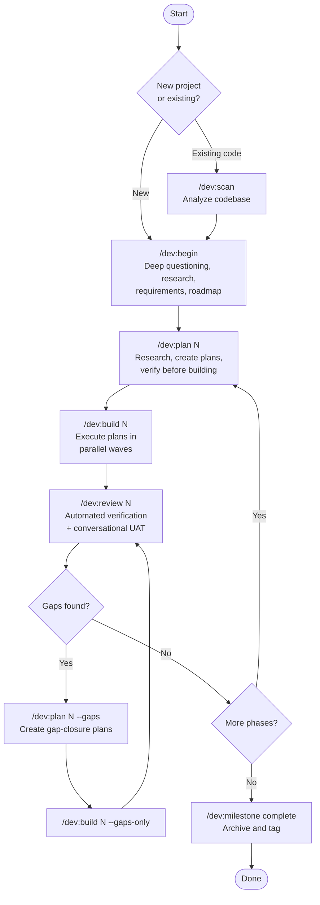
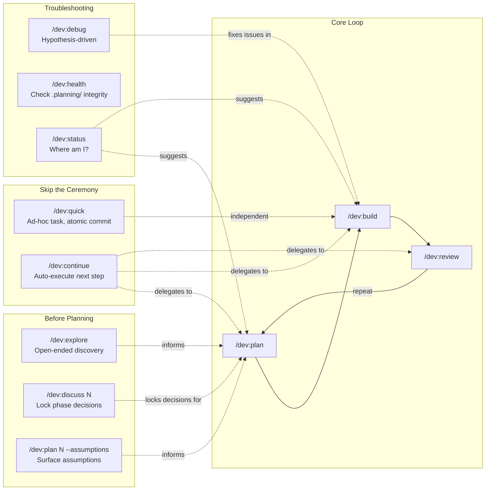
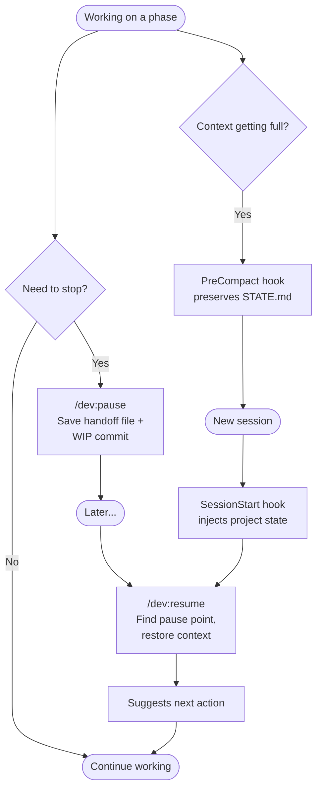
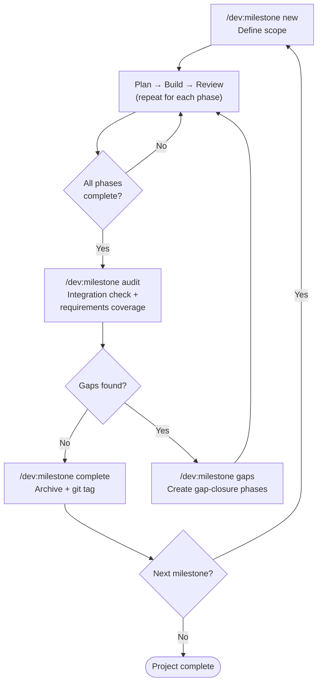
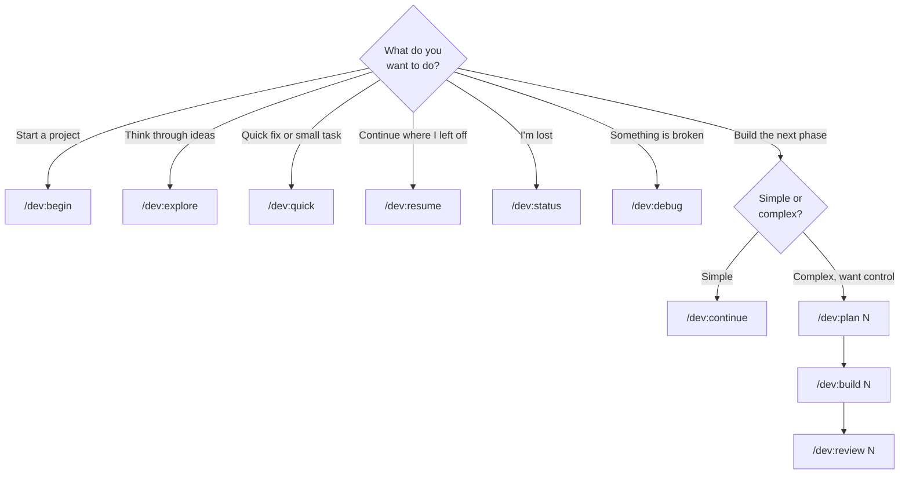

# Towline Workflow

Visual guide to how Towline's commands connect. For detailed reference, see [DOCS.md](DOCS.md).

## Main Workflow Loop

## Entry Points

## Session Management

## Milestone Lifecycle

## Decision Guide

