# Plan-Build-Run Architecture — Agent Orchestration

How each command works internally. [DOCS.md](DOCS.md) is the text reference, [WORKFLOW.md](WORKFLOW.md) shows how commands relate to each other — this document shows the **internal orchestration** of each command: which agents get spawned, in what order, what they read and write, and how the orchestrator sequences the work.

---

## Legend

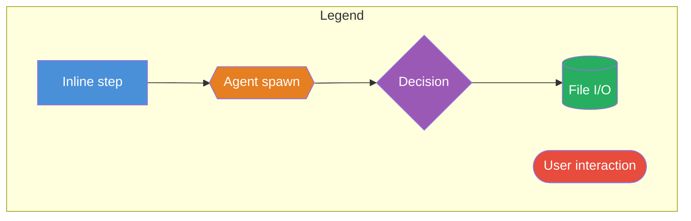

| Symbol | Meaning |
|--------|---------|
| Rectangle `[step]` | Inline — orchestrator does it directly |
| Hexagon `{{agent}}` | Agent spawn via `Task()` |
| Diamond `{decision}` | Conditional branch |
| Cylinder `[(file)]` | File read or write |
| Stadium `([user])` | User interaction point |
| Dashed border | Optional / conditional step |
| `-->` solid arrow | Sequential execution |
| Multiple arrows from one node | Parallel execution (when noted) |

---

## `/pbr:begin` — Project Initialization

The most complex command. A 10-step pipeline with a parallel fan-out/fan-in research phase.

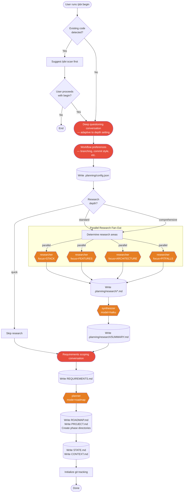

**Agent count**: 2–6 (0–4 researchers + 1 synthesizer + 1 planner)

---

## `/pbr:plan` — Phase Planning

A 3-agent pipeline with an optional revision loop.

```mermaid
flowchart TD
    Start([User runs /pbr:plan N]) --> Validate[Parse and validate phase number]

    Validate --> LoadCtx[("Read ROADMAP.md, REQUIREMENTS.md,<br/>CONTEXT.md, config.json,<br/>prior SUMMARY.md files")]

    LoadCtx --> Assumptions{--assumptions<br/>flag?}
    Assumptions -->|Yes| SurfaceAssumptions([Surface and record assumptions<br/>→ append to CONTEXT.md])
    Assumptions -->|No| SeedCheck

    SurfaceAssumptions --> SeedCheck

    SeedCheck[Scan for matching seeds<br/>in .planning/seeds/] --> ResearchCheck{--skip-research<br/>flag?}

    ResearchCheck -->|Yes| SkipR[Skip research]
    ResearchCheck -->|No| Research{{researcher<br/>phase-scoped}}

    Research --> ResearchOut[(Write phases/NN-slug/RESEARCH.md)]
    ResearchOut --> Planner

    SkipR --> Planner{{planner<br/>mode=phase-plan}}

    Planner --> PlanFiles[(Write PLAN-*.md files)]

    PlanFiles --> CheckerEnabled{plan_checking<br/>enabled?}

    CheckerEnabled -->|No| Approval
    CheckerEnabled -->|Yes| Checker{{plan-checker}}

    Checker --> CheckResult{Issues<br/>found?}

    CheckResult -->|No| Approval
    CheckResult -->|Yes| RevisionCount{Revision<br/>count < 3?}

    RevisionCount -->|Yes| Revise{{planner<br/>mode=revision}}
    RevisionCount -->|No| Approval

    Revise --> RevisedPlan[(Update PLAN-*.md)] --> Checker

    Approval([User approves plan]) --> UpdateState[(Update STATE.md)]
    UpdateState --> Done([Done])

    style Research fill:#e67e22,color:#fff
    style Planner fill:#e67e22,color:#fff
    style Checker fill:#e67e22,color:#fff
    style Revise fill:#e67e22,color:#fff
    style Approval fill:#e74c3c,color:#fff
    style SurfaceAssumptions fill:#e74c3c,color:#fff
```

**Agent count**: 1–3 (0–1 researcher + 1 planner + 0–1 checker), plus up to 3 revision iterations

---

## `/pbr:build` — Phase Execution

Wave-based parallel execution with checkpoint recovery.

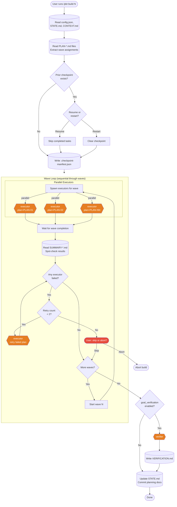

**Agent count**: 1–N executors per wave + 0–1 verifier. Typical: 2–4 executors per wave across 1–3 waves.

---

## `/pbr:review` — Phase Verification

Conditional branching between automated verification and user-driven UAT, with an optional auto-fix pipeline.

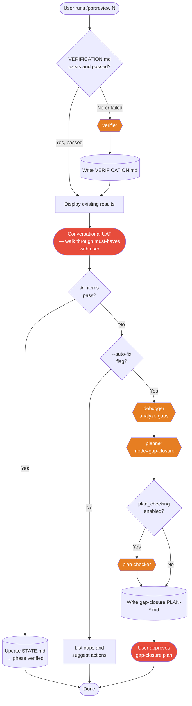

**Agent count**: 0–4 (0–1 verifier + 0–1 debugger + 0–1 planner + 0–1 checker)

---

## `/pbr:scan` — Codebase Analysis

Pure fan-out: 4 parallel mapper agents, each writing different analysis files.

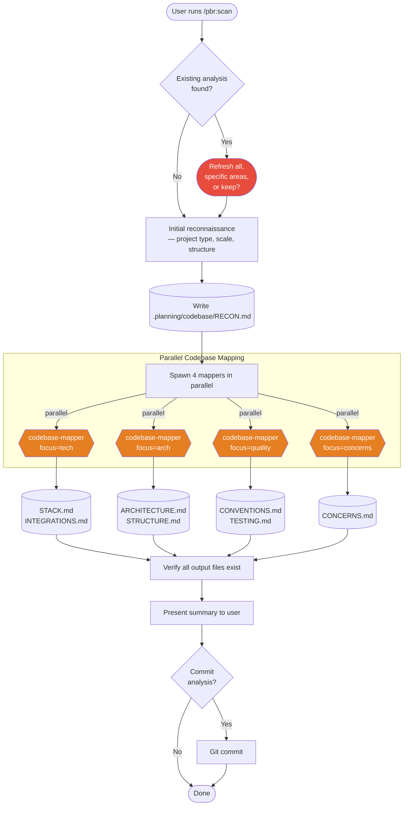

**Agent count**: 4 (all parallel)

---

## `/pbr:explore` — Idea Exploration

Mostly inline conversation with one conditional agent spawn.

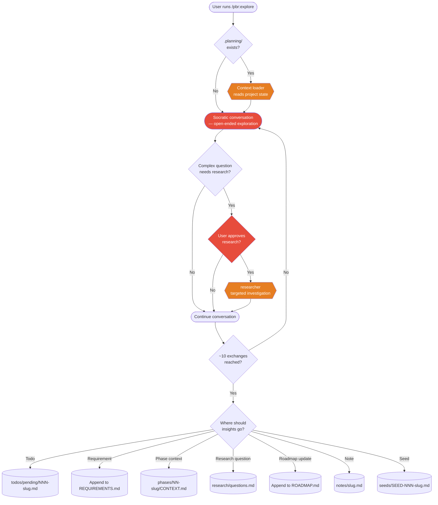

**Agent count**: 0–2 (0–1 context loader + 0–1 researcher)

---

## `/pbr:discuss` — Pre-Planning Discussion

Fully inline — no agents spawned.

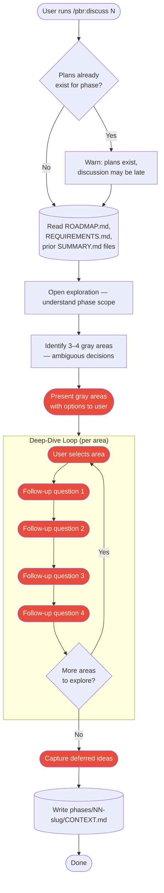

**Agent count**: 0

---

## `/pbr:quick` — Quick Task Execution

Minimal orchestration: one agent, no loops.

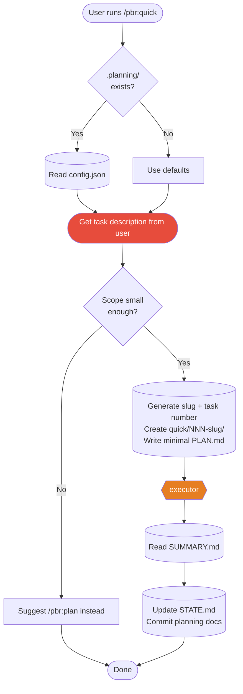

**Agent count**: 1

---

## `/pbr:continue` — Auto-Resume Next Step

A decision tree that delegates to other skills.

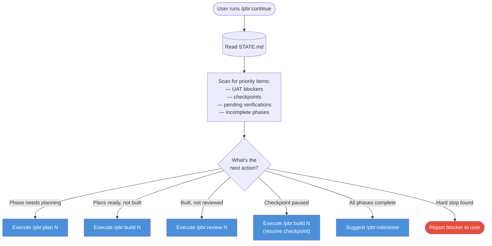

**Agent count**: 0 (delegates to other commands which spawn their own agents)

---

## `/pbr:debug` — Systematic Debugging

Scientific method loop with checkpoint-driven investigation rounds.

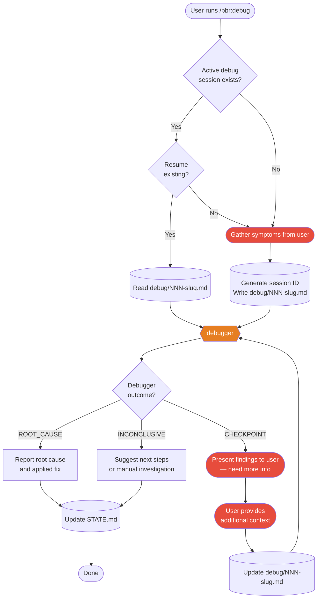

**Agent count**: 1 (may be spawned multiple times across checkpoint rounds, max 5 hypotheses per round)

---

## `/pbr:milestone` — Milestone Management

Four subcommands with different orchestration patterns.

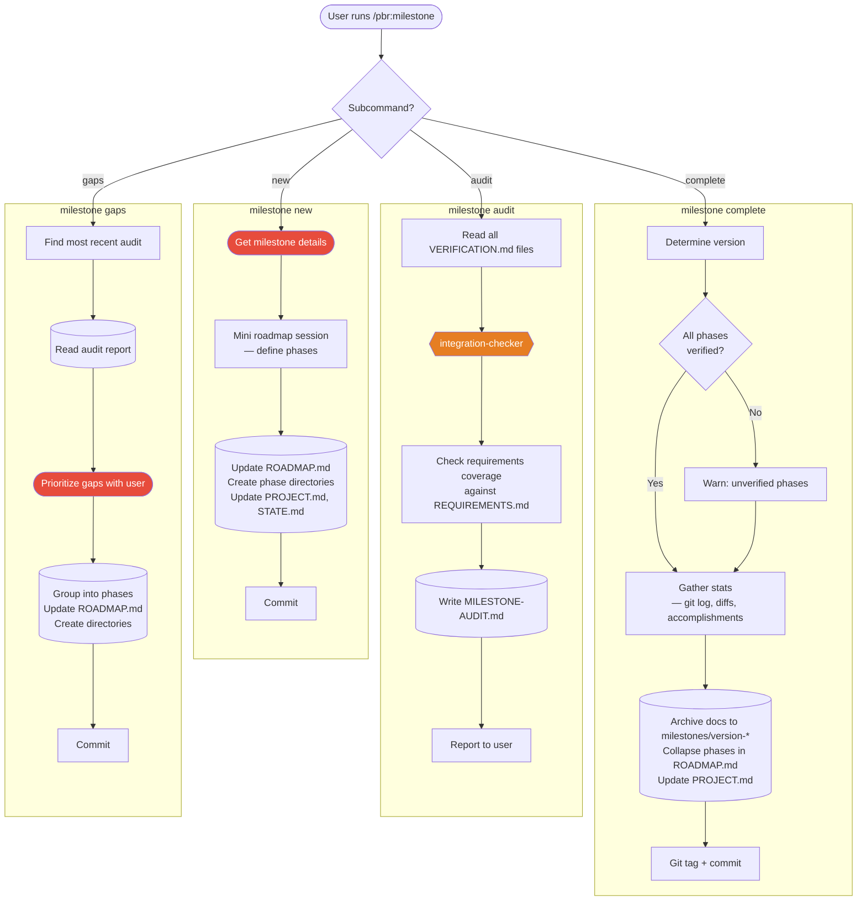

**Agent count**: 0 (new, complete, gaps) or 1 (audit spawns integration-checker)

---

## Session Commands — `/pbr:status`, `/pbr:pause`, `/pbr:resume`

All inline, no agents. Read project state and act on it.

```mermaid
flowchart TD
    subgraph "/pbr:status (read-only)"
        S_Start([Run /pbr:status]) --> S_Read[("Read STATE.md, ROADMAP.md,<br/>config.json, phase directories")]
        S_Read --> S_Calc[Calculate progress per phase]
        S_Calc --> S_Special[Check for special conditions<br/>— debug sessions, pending todos]
        S_Special --> S_Display[Display status dashboard]
        S_Display --> S_Route{Suggest<br/>next action}
    end

    subgraph "/pbr:pause (snapshot)"
        P_Start([Run /pbr:pause]) --> P_Read[(Read STATE.md, config.json)]
        P_Read --> P_Gather[Gather session state<br/>— completed work, git log]
        P_Gather --> P_Remaining[Determine remaining work]
        P_Remaining --> P_Write[("Write .continue-here.md<br/>Update STATE.md")]
        P_Write --> P_Commit[WIP commit]
    end

    subgraph "/pbr:resume (restore)"
        R_Start([Run /pbr:resume]) --> R_Read[(Read STATE.md)]
        R_Read --> R_Search[Search for .continue-here.md files]
        R_Search --> R_Found{Continue file<br/>found?}
        R_Found -->|Yes| R_Display[Display resume context]
        R_Found -->|No| R_Infer[Infer position from STATE.md]
        R_Infer --> R_Display
        R_Display --> R_Validate[Validate resume point<br/>— check for stale data]
        R_Validate --> R_Next[Present next action]
    end
```

**Agent count**: 0 for all three

---

## Simple Commands — `/pbr:todo`, `/pbr:config`, `/pbr:health`, `/pbr:help`

All fully inline with no agent spawns.

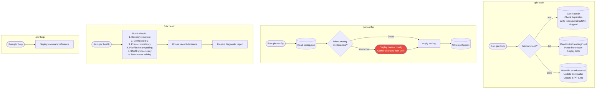

**Agent count**: 0 for all four

---

## Agent Summary

| Agent | Used By | Model | Purpose |
|-------|---------|-------|---------|
| `researcher` | begin, plan, explore | inherit | Domain research, technology investigation |
| `synthesizer` | begin | haiku | Compress research outputs into summary |
| `planner` | begin, plan, review | inherit | Generate roadmaps, phase plans, gap-closure plans |
| `plan-checker` | plan, review | inherit | Verify plan quality, trigger revisions |
| `executor` | build, quick | inherit | Execute plan tasks, write code, create files |
| `verifier` | build, review | inherit | Goal-backward verification of phase outcomes |
| `debugger` | debug, review | inherit | Scientific-method bug investigation |
| `codebase-mapper` | scan | sonnet | Analyze codebase from a specific focus angle |
| `integration-checker` | milestone audit | sonnet | Cross-phase integration and E2E flow checks |

All agents are spawned via `Task()` with `subagent_type` — agent definitions are auto-loaded from `agents/*.md`, never inlined into the orchestrator prompt.

---

## Execution Patterns

### Fan-Out / Fan-In
Used by `/pbr:begin` (researchers) and `/pbr:scan` (mappers). Multiple agents run in parallel, each writing independent output files. The orchestrator waits for all to complete before proceeding.

### Pipeline
Used by `/pbr:plan`. Agents run sequentially — each one's output feeds the next. Researcher → Planner → Checker, with a conditional revision loop back to the planner.

### Wave Execution
Used by `/pbr:build`. Plans are grouped into waves by dependency order. Within each wave, executors run in parallel. Waves execute sequentially — wave 2 doesn't start until wave 1 completes.

### Checkpoint Loop
Used by `/pbr:debug`. The agent runs, hits a checkpoint when it needs user input, the orchestrator presents findings and collects input, then respawns the agent with the new context.

### Delegation
Used by `/pbr:continue`. The orchestrator reads state, decides which command to run next, and hands off to that command's full orchestration flow.
