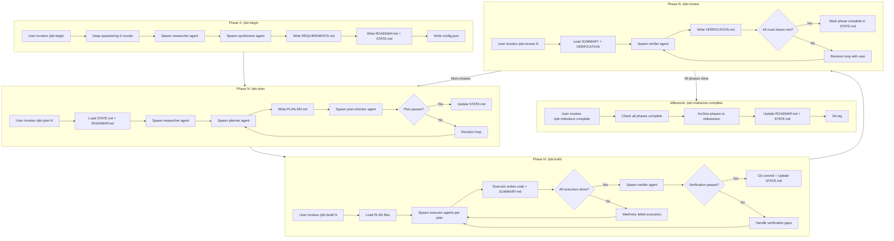
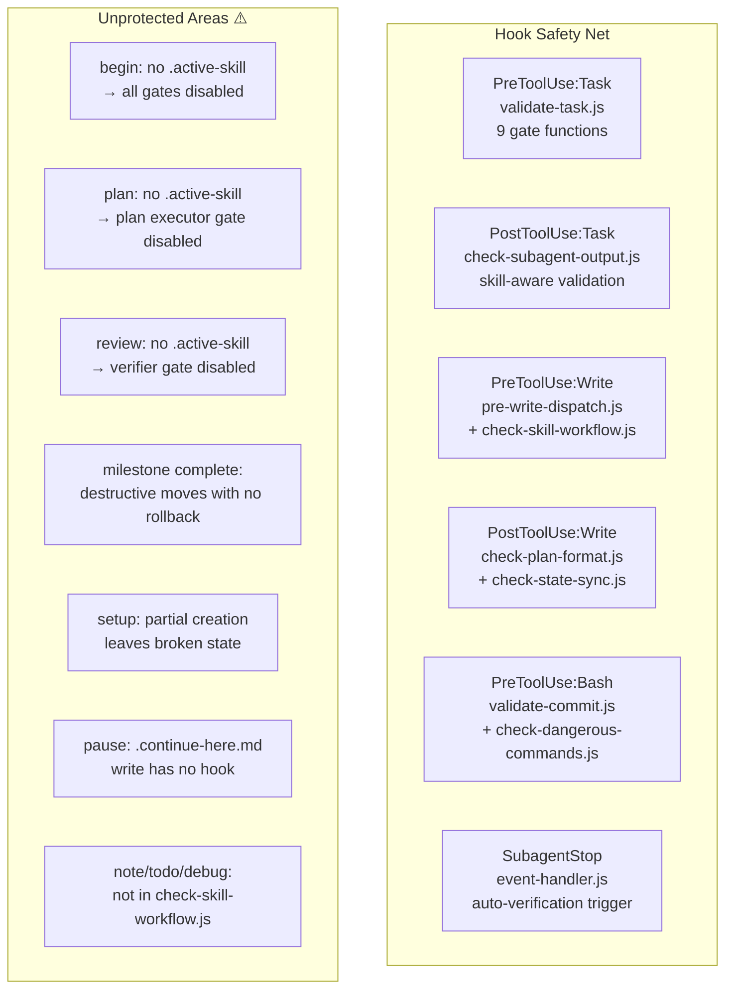
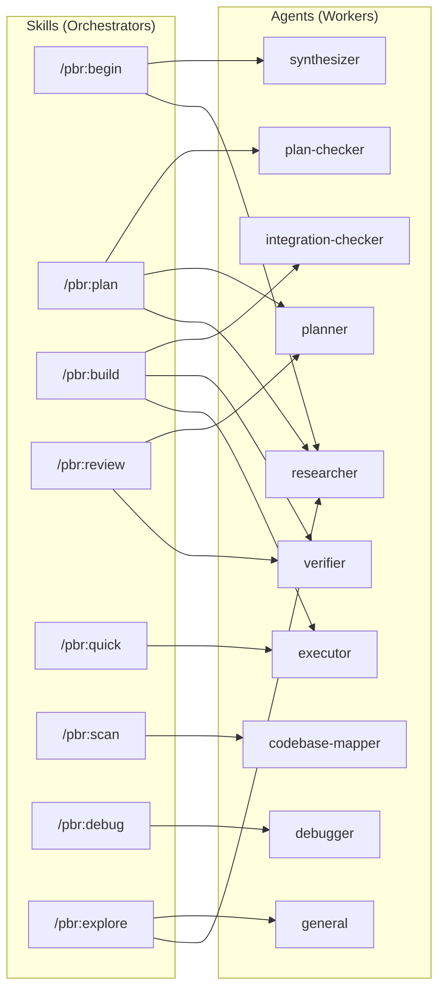

# PBR Full Lifecycle Flowchart

## Primary Workflow: begin → plan → build → review → milestone

```mermaid
flowchart TD
    subgraph BEGIN["Phase 0: /pbr:begin"]
        B1[User invokes /pbr:begin] --> B2[Deep questioning 5 rounds]
        B2 --> B3[Spawn researcher agent]
        B3 --> B4[Spawn synthesizer agent]
        B4 --> B5[Write REQUIREMENTS.md]
        B5 --> B6[Write ROADMAP.md + STATE.md]
        B6 --> B7[Write config.json]
    end

    subgraph PLAN["Phase N: /pbr:plan"]
        P1[User invokes /pbr:plan N] --> P2[Load STATE.md + ROADMAP.md]
        P2 --> P3[Spawn researcher agent]
        P3 --> P4[Spawn planner agent]
        P4 --> P5[Write PLAN-NN.md]
        P5 --> P6[Spawn plan-checker agent]
        P6 --> P7{Plan passes?}
        P7 -->|Yes| P8[Update STATE.md]
        P7 -->|No| P9[Revision loop]
        P9 --> P4
    end

    subgraph BUILD["Phase N: /pbr:build"]
        BU1[User invokes /pbr:build N] --> BU2[Load PLAN files]
        BU2 --> BU3[Spawn executor agents per plan]
        BU3 --> BU4[Executor writes code + SUMMARY.md]
        BU4 --> BU5{All executors done?}
        BU5 -->|Yes| BU6[Spawn verifier agent]
        BU5 -->|No| BU7[Wait/retry failed executors]
        BU7 --> BU3
        BU6 --> BU8{Verification passes?}
        BU8 -->|Yes| BU9[Git commit + Update STATE.md]
        BU8 -->|No| BU10[Handle verification gaps]
        BU10 --> BU3
    end

    subgraph REVIEW["Phase N: /pbr:review"]
        R1[User invokes /pbr:review N] --> R2[Load SUMMARY + VERIFICATION]
        R2 --> R3[Spawn verifier agent]
        R3 --> R4[Write VERIFICATION.md]
        R4 --> R5{All must-haves met?}
        R5 -->|Yes| R6[Mark phase complete in STATE.md]
        R5 -->|No| R7[Revision loop with user]
        R7 --> R3
    end

    subgraph MILESTONE["Milestone: /pbr:milestone complete"]
        M1[User invokes /pbr:milestone complete] --> M2[Check all phases complete]
        M2 --> M3[Archive phases to milestones/]
        M3 --> M4[Update ROADMAP.md + STATE.md]
        M4 --> M5[Git tag]
    end

    BEGIN --> PLAN
    PLAN --> BUILD
    BUILD --> REVIEW
    REVIEW -->|More phases| PLAN
    REVIEW -->|All phases done| MILESTONE
```

## Hook Coverage Overlay

```mermaid
flowchart TD
    subgraph HOOKS["Hook Safety Net"]
        direction LR
        H1["PreToolUse:Task<br/>validate-task.js<br/>9 gate functions"]
        H2["PostToolUse:Task<br/>check-subagent-output.js<br/>skill-aware validation"]
        H3["PreToolUse:Write<br/>pre-write-dispatch.js<br/>+ check-skill-workflow.js"]
        H4["PostToolUse:Write<br/>check-plan-format.js<br/>+ check-state-sync.js"]
        H5["PreToolUse:Bash<br/>validate-commit.js<br/>+ check-dangerous-commands.js"]
        H6["SubagentStop<br/>event-handler.js<br/>auto-verification trigger"]
    end

    subgraph GAPS["Unprotected Areas ⚠️"]
        G1["begin: no .active-skill<br/>→ all gates disabled"]
        G2["plan: no .active-skill<br/>→ plan executor gate disabled"]
        G3["review: no .active-skill<br/>→ verifier gate disabled"]
        G4["milestone complete:<br/>destructive moves with no rollback"]
        G5["setup: partial creation<br/>leaves broken state"]
        G6["pause: .continue-here.md<br/>write has no hook"]
        G7["note/todo/debug:<br/>not in check-skill-workflow.js"]
    end
```

## Agent Spawn Map

```mermaid
flowchart LR
    subgraph SKILLS["Skills (Orchestrators)"]
        begin["/pbr:begin"]
        plan["/pbr:plan"]
        build["/pbr:build"]
        review["/pbr:review"]
        quick["/pbr:quick"]
        scan["/pbr:scan"]
        debug["/pbr:debug"]
        explore["/pbr:explore"]
    end

    subgraph AGENTS["Agents (Workers)"]
        researcher["researcher"]
        planner["planner"]
        plan_checker["plan-checker"]
        executor["executor"]
        verifier["verifier"]
        integration["integration-checker"]
        mapper["codebase-mapper"]
        debugger_a["debugger"]
        synthesizer["synthesizer"]
        general["general"]
    end

    begin --> researcher
    begin --> synthesizer
    plan --> researcher
    plan --> planner
    plan --> plan_checker
    build --> executor
    build --> verifier
    build --> integration
    review --> verifier
    review --> planner
    quick --> executor
    scan --> mapper
    debug --> debugger_a
    explore --> researcher
    explore --> general
```
