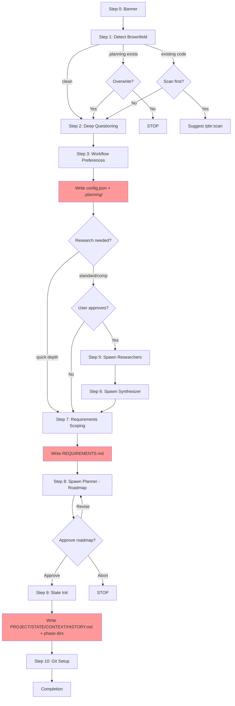

# Audit: /pbr:begin

## Skill Overview
- Lines: 597 | CRITICAL markers: 0 | STOP markers: 2 (lines 7, 76)
- Agents spawned: pbr:researcher (parallel, Step 5), pbr:synthesizer (Step 6), pbr:planner (Step 8)
- Hook coverage: check-subagent-output.js (begin+planner validates REQUIREMENTS.md, ROADMAP.md, STATE.md exist), validate-task.js (checkActiveSkillIntegrity advisory only)

## Workflow Step Analysis
| Step | Description | Enforcement | Skip Risk | Hook Coverage |
|------|-------------|-------------|-----------|---------------|
| 0 | Display banner | None | Low | None |
| 1 | Detect brownfield (.planning/ check) | STOP marker at line 76 for cancel path | Low | None |
| 2 | Deep questioning (inline conversation) | None | Low (interactive) | None |
| 3 | Workflow preferences (5 sub-prompts) | None | Medium | None |
| 3-post | Write config.json + create .planning/ | None | **HIGH** | None |
| 4 | Research decision gate | None | Low | None |
| 5 | Spawn researchers (parallel Task) | None | Low | check-subagent-output.js (researcher) |
| 6 | Spawn synthesizer | None | Low | check-subagent-output.js (synthesizer) |
| 7 | Requirements scoping (inline) | None | Medium | None |
| 7e | Write REQUIREMENTS.md | None | **HIGH** | None |
| 8 | Spawn planner (roadmap) | None | Low | check-subagent-output.js (begin+planner) |
| 9a | Write PROJECT.md | None | **HIGH** | None |
| 9b | Write STATE.md | None | **HIGH** | None |
| 9c | Write CONTEXT.md | None | **HIGH** | None |
| 9d | Write HISTORY.md | None | **HIGH** | None |
| 9e | Create phase directories | None | **HIGH** | None |
| 10 | Git setup + initial commit | None | Medium | validate-commit.js (commit format) |

## Enforcement Gaps

1. **No CRITICAL markers on ANY file creation step.** Steps 3-post, 7e, 9a-9e all create essential files but have zero CRITICAL/STOP markers. The skill relies entirely on the LLM following sequential instructions. Given the CLAUDE.md lesson that "prompt-only instructions get skipped under cognitive load," these are all high-risk skip points.
   - **Fix**: Add CRITICAL markers before Steps 3-post, 7e, 9a, 9b, 9c, 9d, 9e.

2. **No .active-skill registration.** Unlike build and quick, begin never writes `.planning/.active-skill`. This means all validate-task.js gates that check active skill are silently bypassed during begin. Specifically, if the planner spawns an executor by mistake, nothing blocks it.
   - **Fix**: Write `.planning/.active-skill` with `begin` after creating `.planning/` in Step 3-post.

3. **No pre-spawn gate for begin's planner.** validate-task.js has no `checkBeginPlannerGate`. The planner could be spawned before REQUIREMENTS.md exists (if Step 7e was skipped).
   - **Fix**: Add a gate in validate-task.js that blocks pbr:planner when active-skill is "begin" and REQUIREMENTS.md does not exist.

4. **Step 5 directory creation lacks CRITICAL marker.** "Create `.planning/research/` directory first" on line 212 is a plain instruction with no enforcement. If skipped, researchers will fail to write output.
   - **Fix**: Add CRITICAL marker before `.planning/research/` creation.

5. **No hook validates that Step 9 state files are consistent.** check-subagent-output.js checks for REQUIREMENTS.md, ROADMAP.md, STATE.md existence after the planner completes (lines 259-265), but Steps 9a-9e are inline orchestrator work done AFTER the planner. There is no hook validating PROJECT.md, CONTEXT.md, HISTORY.md, or phase directory creation.
   - **Fix**: Add a PostToolUse check in check-subagent-output.js for the begin skill's completion that validates all 6+ expected files.

6. **No validation that config.json was written before research.** Step 3 says "This step MUST happen BEFORE research (Step 5) because depth controls how many researchers to spawn" (line 176), but this ordering dependency has no hook enforcement.
   - **Fix**: Consider adding a check that `.planning/config.json` exists before spawning researchers.

## User-Facing Workflow Gaps

1. **No recovery from partial Step 9 failure.** If the orchestrator crashes midway through writing PROJECT.md, STATE.md, CONTEXT.md, HISTORY.md, and phase directories, there is no mechanism to detect which files were written and which were skipped on re-run. Re-running `/pbr:begin` would prompt to overwrite the entire `.planning/` directory.
   - **Fix**: Add a "repair" mode that checks which Step 9 artifacts exist and only creates missing ones.

2. **Research timeout has no upper bound.** Step 5 says to check TaskOutput periodically but provides no maximum wait time. If a researcher hangs, the user is stuck.
   - **Fix**: Document a timeout threshold (e.g., 5 minutes per researcher) and add explicit timeout handling.

3. **No way to skip individual workflow preference questions.** Step 3 presents 5 sequential prompts (mode, depth, parallelization, git branching, commit docs). Users who want defaults for everything must answer all 5.
   - **Fix**: Add a "Use all defaults" option at the start of Step 3.

## Agent Instruction Gaps

1. **Planner in roadmap mode receives no constraint on milestone structure.** The planner agent definition mentions milestone grouping (line 41 of planner.md) but the roadmap prompt template is external and not audited here. If the template lacks explicit milestone formatting rules, the planner may omit `## Milestone:` sections that Step 8 expects.
   - **Fix**: Ensure the roadmap prompt template explicitly requires milestone sections, or have Step 8 handle the missing-milestone case more robustly (it partially does on line 383).

2. **Researcher prompt placeholder resolution is manual.** Step 5 lists 7 placeholders that the orchestrator must fill. If any are missed, the researcher gets broken prompts. No validation occurs.
   - **Fix**: Add a pre-spawn sanity check that all `{placeholder}` tokens are resolved before sending.

3. **Synthesizer has no explicit constraint on SUMMARY.md location.** The synthesizer is told to create `.planning/research/SUMMARY.md` only implicitly via the template. If it writes elsewhere, check-subagent-output.js will flag it, but the orchestrator won't know where to read results.
   - **Fix**: Explicit path constraint in synthesizer prompt.

## Mermaid Workflow Flowchart

Note: Red-shaded nodes are high skip-risk file creation steps with no CRITICAL markers.

## Priority Fixes
- [ ] P1: Add CRITICAL markers to Steps 3-post, 7e, 9a-9e (all file creation steps)
- [ ] P1: Write `.planning/.active-skill` with `begin` after creating `.planning/`
- [ ] P2: Add validate-task.js gate: block planner when active-skill=begin and REQUIREMENTS.md missing
- [ ] P2: Add CRITICAL marker to `.planning/research/` directory creation in Step 5
- [ ] P3: Add "Use all defaults" option to Step 3 workflow preferences
- [ ] P3: Add completion validation hook for begin skill checking all expected artifacts
