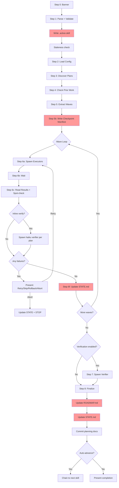

# Audit: /pbr:build

## Skill Overview
- Lines: 961 | CRITICAL markers: 0 | STOP markers: 1 (line 8)
- Agents spawned: pbr:executor (Step 6a, per plan per wave), pbr:verifier (Step 6c-ii inline, Step 7), pbr:codebase-mapper (Step 8-pre-c)
- Hook coverage: validate-task.js (checkBuildExecutorGate, checkBuildDependencyGate, checkCheckpointManifest advisory, checkActiveSkillIntegrity), check-subagent-output.js (build+executor validates SUMMARY commits)

## Workflow Step Analysis
| Step | Description | Enforcement | Skip Risk | Hook Coverage |
|------|-------------|-------------|-----------|---------------|
| 0 | Display banner | None | Low | None |
| 1 | Parse and validate | None | Low | None |
| 1.4 | Write .active-skill | None | Medium | checkActiveSkillIntegrity (advisory) |
| 1.7 | Confirm execute gate | None | Low | None |
| 1.8 | Git branch creation | None | Medium | None |
| 1.9 | Record pre_build_commit | None | Medium | None |
| 1-stale | Staleness check | None | Medium | None |
| 2 | Load config | None | Low | None |
| 3 | Discover plans (plan-index) | None | Low | checkBuildExecutorGate |
| 4 | Check prior work (crash recovery) | None | Medium | None |
| 5 | Extract waves | None | Low | None |
| 5b | Write checkpoint manifest | None | **HIGH** | checkCheckpointManifest (advisory only) |
| 6a | Spawn executors per wave | None | Low | checkBuildExecutorGate, checkBuildDependencyGate |
| 6b | Wait for wave completion | None | Low | None |
| 6c | Read results + spot-check | None | Medium | check-subagent-output.js (executor) |
| 6c-ii | Inline per-task verification | None | Medium | None |
| 6d | Handle failures | None | Low (interactive) | None |
| 6e | Handle checkpoints | None | Low (interactive) | None |
| 6f | Update STATE.md per wave | None | **HIGH** | check-state-sync.js |
| 6f-gate | SUMMARY gate (3 checks) | None | **HIGH** | None |
| 7 | Phase verification (verifier) | None | Medium | check-subagent-output.js (verifier) |
| 8-pre | Determine final status | None | Low | None |
| 8-pre-c | Codebase map update | None | Low | None |
| 8a | Update ROADMAP.md | None | **HIGH** | check-roadmap-sync.js |
| 8b | Update STATE.md | None | **HIGH** | check-state-sync.js |
| 8c | Commit planning docs | None | Medium | validate-commit.js |
| 8d | Git branch merge | None | Medium | None |
| 8e | Auto-advance/auto-continue | None | Low | None |
| 8e-ii | Check pending todos | None | Medium | None |
| 8f | Present completion summary | None | Low | None |

## Enforcement Gaps

1. **Zero CRITICAL markers in the entire skill.** This is the most complex skill (961 lines, multi-wave execution with parallel agents) and it has zero CRITICAL markers. Every file creation/update step relies purely on the LLM following instructions.
   - **Fix**: Add CRITICAL markers to: Step 1.4 (.active-skill), Step 5b (checkpoint manifest), Step 6f (STATE.md update), Step 8a (ROADMAP.md update).

2. **Checkpoint manifest (Step 5b) is advisory-only.** validate-task.js's `checkCheckpointManifest` returns an advisory warning, not a blocking gate. If the manifest is never written, crash recovery (Step 6 crash recovery check) silently falls through.
   - **Fix**: Promote checkCheckpointManifest from advisory to blocking (exit code 2). Or add CRITICAL marker to Step 5b.

3. **SUMMARY gate (Step 6f) has no hook enforcement.** The 3-gate check (SUMMARY exists, non-empty, valid frontmatter) before updating STATE.md is purely prompt-based. If skipped, STATE.md could be updated based on missing or corrupt executor output.
   - **Fix**: Add a hook in check-subagent-output.js that validates SUMMARY frontmatter structure for build+executor completions.

4. **Step 1.4 .active-skill write is not verified.** The skill says to write `.active-skill` with `build` but has no verification step. If the write fails silently, all validate-task.js gates for build are disabled.
   - **Fix**: Add CRITICAL marker and a verification read-back.

5. **Spot-check in Step 6c has no enforcement if it fails.** Lines 386-395 describe spot-checking executor claims, but the result is only a warning. A plan that produced zero actual files could pass if the orchestrator skips spot-checking.
   - **Fix**: Make at least 1 spot-check mandatory (not skippable) per executor completion.

6. **No validation of executor prompt completeness.** The executor prompt template (lines 287-338) has ~12 fields to fill. If any placeholder is missed, the executor receives broken context. No hook validates prompt construction.
   - **Fix**: Consider a pre-spawn prompt validation helper.

7. **Rollback path (Step 6d) uses `git reset --soft`.** Line 513: this is a destructive git command. The pre-bash hook `check-dangerous-commands.js` may block it, creating a conflict between the skill's instructions and the hook's enforcement.
   - **Fix**: Verify that `check-dangerous-commands.js` has an exemption for `git reset --soft` during build skill, or use a safer alternative.

8. **No cleanup of .active-skill on skill exit.** Unlike quick (Step 10), build never deletes `.planning/.active-skill`. If the build aborts or crashes, the file remains and may interfere with subsequent skills.
   - **Fix**: Add .active-skill cleanup in all exit paths (completion, abort, error).

## User-Facing Workflow Gaps

1. **No visibility into parallel executor progress.** Lines 346-349 describe periodic progress reporting, but this relies on the orchestrator remembering to poll. Under cognitive load, the orchestrator may skip polling entirely, leaving the user with no updates during long parallel builds.
   - **Fix**: This is inherent to the architecture. Document expected wait times.

2. **Rollback option presents no preview.** Step 6d "Rollback" runs `git reset --soft` without showing the user what commits will be undone. The user must trust the `last_good_commit` value.
   - **Fix**: Show `git log --oneline {last_good_commit}..HEAD` before executing rollback.

3. **8f completion summary has 3 completely different templates.** The user experience varies dramatically between passed/gaps/milestone-complete. Consistent structure would help.
   - **Fix**: Minor -- the templates are well-defined, just complex.

4. **No handling of executor that produces code but no SUMMARY.md.** The handoff bug check (Step 6d) only fires on failed executors. If an executor returns "success" but wrote no SUMMARY.md, the SUMMARY gate in 6f should catch it -- but only if 6f isn't skipped.
   - **Fix**: check-subagent-output.js already warns about missing SUMMARY, but it's advisory. The 6f SUMMARY gate is the real defense, which needs CRITICAL enforcement.

## Agent Instruction Gaps

1. **Executor prompt says "Read the full plan file from the path in <plan_file>" (line 326).** This means every executor reads the entire PLAN.md into its context, potentially duplicating the inlined summary. For large plans, this wastes executor context.
   - **Fix**: Clarify whether the executor should read the full plan or rely on the inlined summary.

2. **Executor state write rules say "Do NOT modify STATE.md" (executor.md line 78).** But the executor could still attempt to modify STATE.md via the Write tool. There is no PreToolUse hook blocking executor writes to STATE.md specifically.
   - **Fix**: Add a pre-write hook that blocks STATE.md writes when `.active-skill` is `build` and the write is from a subagent context.

3. **Inline verifier (Step 6c-ii) uses haiku model with minimal prompt.** The 3-check verification (existence, substantiveness, wiring) may be too sophisticated for haiku on complex codebases. No quality gate on the inline verifier's results.
   - **Fix**: Consider using sonnet for inline verification, or add a confidence threshold.

## Mermaid Workflow Flowchart

## Priority Fixes
- [ ] P1: Add CRITICAL markers to Steps 1.4, 5b, 6f, 8a, 8b (the zero-CRITICAL-in-961-lines problem)
- [ ] P1: Add .active-skill cleanup in all exit paths (completion, abort, error)
- [ ] P1: Promote checkpoint manifest check from advisory to blocking, or enforce via CRITICAL
- [ ] P2: Add CRITICAL enforcement to SUMMARY gate (Step 6f)
- [ ] P2: Verify git reset --soft compatibility with check-dangerous-commands.js
- [ ] P2: Add pre-rollback preview (show commits to be undone)
- [ ] P3: Clarify executor prompt about full plan read vs. inlined summary
- [ ] P3: Consider PreToolUse hook blocking STATE.md writes from executor context
