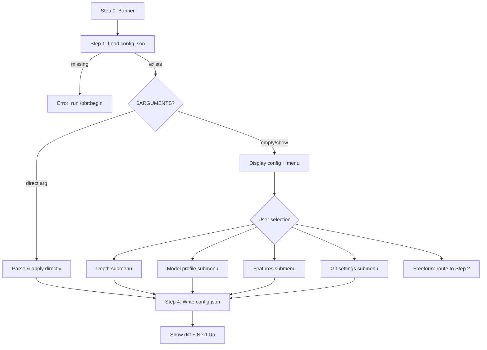

# Audit: /pbr:config

## Skill Overview
- Lines: 257 | CRITICAL markers: 0 | STOP markers: 1 (line 7, anti-re-read)
- Agents spawned: None (fully inline)
- Hook coverage: None specific to config — general hooks (post-write-dispatch for config.json writes, check-state-sync) apply indirectly

## Workflow Step Analysis
| Step | Description | Enforcement | Skip Risk | Hook Coverage |
|------|-------------|-------------|-----------|---------------|
| 0 | Display banner | None | Low (cosmetic) | None |
| 1 | Load config.json | None | Low (needed for display) | None |
| 2 | Parse $ARGUMENTS for direct setting | None | Low (routing logic) | None |
| 3 | Interactive mode — AskUserQuestion menus | None | Medium — under cognitive load, LLM may skip menus and apply settings directly | None |
| 4 | Apply changes + write config.json | None | Low (the whole point) | post-write-dispatch.js may validate config.json format indirectly |

## Enforcement Gaps

1. **No input validation hook for config values.** The skill lists validation rules (lines 250-256: depth must be one of quick/standard/comprehensive, models must be sonnet/inherit/haiku/opus, etc.) but these are prompt-only. No hook validates config.json after writes. An LLM under load could write `depth: "fast"` or `models.executor: "gpt-4"` and nothing would catch it.
   - **Fix:** Add a `checkConfigWrite()` function to `post-write-dispatch.js` that validates config.json schema on every write.

2. **No CRITICAL marker on version migration (line 221-225).** The v1-to-v2 migration step has no enforcement. If config version is 1, the LLM could skip migration and leave stale fields. This silently breaks downstream depth resolution.
   - **Fix:** Add CRITICAL marker before the migration check. Or better: make `pbr-tools.js config load` auto-migrate on read.

3. **No validation of `resolve-depth` output.** Step 3 calls `pbr-tools.js config resolve-depth` (line 139) but doesn't validate the output. If the command fails or returns garbage, the LLM may display nonsense or skip depth profile display.
   - **Fix:** Add error handling instruction: "If the command exits non-zero, display a warning and show raw config values instead."

4. **Feature namespace normalization is prompt-only (lines 54, 162).** The instruction to prepend `features.` to bare feature names has no hook enforcement. Under cognitive load, the LLM could write `auto_continue: true` at the top level of config instead of `features.auto_continue: true`.
   - **Fix:** The config schema validation hook (Gap #1) would catch this.

## User-Facing Workflow Gaps

1. **No undo/rollback.** If the user changes a setting and regrets it, there's no `/pbr:config undo` or history. The only recourse is manually editing config.json.
   - **Fix (P3):** Low priority — config changes are visible and cheap to redo manually.

2. **No feedback on invalid freeform input in interactive mode.** Line 184 says "interpret as a direct setting command" but if the user types something unparseable (e.g., "make it faster"), there's no defined error path. The LLM will guess or hallucinate.
   - **Fix:** Add an explicit fallback: "If freeform text doesn't match any known setting pattern, display available options and re-prompt."

3. **Parallelization settings hidden under "Features."** Line 121 groups parallelization under Features, but the display (lines 87-90) shows it as a separate section. Users may not realize they can configure parallelization through the Features menu.
   - **Fix (P3):** Cosmetic — add a note in the Features sub-menu.

## Agent Instruction Gaps

N/A — no agents spawned.

## Mermaid Workflow Flowchart

## Priority Fixes
- [ ] P1: Add config.json schema validation hook in post-write-dispatch.js
- [ ] P2: Add error handling for `pbr-tools.js config resolve-depth` failure
- [ ] P2: Add freeform input fallback in interactive mode
- [ ] P3: Auto-migrate config version on load in pbr-tools.js
- [ ] P3: Document parallelization access path in Features menu
