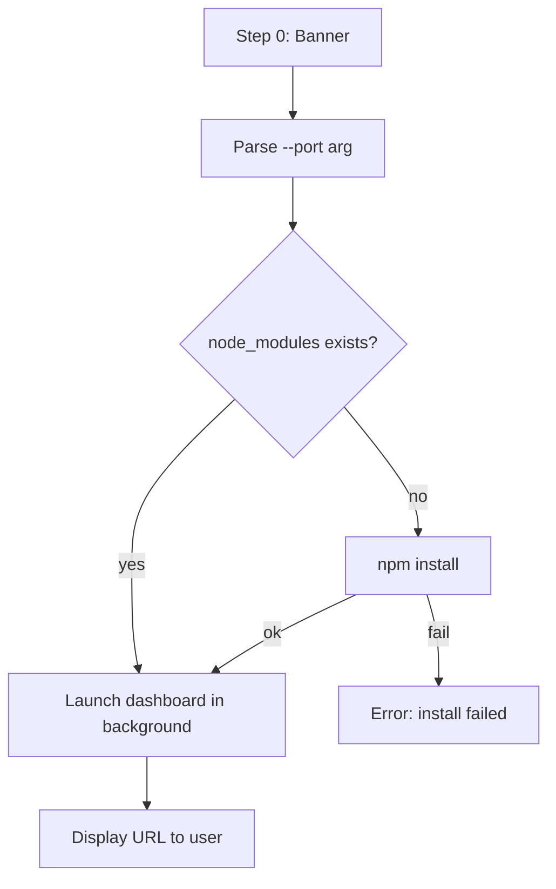

# Audit: /pbr:dashboard

## Skill Overview
- Lines: 47 | CRITICAL markers: 0 | STOP markers: 1 (line 8, anti-re-read)
- Agents spawned: None
- Hook coverage: None — no hooks target this skill
- Allowed tools: Bash, Read

## Workflow Step Analysis
| Step | Description | Enforcement | Skip Risk | Hook Coverage |
|------|-------------|-------------|-----------|---------------|
| 0 | Display banner | None | Low | None |
| 1 | Parse --port argument | None | Low | None |
| 2 | Check node_modules, npm install if missing | None | Medium — LLM may skip the check and go straight to launch | None |
| 3 | Launch dashboard in background | None | Low (core task) | None |
| 4 | Output URL to user | None | Low | None |

## Enforcement Gaps

1. **No error handling for npm install failure (Step 2).** If `npm install --prefix` fails (network issue, permission error), there's no defined error path. The skill will proceed to Step 3 and the dashboard launch will fail with a cryptic Node.js error.
   - **Fix:** Add: "If npm install exits non-zero, display error and stop. Do not proceed to Step 3."

2. **No error handling for port-in-use (Step 3, noted in line 45).** The skill mentions this edge case in Notes but provides no structured error handling. The user sees a raw Node.js error.
   - **Fix:** Add: "After launching, wait 2 seconds and check if the process is still running. If not, read stderr and display: 'Dashboard failed to start. Port {port} may be in use. Try /pbr:dashboard --port {port+1}'."

3. **No verification that launch succeeded.** The skill fires-and-forgets with `&`. There's no check that the dashboard is actually serving.
   - **Fix (P3):** Add a `curl http://localhost:{port}` health check after a brief delay.

4. **`${CLAUDE_PLUGIN_ROOT}` path resolution not guarded.** On Windows with MSYS, `${CLAUDE_PLUGIN_ROOT}` can expand to `/d/Repos/...` which Node.js can't resolve (documented in CLAUDE.md memory). The skill doesn't use the `-e` bootstrap pattern from hooks.json.
   - **Fix:** Use the full absolute path from the Bash environment or resolve via `node -e "console.log(require('path').resolve(...))"`.

## User-Facing Workflow Gaps

1. **No way to stop the dashboard.** The skill launches a background process but provides no `/pbr:dashboard stop` command. The user must find and kill the process manually (`kill $(lsof -ti:3000)` or similar).
   - **Fix (P2):** Write the PID to `.planning/.dashboard-pid`. Add a `stop` subcommand that reads the PID and kills it.

2. **No indication of existing dashboard.** If the user runs `/pbr:dashboard` when one is already running on the same port, they get a port-in-use error with no context.
   - **Fix:** Check for `.planning/.dashboard-pid` or probe the port before launching.

3. **No `.planning/` directory required.** Line 141 says it works without `.planning/` but the launch command uses `--dir <cwd>`. If cwd has no `.planning/`, the dashboard shows empty state. This is fine but not communicated.
   - **Fix (P3):** Add a note in Step 4 output if no `.planning/` exists: "No .planning/ directory found. Dashboard will show empty state until you run /pbr:begin."

## Agent Instruction Gaps

N/A — no agents spawned.

## Mermaid Workflow Flowchart

## Priority Fixes
- [ ] P1: Add error handling for npm install failure
- [ ] P2: Add `stop` subcommand with PID tracking
- [ ] P2: Detect already-running dashboard before launch
- [ ] P2: Add error handling for port-in-use
- [ ] P3: Add launch verification (health check)
- [ ] P3: Guard against MSYS path expansion on Windows
