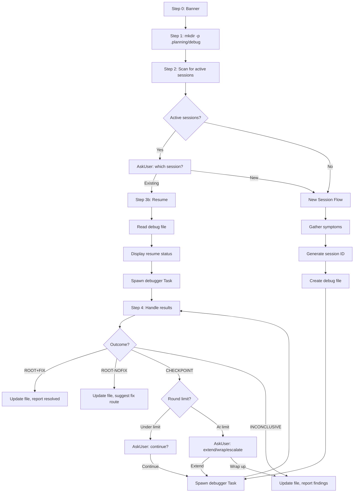

# Audit: /pbr:debug

## Skill Overview
- Lines: 516 | CRITICAL markers: 0 | STOP markers: 1 (line 8, do-not-read)
- Agents spawned: `pbr:debugger` (via Task, potentially multiple rounds)
- Hook coverage:
  - `check-subagent-output.js` (lines 87-95): validates debugger output -- checks for files in `.planning/debug/`
  - `check-skill-workflow.js`: **NOT listed** -- debug is not in the switch statement (lines 114-132), so no `.active-skill` enforcement
  - `validate-task.js`: lists `debugger` as a valid agent (line 31)

## Workflow Step Analysis

| Step | Description | Enforcement | Skip Risk | Hook Coverage |
|------|-------------|-------------|-----------|---------------|
| 0 | Display banner | None | Low | None |
| 1 | Ensure `.planning/debug/` exists via `mkdir -p` | None | **HIGH** -- directory creation, no CRITICAL marker | None |
| 2 | Check for active debug sessions + load depth config | None | Medium -- depth config failure has fallback (5 rounds) | None |
| 2a | Session select (AskUserQuestion if active sessions) | None | Low -- user interaction | None |
| 3a | New session: gather symptoms | None | Medium -- symptom gathering is freeform | None |
| 3a.2 | Generate session ID | None | Low | None |
| 3a.3 | Create debug file | None | **HIGH** -- file creation, no CRITICAL marker | check-subagent-output.js (post-hoc) |
| 3a.4 | Spawn debugger Task | None | Medium | validate-task.js |
| 3b | Resume flow: read debug file, spawn continuation | None | Medium | validate-task.js |
| 4 | Handle debugger results (4 outcome branches) | None | Medium -- complex branching logic | None |
| 4-ROOT+FIX | Update debug file, STATE.md, report | None | Medium -- multiple writes | None |
| 4-ROOT-NOFIX | Update debug file, suggest next steps | None | Low | None |
| 4-CHECKPOINT | Present checkpoint, potentially spawn another debugger | None | Medium -- round counter management | None |
| 4-INCONCLUSIVE | Update debug file, report findings | None | Low | None |

## Enforcement Gaps

1. **No CRITICAL marker on `mkdir -p .planning/debug` (Step 1)**: This is the first action and if skipped, all subsequent file writes fail. The skill even says "Do NOT skip this step" (line 57) but uses prose instead of a CRITICAL marker.
   - **Fix**: Add `**CRITICAL**` marker before Step 1's mkdir command.

2. **No CRITICAL marker on debug file creation (Step 3a, "Create Debug File")**: The debug file is the persistent state for the entire session. If skipped, the debugger agent has nowhere to write and the session is untrackable.
   - **Fix**: Add `**CRITICAL**` marker before the Write call for the debug file.

3. **Round counter is purely in-memory with no persistence**: The round counter (initialized in Step 2, incremented in Step 4 CHECKPOINT) exists only in the orchestrator's context. If the session is interrupted and resumed via `/pbr:debug`, the counter resets to 0, allowing unlimited rounds.
   - **Fix**: Persist round count in the debug file frontmatter (e.g., `rounds: 3`). Read it on resume.

4. **No hook validates round limit enforcement**: The hypothesis round limit (Step 4 CHECKPOINT, line 394) is purely prompt-driven. No hook checks whether the limit has been exceeded.
   - **Fix**: Add a `check-subagent-output.js` check or a new PostToolUse hook that reads the debug file's round count after each debugger spawn.

5. **Debug skill not in `check-skill-workflow.js`**: Unlike explore, scan, discuss, etc., debug is not registered. The debugger agent can write anywhere (by design it needs to modify source code for fixes), but the orchestrator itself should be constrained.
   - **Fix**: Consider adding debug to the switch with a custom rule: orchestrator writes only to `.planning/`, but the debugger agent (detected via `.active-agent`) can write anywhere.

6. **Staleness detection is prompt-only (line 422-426)**: The 7-day staleness check relies entirely on the LLM doing date arithmetic. No hook validates this.
   - **Fix**: Low priority -- staleness is advisory, not safety-critical.

## User-Facing Workflow Gaps

1. **No way to manually close a debug session**: The skill has no "close" or "resolve" subcommand. Sessions can only be resolved by the debugger agent finding the root cause, or going stale after 7 days.
   - **Fix**: Add a `/pbr:debug close <NNN>` subcommand that sets status to `stale` with a user-provided reason.

2. **Session selection UI is limited to 3 most recent**: If a user has 5+ active sessions (line 83), they can only see 3 + "New session". Older sessions are hidden.
   - **Fix**: Add "Show all sessions" as an option, or mention the hidden sessions count.

3. **Debugger agent failure has no automatic retry**: If the Task() fails (line 468-480), the user must manually re-run. No automatic recovery.
   - **Fix**: Consider one automatic retry before surfacing the error.

4. **No progress visibility during debugger execution**: The user sees "Spawning debugger..." but has no visibility into what the debugger is doing until it completes. Long investigations could feel stalled.
   - **Fix**: The debugger agent could write progress markers to the debug file that the orchestrator polls, but this would add complexity. Low priority.

## Agent Instruction Gaps

1. **Debug file format mismatch between skill and agent**: The skill's template (lines 128-178) uses `id: "{NNN}"` and status values `active/resolved/stale`. The agent definition (debugger.md line 47) uses `slug: "{slug}"` and status values `gathering/investigating/fixing/verifying/resolved`. These are incompatible schemas.
   - **Fix**: Align the debug file format. The agent's format is more detailed (5 statuses vs 3). Either the skill should adopt the agent's schema, or the templates should be authoritative and the agent updated to match.

2. **Agent doesn't know about round limits**: The debugger agent has no concept of the hypothesis round limit. It will investigate until it runs out of hypotheses or context. The limit is enforced only by the orchestrator not spawning more rounds.
   - **Fix**: Pass the remaining round count to the agent so it can prioritize hypotheses accordingly.

3. **Agent's CHECKPOINT output format is undefined**: The skill expects specific output formats for each outcome (lines 219-343), but the debugger agent definition doesn't specify these exact output formats. The agent uses its own return value structure (lines 170-176).
   - **Fix**: Add explicit output format requirements to the debugger agent's "Return Values" section matching what the skill expects.

## Mermaid Workflow Flowchart

## Priority Fixes
- [ ] P1: Add CRITICAL markers on Step 1 (mkdir) and Step 3a debug file creation
- [ ] P1: Align debug file schema between skill template and debugger agent definition
- [ ] P2: Persist round counter in debug file frontmatter instead of in-memory only
- [ ] P2: Define explicit agent output formats matching the 4 outcome types the skill expects
- [ ] P2: Add `/pbr:debug close <NNN>` subcommand for manual session closure
- [ ] P3: Pass remaining round count to debugger agent for hypothesis prioritization
- [ ] P3: Register debug in `check-skill-workflow.js` with orchestrator-only write constraints
