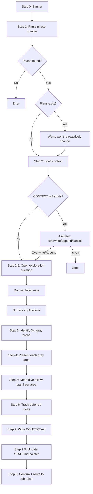

# Audit: /pbr:discuss

## Skill Overview
- Lines: 348 | CRITICAL markers: 0 | STOP markers: 1 (line 8, do-not-read)
- Agents spawned: None (runs inline)
- Hook coverage:
  - `check-skill-workflow.js` line 126: registered as read-only skill -- blocks writes outside `.planning/`
  - `check-plan-format.js`: may validate CONTEXT.md if it matches file patterns (needs verification)
  - No discuss-specific PostToolUse hooks

## Workflow Step Analysis

| Step | Description | Enforcement | Skip Risk | Hook Coverage |
|------|-------------|-------------|-----------|---------------|
| 0 | Display banner | None | Low | None |
| 1 | Parse phase number + validate | None | Low -- fails loudly | None |
| 1a | Check for existing plans (warn only) | None | Medium -- warning could be skipped | None |
| 2 | Load phase context (ROADMAP, prior SUMMARYs, REQUIREMENTS, existing CONTEXT.md) | None | Medium -- reading 4 sources is heavy | None |
| 2-CONTEXT | Handle existing CONTEXT.md (AskUserQuestion: overwrite/append/cancel) | None | Low -- user interaction | None |
| 2.5 | Open exploration phase (mental model question) | None | **HIGH** -- LLM may skip to gray areas | None |
| 2.5a | Domain-aware follow-ups (2-3 probes) | None | Medium | None |
| 2.5b | Surface implications | None | Medium | None |
| 2.5c | Let conversation reveal gray areas | None | Medium | None |
| 3 | Identify 3-4 gray areas | None | Medium -- analysis step | None |
| 4 | Present gray areas (AskUserQuestion per area) | None | Low -- user interaction | None |
| 5 | Deep-dive each area (4 follow-up questions) | None | **HIGH** -- 4 questions x N areas is tedious, LLM likely shortcuts | None |
| 6 | Capture deferred ideas | None | **HIGH** -- easy to forget this tracking step | None |
| 7 | Write CONTEXT.md | None | Medium -- core output | check-skill-workflow.js (write scope) |
| 7.5 | Update STATE.md pointer | None | **HIGH** -- easy to skip after main write | check-state-sync.js (indirect) |
| 8 | Confirm and route | None | Low | None |

## Enforcement Gaps

1. **No CRITICAL marker on CONTEXT.md write (Step 7)**: This is the sole output artifact of the entire skill. If the LLM produces a good conversation but skips the write, all decisions are lost.
   - **Fix**: Add `**CRITICAL**` marker before Step 7.

2. **No CRITICAL marker on STATE.md pointer update (Step 7.5)**: Without this pointer, `/pbr:resume` and `progress-tracker.js` won't know discussion decisions exist for this phase. This is an ordering dependency on Step 7.
   - **Fix**: Add `**CRITICAL**` marker before Step 7.5.

3. **Step 5 deep-dive is extremely high skip-risk**: The skill asks for 4 follow-up questions per gray area. With 3-4 gray areas, that's 12-16 questions. Under cognitive load, the LLM will almost certainly truncate this. The skill acknowledges this with "unless the user asks to skip" (line 317) but doesn't enforce any minimum.
   - **Fix**: Add a minimum of 1 follow-up per area with a CRITICAL marker. Make the remaining 3 optional but tracked. Consider reducing default to 2 follow-ups.

4. **Step 6 (deferred ideas) has no enforcement**: Tracking deferred ideas is crucial for preventing scope creep later, but it's a passive observation step with nothing enforcing it.
   - **Fix**: Add a CRITICAL marker: "CRITICAL -- Before writing CONTEXT.md, review conversation for deferred ideas. List at least one deferred item or explicitly state 'None deferred.'"

5. **No hook validates CONTEXT.md format**: While `check-plan-format.js` validates PLAN.md, SUMMARY.md, VERIFICATION.md, and STATE.md formats, CONTEXT.md is not in its validation list. A malformed CONTEXT.md would silently propagate to the planner.
   - **Fix**: Add CONTEXT.md validation to `check-plan-format.js` -- at minimum, check for required sections (Decision Summary, Locked Decisions, Deferred Ideas, Claude's Discretion).

6. **Step 2.5 (open exploration) is the newest addition and most likely to be skipped**: This step was added to improve discussion quality but has no enforcement. The LLM could jump directly from Step 2 to Step 3.
   - **Fix**: Add a CRITICAL marker: "CRITICAL -- Do NOT jump to gray areas. Ask the open question first."

## User-Facing Workflow Gaps

1. **No way to amend a single decision after CONTEXT.md is written**: The skill supports "Append" mode for existing CONTEXT.md, but this adds a full new amendment section. There's no lightweight way to change just one locked decision.
   - **Fix**: Consider adding a `/pbr:discuss amend <N> <decision-index>` flow, or document that individual decisions can be manually edited in the file.

2. **"Let Claude decide" creates invisible decisions**: When the user selects "Let Claude decide" on a gray area, the decision is deferred to planning time. The user has no visibility into what Claude actually chose until they read the PLAN.md.
   - **Fix**: Consider adding a step where "Claude's Discretion" items are summarized in the plan with rationale, and the plan skill surfaces them to the user.

3. **Discussion for phase with existing plans only warns**: Step 1a warns that "decisions won't retroactively change" existing plans, but doesn't offer to invalidate or re-plan. The user must manually run `/pbr:plan` after.
   - **Fix**: After writing CONTEXT.md, if plans already exist, offer: "Plans exist for this phase. Re-plan with new decisions? `/pbr:plan {N}`" -- this is already in the routing (Step 8), which is adequate.

4. **No progress indicator during long discussions**: With 3-4 gray areas and 4 follow-ups each, the discussion can take 15+ minutes. No progress indicator shows how far along the user is.
   - **Fix**: Add a progress line before each gray area: "Gray Area 2 of 4: ..."

## Agent Instruction Gaps

N/A -- this skill spawns no agents. However:

1. **Decision Summary format is underspecified for downstream consumers**: The Decision Summary (line 206) is described as "~300 tokens" and "injected into agent prompts by the plan skill." But the exact injection mechanism is not documented here, creating a coupling risk.
   - **Fix**: Reference the plan skill's CONTEXT.md loading step explicitly, or add a comment about the expected consumer.

## Mermaid Workflow Flowchart

## Priority Fixes
- [ ] P1: Add CRITICAL marker on CONTEXT.md write (Step 7) and STATE.md update (Step 7.5)
- [ ] P1: Add CRITICAL marker on Step 2.5 open exploration -- prevent jumping to gray areas
- [ ] P2: Add CONTEXT.md format validation to `check-plan-format.js`
- [ ] P2: Reduce deep-dive to 2 follow-ups default, with CRITICAL on at least 1 per area
- [ ] P2: Add CRITICAL marker on deferred ideas capture (Step 6)
- [ ] P3: Add progress indicator ("Gray Area N of M") before each presentation
