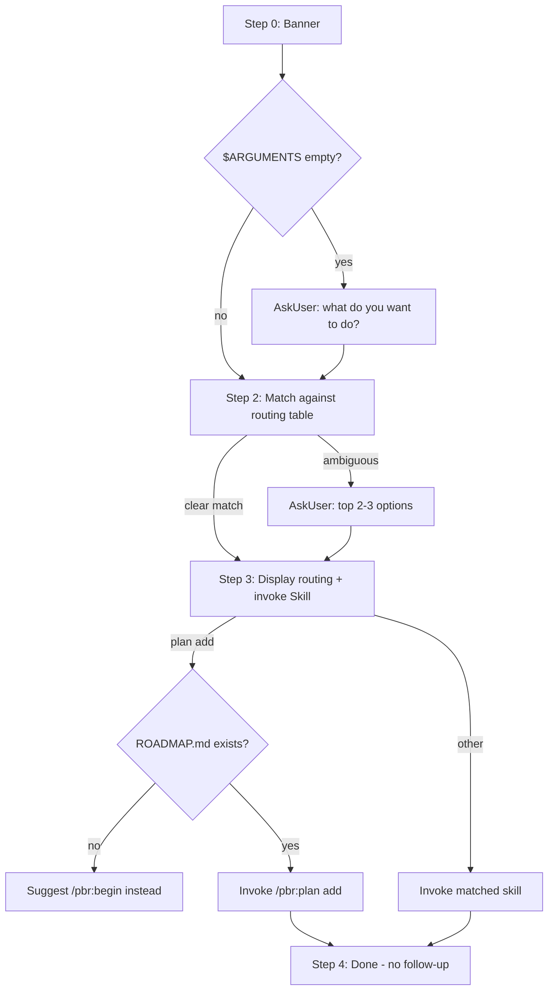

# Audit: /pbr:do

## Skill Overview
- Lines: 71 | CRITICAL markers: 0 | STOP markers: 1 (line 8, anti-re-read)
- Agents spawned: None directly — dispatches to other skills via `Skill` tool
- Hook coverage: validate-skill-args.js (only for /pbr:plan routing), check-skill-workflow.js (indirectly, via dispatched skill)
- Allowed tools: Read, Skill, AskUserQuestion

## Workflow Step Analysis
| Step | Description | Enforcement | Skip Risk | Hook Coverage |
|------|-------------|-------------|-----------|---------------|
| 0 | Display banner | None | Low | None |
| 1 | Validate input — AskUser if empty | None | Low | None |
| 2 | Analyze text against routing table | None | Medium — first-match routing could misroute; LLM may not follow table order | validate-skill-args.js (only /pbr:plan) |
| 3 | Confirm routing + invoke Skill | None | Low | None |
| 4 | No follow-up | None | Medium — LLM may add commentary after dispatch | None |

## Enforcement Gaps

1. **No ROADMAP.md check before routing to `/pbr:plan add` is not enforced.** Line 66 says "check if `.planning/ROADMAP.md` exists first" before routing to plan, but this is prompt-only with no CRITICAL marker. Under load, the LLM may skip this check and dispatch to plan, which then fails with a confusing error.
   - **Fix:** Add CRITICAL marker on the ROADMAP.md check for plan routing. Alternatively, `/pbr:plan add` should handle missing ROADMAP gracefully itself.

2. **Routing table order is prompt-only.** The instruction "Apply the first matching rule" (line 35) has no structural enforcement. The LLM could evaluate rules out of order, especially under cognitive load, causing bugs to be routed to `/pbr:quick` instead of `/pbr:debug`.
   - **Fix (P3):** Low risk since the routing table is simple and the Skill tool call makes the routing visible. The `validate-skill-args.js` hook catches the most critical misroute (freeform text to /pbr:plan).

3. **No enforcement that Step 4 (no follow-up) is respected.** Line 70 says "Do not add any additional output after the Skill tool call" but the LLM commonly adds a wrap-up message. This wastes tokens and confuses the user (they see two "completion" messages).
   - **Fix (P3):** Reinforce with: "STOP after the Skill tool call. Your turn ends here."

4. **Duplicate routing logic.** The routing table in `/pbr:do` (lines 37-45) duplicates `validate-skill-args.js` ROUTE_PATTERNS (lines 36-58). They use different matching logic — the skill uses semantic understanding while the hook uses regex. Drift between them could cause inconsistent behavior.
   - **Fix (P2):** Document the intentional duplication. The hook is a safety net for `/pbr:plan` misuse; the skill is the primary router. They serve different purposes.

## User-Facing Workflow Gaps

1. **No feedback on routing confidence.** The user sees "Routing to: /pbr:quick" but doesn't know if the LLM was confident or guessing. For ambiguous inputs, the user may be surprised by the route.
   - **Fix (P3):** The ambiguity handling (lines 46-52) already covers this — AskUser with top 2-3 options. No additional fix needed.

2. **No way to override routing.** If the user disagrees with the routing decision shown in Step 3, there's no "cancel" or "route differently" option. The Skill is invoked immediately after displaying the decision.
   - **Fix (P2):** Add a confirmation gate: "Route to {skill}? [Yes / Choose different]" via AskUserQuestion before invoking.

## Agent Instruction Gaps

N/A — no agents spawned directly. Dispatched skills handle their own agents.

## Mermaid Workflow Flowchart

## Priority Fixes
- [ ] P2: Add confirmation gate before invoking dispatched skill
- [ ] P2: Document intentional routing logic duplication with validate-skill-args.js
- [ ] P3: Add CRITICAL marker on ROADMAP.md check for plan routing
- [ ] P3: Add STOP marker after Skill tool call in Step 4
