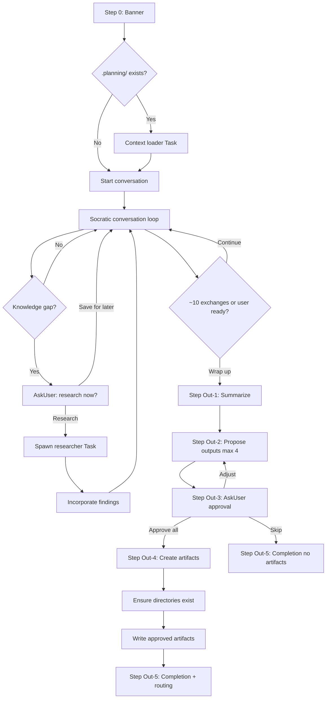

# Audit: /pbr:explore

## Skill Overview
- Lines: 381 | CRITICAL markers: 0 | STOP markers: 1 (line 8, do-not-read)
- Agents spawned: `pbr:researcher` (optional, mid-conversation), context-loader Task (optional, pre-conversation)
- Hook coverage:
  - `check-skill-workflow.js` line 128: registered as read-only skill -- blocks writes outside `.planning/`
  - No PostToolUse hooks validate explore-specific artifacts

## Workflow Step Analysis

| Step | Description | Enforcement | Skip Risk | Hook Coverage |
|------|-------------|-------------|-----------|---------------|
| 0 | Display banner | None | Low | None |
| Pre | Context loader Task (if `.planning/` exists) | None | Low -- optional | None |
| Conv | Socratic conversation (open-ended) | None | N/A -- interactive | None |
| Mid | Mid-conversation research (optional researcher spawn) | None | Low -- user-gated | validate-task.js |
| Context | Context pressure check (~10 exchanges) | None | **HIGH** -- LLM rarely self-monitors exchange count | None |
| Out-1 | Summarize insights | None | Medium | None |
| Out-2 | Propose outputs (max 4) | None | Medium | None |
| Out-3 | Confirm with AskUserQuestion | None | Low -- user interaction | None |
| Out-4 | Create artifacts | None | **HIGH** -- multi-type file creation | check-skill-workflow.js (write scope) |
| Out-4a | Directory creation before writes | None | **HIGH** -- no CRITICAL marker, line 212 | None |
| Out-5 | Completion banner + routing | None | Low | None |

## Enforcement Gaps

1. **No CRITICAL marker on artifact directory creation (Output Step 4, line 212)**: The skill says "Before writing any artifact, ensure the target directory exists" but has no CRITICAL marker. Per MEMORY.md, this is the #1 skip-risk pattern.
   - **Fix**: Add `**CRITICAL**` marker before the directory creation instruction at line 212.

2. **No CRITICAL marker on "do NOT create artifacts until user approves" (line 209)**: The instruction "Do NOT create any artifacts until the user selects 'Approve all'" is critical for preventing unauthorized writes, but has no enforcement marker.
   - **Fix**: Add `**CRITICAL -- HARD STOP**` before line 209.

3. **No hook validates that artifacts were actually created**: After the user approves outputs, there's no PostToolUse hook checking that the approved artifacts exist on disk. The skill could approve 3 artifacts but only create 1.
   - **Fix**: Add explore-specific validation in `check-subagent-output.js` or a new post-skill hook that compares approved vs created artifacts.

4. **Note filename format inconsistency (line 295)**: Explore uses `{NNN}-{slug}.md` for notes, but the note skill uses `{YYYY-MM-DD}-{slug}.md`. Both write to `.planning/notes/`. This creates a mixed-format directory.
   - **Fix**: Align to the note skill's `{YYYY-MM-DD}-{slug}.md` format. Update lines 293-306.

5. **Seed format has no validation**: Seeds (`.planning/seeds/SEED-{NNN}-{slug}.md`) are a unique artifact type only created by explore. No hook or other skill validates their format or existence.
   - **Fix**: Low priority -- seeds are a capture mechanism, not a workflow gate.

6. **Context pressure check is unenforceable (line 149-155)**: "After approximately 10 exchanges" is impossible for the LLM to track reliably. No hook counts exchanges.
   - **Fix**: Consider a PostToolUse hook that tracks exchange count via `.planning/.explore-exchanges` file, triggering a reminder at ~10.

## User-Facing Workflow Gaps

1. **No way to resume an interrupted explore session**: If the user runs `/clear` mid-conversation (before output routing), all conversation insights are lost. There's no checkpoint mechanism.
   - **Fix**: Consider auto-saving conversation summary to `.planning/notes/explore-draft-{date}.md` after every 5 exchanges, or suggest `/pbr:pause` proactively.

2. **"Skip" ends with no artifacts and no record**: If the user chooses "Skip" in Output Step 3, the entire exploration is lost. No note, no log, nothing.
   - **Fix**: When user selects "Skip", offer to save a brief summary as a note: "Save a one-line note about this exploration for future reference?"

3. **Research file format not shown to user**: When mid-conversation research completes, the user sees "results in .planning/research/{slug}.md" but has no visibility into what the researcher found without manually reading the file.
   - **Fix**: The skill already says to incorporate 2-3 key findings (line 141-142), which is good. No change needed.

4. **Output routing for seeds is unclear**: The seed format (lines 308-328) includes a `trigger` field referencing `{phase-slug}`, but the user may not know what phase slugs exist. No guidance is given.
   - **Fix**: When creating a seed, auto-populate the trigger field from ROADMAP.md phase list, or ask the user what condition should activate it.

## Agent Instruction Gaps

1. **Researcher agent receives minimal context**: The mid-conversation research prompt (lines 122-134) provides only a topic and output path. It doesn't pass the conversation context, user constraints from CONTEXT.md, or the explore skill's discovered insights so far. The researcher may duplicate or contradict conversation findings.
   - **Fix**: Include a brief (200-300 token) summary of the conversation's key points in the researcher prompt.

2. **Context loader Task has no failure recovery beyond a warning**: Line 362-363 says to display a warning and continue. This is good behavior but the warning message uses a special character (triangle warning) that may not render in all terminals.
   - **Fix**: Use ASCII-safe warning format consistent with other skills' error boxes.

## Mermaid Workflow Flowchart

## Priority Fixes
- [ ] P1: Add CRITICAL marker on directory creation before artifact writes (line 212)
- [ ] P1: Add CRITICAL/HARD STOP marker on "do not create artifacts until user approves" (line 209)
- [ ] P2: Fix note filename format to match note skill's `{YYYY-MM-DD}-{slug}.md` convention
- [ ] P2: Offer to save summary note when user chooses "Skip"
- [ ] P3: Include conversation summary in researcher agent prompts
- [ ] P3: Add explore-specific artifact validation hook
