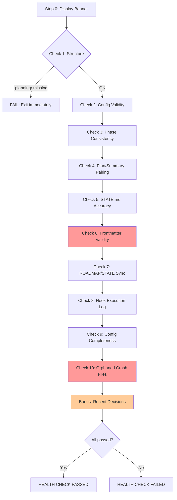

# Audit: /pbr:health

## Skill Overview
- Lines: 221 | CRITICAL markers: 0 | STOP markers: 1 (boilerplate only)
- Agents spawned: none (inline, read-only skill)
- Hook coverage: None. Health is a diagnostic tool that checks hook state but is not itself protected by hooks.

## Workflow Step Analysis

| Step | Description | Enforcement | Skip Risk | Hook Coverage |
|------|-------------|-------------|-----------|---------------|
| 0 | Display banner | None | Low | None |
| Check 1 | Structure (.planning/, STATE.md, config.json, ROADMAP.md) | None | Low (first check) | None |
| Check 2 | Config validity (JSON parse, required fields) | None | Low | None |
| Check 3 | Phase consistency (dirs vs ROADMAP.md) | None | Medium | None |
| Check 4 | Plan/Summary pairing | None | Medium | None |
| Check 5 | STATE.md accuracy (vs filesystem) | None | **Medium** | None |
| Check 6 | Frontmatter validity (all PLAN/SUMMARY files) | None | **High** | None |
| Check 7 | ROADMAP/STATE sync | None | **Medium** | None |
| Check 8 | Hook execution log | None | **Medium** | None |
| Check 9 | Config completeness | None | **Medium** | None |
| Check 10 | Orphaned crash recovery files | None | **High** | None |
| Bonus | Recent decisions from decisions.jsonl | None | **High** | None |
| Completion | Display branded result | None | Low | None |

## Enforcement Gaps

1. **No CRITICAL marker ensuring ALL 10 checks run.** The instruction says "Run all 10 checks in order" but under cognitive load, the LLM routinely drops later checks in a long sequence. Checks 6-10 and the Bonus are at highest risk. Empirically, the LLM will run 3-5 checks and then skip to the completion banner. **Fix:** Add CRITICAL marker at the top: "You MUST run ALL 10 checks. Do not display the completion banner until all 10 are complete." Add a CRITICAL marker before Check 6 as a mid-sequence reminder.

2. **Check 6 (Frontmatter validity) is the most expensive check.** It requires globbing all PLAN and SUMMARY files, reading each one's frontmatter, and validating YAML. In a large project (20+ plans), this consumes significant context. The LLM will skip it to save budget. **Fix:** Add CRITICAL marker. Consider suggesting `pbr-tools.js` for bulk frontmatter validation.

3. **Check 10 (Orphaned crash recovery files) is last and most skippable.** Orphaned `.PROGRESS-*` and `.checkpoint-manifest.json` files are real problems that cause build confusion. Being check #10, it's almost guaranteed to be skipped. **Fix:** Move it higher in the sequence (e.g., after Check 5) or add CRITICAL marker.

4. **No hook validates health check completeness.** Since health is read-only and does not modify files, there is no PostToolUse trigger to catch incomplete execution. The only output is the display, which is ephemeral. **Fix:** Acceptable for a read-only diagnostic, but consider having health write a `.planning/logs/health-check.jsonl` entry for audit trail.

5. **Check 8 references both `hooks.jsonl` and legacy `.hook-log` but the instructions for handling the legacy path are vague.** "Use whichever file exists (prefer hooks.jsonl)" does not handle the case where BOTH exist. **Fix:** Specify: "If both exist, only check hooks.jsonl (the logger migrated entries already)."

## User-Facing Workflow Gaps

1. **No severity-based summary.** The completion banner shows "{N} checks passed, {F} failures, {M} warnings" but does not prioritize which failures to fix first. A Check 1 failure (no .planning/ dir) is far more serious than a Check 9 warning (missing optional config field). **Fix:** Add severity levels to the summary or list failures in priority order.

2. **Check 1 early-exit prevents diagnosing partial corruption.** If `.planning/` is missing, health stops immediately. But if `.planning/` exists with only some files, Check 1 lists the missing files. However, subsequent checks may crash on missing files rather than gracefully handling them. **Fix:** Ensure Checks 2-10 gracefully handle missing prerequisite files (e.g., Check 7 should skip if ROADMAP.md does not exist, not error).

3. **No "fix all" option.** After displaying failures, the skill tells the user to fix things manually and re-run. For common issues (stale STATE.md, orphaned progress files), automated fixes would save time. The anti-pattern "DO NOT auto-repair anything" is too conservative for safe fixes like deleting orphaned `.PROGRESS-*` files. **Fix:** Consider a `--fix` flag for safe auto-repairs.

4. **Check 9 references specific config fields but the list may drift.** As new skills add config dependencies, Check 9's hardcoded list of fields will become stale. **Fix:** Reference a central config schema (config-schema.json already exists) rather than hardcoding field names in the skill.

## Agent Instruction Gaps

N/A -- this skill does not spawn agents.

## Mermaid Workflow Flowchart

## Priority Fixes
- [ ] P1: Add CRITICAL marker at top: "You MUST run ALL 10 checks before displaying results"
- [ ] P1: Add mid-sequence CRITICAL reminder before Check 6
- [ ] P2: Move Check 10 (orphaned files) higher in the sequence
- [ ] P2: Ensure Checks 2-10 gracefully handle missing prerequisite files
- [ ] P3: Consider `--fix` flag for safe auto-repairs (orphaned files, stale STATE.md)
- [ ] P3: Reference config-schema.json in Check 9 instead of hardcoded field list
- [ ] P3: Clarify Check 8 handling when both hooks.jsonl and .hook-log exist
