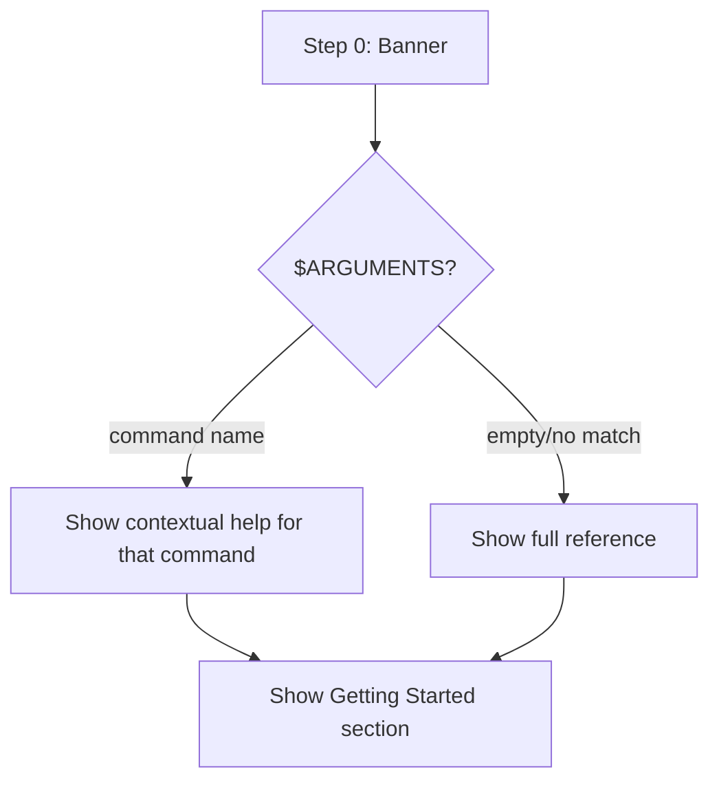

# Audit: /pbr:help

## Skill Overview
- Lines: 156 | CRITICAL markers: 0 | STOP markers: 1 (line 7, anti-re-read)
- Agents spawned: None
- Hook coverage: None — pure display skill, no writes
- Allowed tools: Read only

## Workflow Step Analysis
| Step | Description | Enforcement | Skip Risk | Hook Coverage |
|------|-------------|-------------|-----------|---------------|
| 0 | Display banner | None | Low (cosmetic) | None |
| 1 | Check $ARGUMENTS for command name | None | Low | None |
| — | If match: show contextual help | None | Low | None |
| — | If no match: show full reference | None | Low | None |

## Enforcement Gaps

1. **No enforcement needed.** This is a read-only display skill. It writes no files, spawns no agents, and modifies no state. The only tool allowed is `Read`. There is nothing to skip that would cause harm.

2. **Stale reference data.** The command tables (lines 40-102) are hardcoded in the SKILL.md prompt. When new skills are added or arguments change, this file must be manually updated. There's no hook or test that verifies help text matches actual skill definitions.
   - **Fix (P3):** Add a cross-reference test in `cross-plugin-compat.test.js` that verifies every skill directory has a matching entry in help's command tables.

3. **Contextual help matching is vague.** Line 25 says "Match the argument against the command tables below" but doesn't specify exact matching logic. The LLM could match "plan" to `/pbr:plan` or to the "Planning & Discovery" section header, producing different outputs.
   - **Fix (P3):** Specify: "Match against the first column of each table row. If the argument matches a command name (without the /pbr: prefix), show only that row and its subcommands."

## User-Facing Workflow Gaps

1. **No dynamic help.** Help doesn't read actual skill files to show current argument-hints or descriptions. If a skill's argument-hint changes, help shows stale info until manually updated.
   - **Fix (P3):** Low priority since help is rarely the source of truth — users learn from experience.

2. **No help for utility skills.** The help reference doesn't list `/pbr:do`, `/pbr:dashboard`, `/pbr:statusline`, or `/pbr:help` itself. Users can't discover these through the help system.
   - **Fix (P2):** Add a "Utility Commands" section listing do, dashboard, statusline, help.

## Agent Instruction Gaps

N/A — no agents spawned.

## Mermaid Workflow Flowchart

## Priority Fixes
- [ ] P2: Add utility commands (do, dashboard, statusline, help) to the reference tables
- [ ] P3: Add cross-reference test that help lists all registered skills
- [ ] P3: Clarify contextual help matching logic
