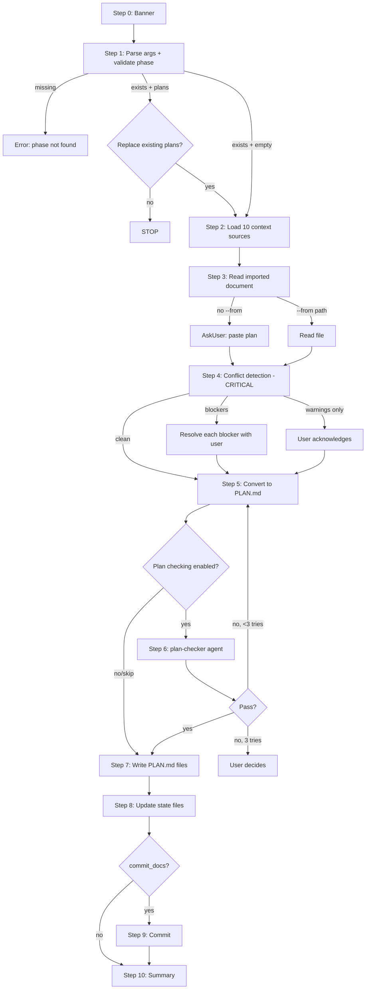

# Audit: /pbr:import

## Skill Overview
- Lines: 504 | CRITICAL markers: 1 (Step 4, line 108) | STOP markers: 1 (line 8, anti-re-read)
- Agents spawned: plan-checker (Step 6, conditional)
- Hook coverage: check-plan-format.js (validates PLAN.md writes), post-write-dispatch.js (STATE.md/ROADMAP.md writes), validate-task.js (plan-checker Task gate — but only if active-skill matches)

## Workflow Step Analysis
| Step | Description | Enforcement | Skip Risk | Hook Coverage |
|------|-------------|-------------|-----------|---------------|
| 0 | Display banner | None | Low | None |
| 1 | Parse args, validate phase exists | None | Low (early exit on error) | None |
| 2 | Load full project context (10 sources) | None | High — 10 context sources is heavy; LLM may skip seeds, notes, or todos | None |
| 3 | Read/parse imported document | None | Low (core task) | None |
| 4 | Conflict detection (6 BLOCKER + 7 WARNING + 3 INFO checks) | CRITICAL (line 108) | Medium — 16 checks is a lot; LLM may shortcut, especially INFO checks | None |
| 5 | Convert to PLAN.md format | None | Medium — complex format with YAML frontmatter + XML tasks; easy to produce malformed output | check-plan-format.js |
| 6 | Plan checker (conditional) | None | Medium — LLM may skip if `--skip-checker` logic is misread | validate-task.js (partial) |
| 7 | Write PLAN.md files | None | Low (core task) | check-plan-format.js |
| 8a | Update ROADMAP.md progress table | None | **High** — this is a side-effect that doesn't produce visible output; frequently skipped | post-write-dispatch.js (roadmap sync) |
| 8b | Update STATE.md | None | Medium | check-state-sync.js |
| 8c | Generate dependency fingerprints | None | **High** — complex side-effect, no hook validates fingerprints exist | None |
| 8d | Update CONTEXT.md (conditional) | None | Medium | None |
| 8e | Emit workflow event | None | Low (falls back silently) | None |
| 9 | Commit (conditional) | None | Low | validate-commit.js |
| 10 | Confirm summary | None | Low (cosmetic) | None |

## Enforcement Gaps

1. **Step 2: No CRITICAL marker on context loading.** Loading 10 context sources is the most cognitively demanding inline step. The LLM will frequently skip items 7-10 (research summary, seeds, pending todos, notes). These skips degrade conflict detection quality in Step 4.
   - **Fix:** Add CRITICAL marker: "CRITICAL: You MUST attempt to load ALL 10 sources. For missing files, log [SKIPPED] but do not skip the check."

2. **Step 4: 16 individual checks with no structural enforcement.** Despite the CRITICAL marker on the step, individual checks within it have no enforcement. The LLM may run BLOCKER checks but skip WARNING and INFO checks.
   - **Fix:** Add a mandatory checklist output before the report: "Before presenting the Conflict Detection Report, verify you checked: [B1] Locked decisions [B2] Deferred ideas ... [W7] Dependency ordering [I3] Prior patterns. Mark each CHECKED or N/A."

3. **Step 8a: ROADMAP.md update has no CRITICAL marker.** This is the highest-risk skip in the skill. If the roadmap isn't updated, `/pbr:status` shows stale progress, and downstream skills may misread phase readiness. The `post-write-dispatch.js` check-roadmap-sync validates consistency but only AFTER a write — if the step is skipped entirely, no write happens and no hook fires.
   - **Fix:** Add CRITICAL marker on Step 8a. Also consider: have `check-subagent-output.js` verify ROADMAP.md was touched when import skill completes.

4. **Step 8c: Dependency fingerprints have zero enforcement.** This is a complex calculation (file byte length + mtime) that the LLM will almost certainly skip or get wrong. No hook validates that fingerprints exist or are correct.
   - **Fix (P2):** Move fingerprint generation into `pbr-tools.js` as a CLI command (`pbr-tools.js plan fingerprint --phase N`). The skill just calls the command.

5. **No active-skill file written.** Import doesn't write `.planning/.active-skill`, so `validate-task.js` gate checks won't recognize it. The plan-checker Task() in Step 6 won't be validated by the skill-aware gates.
   - **Fix:** Add Step 0.5: Write `.planning/.active-skill` with content `import`. Add cleanup in error paths and Step 10.

6. **Step 5: PLAN.md naming convention not enforced.** The skill says to write `{phase}-{plan_num}-PLAN.md` but the CLAUDE.md memory says "Plan files MUST be named `PLAN-{NN}.md`". This contradiction could produce files that fail the build executor gate regex `/^PLAN.*\.md$/i`.
   - **Fix:** Clarify the naming convention. If import uses `{phase}-{plan_num}-PLAN.md`, update the build gate regex. Or standardize on `PLAN-{NN}.md`.

## User-Facing Workflow Gaps

1. **No partial import recovery.** If the skill fails at Step 5 or later, there's no way to resume. The user must re-run the entire import. Context loaded in Step 2 is lost.
   - **Fix (P3):** Write intermediate state (parsed document structure) to a temp file in `.planning/phases/{NN}-{slug}/` so re-runs can skip Steps 2-4.

2. **No preview before write.** The user sees the conflict detection report but never sees the generated PLAN.md content before it's written in Step 7. If the conversion was poor, they discover it only after the fact.
   - **Fix (P2):** Add a confirmation gate between Step 5 and Step 7: show plan summaries (names, task counts, wave structure) and ask "Write these plans?"

3. **Error for missing phase directory (Step 1, line 56) assumes directory pre-exists.** If the user runs `/pbr:import 3` but phase 3's directory hasn't been created yet (only exists in ROADMAP.md), the skill fails. No guidance on creating the directory.
   - **Fix:** Auto-create the phase directory if it exists in ROADMAP.md but not on disk.

## Agent Instruction Gaps

1. **Plan-checker prompt (lines 279-311) lacks explicit output format.** The prompt says "Return your structured report" but doesn't specify the format. The plan-checker agent has its own format, but the import-specific `<import_note>` additions could confuse it.
   - **Fix:** Add: "Output format: Follow your standard structured report format from your agent definition."

2. **Revision loop reference (line 316) is abstract.** The skill says "Reference: skills/shared/revision-loop.md" but doesn't inline the key parameters. Under cognitive load, the LLM may not read the shared fragment and instead improvise a revision loop that doesn't cap at 3 iterations.
   - **Fix:** Inline the cap: "Maximum 3 revision iterations. After 3 failures, escalate to user per the error in lines 481-493."

## Mermaid Workflow Flowchart

## Priority Fixes
- [ ] P1: Add CRITICAL marker on Step 8a (ROADMAP.md update) — highest skip risk
- [ ] P1: Write .active-skill file so validate-task.js gates work
- [ ] P1: Resolve PLAN.md naming convention conflict with build gate regex
- [ ] P2: Add CRITICAL marker on Step 2 context loading (10 sources)
- [ ] P2: Move dependency fingerprint generation to pbr-tools.js CLI command
- [ ] P2: Add user preview gate between Step 5 and Step 7
- [ ] P2: Inline revision loop cap (max 3 iterations) instead of referencing shared fragment
- [ ] P3: Add mandatory checklist output before conflict detection report
- [ ] P3: Auto-create phase directory if missing on disk but present in ROADMAP
