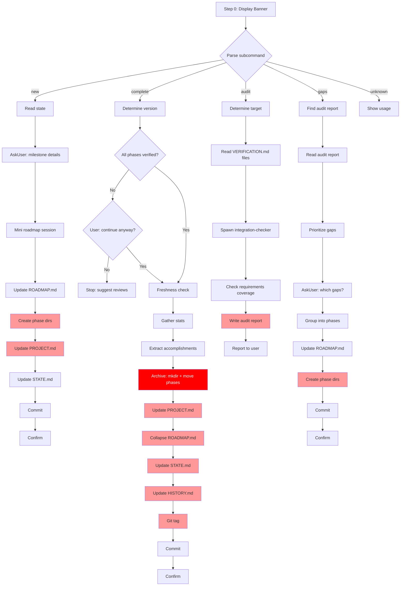

# Audit: /pbr:milestone

## Skill Overview
- Lines: 707 | CRITICAL markers: 0 | STOP markers: 1 (boilerplate only)
- Agents spawned: integration-checker (in `audit` subcommand only)
- Hook coverage: validate-task.js `checkMilestoneCompleteGate` (blocks milestone complete if phases lack VERIFICATION.md). validate-commit.js (format enforcement). check-state-sync.js (auto-syncs on SUMMARY/VERIFICATION writes, relevant to archive operations).

## Workflow Step Analysis

### Subcommand: `new`

| Step | Description | Enforcement | Skip Risk | Hook Coverage |
|------|-------------|-------------|-----------|---------------|
| 1 | Read current state (ROADMAP.md, STATE.md, PROJECT.md) | None | Low | None |
| 2 | Get milestone details via AskUserQuestion | None | Low | None |
| 3 | Determine phase numbering | None | Low | None |
| 4 | Mini roadmap session (ask about areas, requirements) | None | Medium | None |
| 5 | Update ROADMAP.md with new milestone section | **None** | **Medium** | **None** |
| 6 | Create phase directories | **None** | **HIGH** | **None** |
| 7 | Update PROJECT.md (create if needed) | **None** | **HIGH** | **None** |
| 8 | Update STATE.md | **None** | **Medium** | check-state-sync.js (partial) |
| 9 | Commit (if planning.commit_docs) | None | Medium | validate-commit.js |
| 10 | Confirm with branded output | None | Low | None |

### Subcommand: `complete`

| Step | Description | Enforcement | Skip Risk | Hook Coverage |
|------|-------------|-------------|-----------|---------------|
| 1 | Determine version | None | Low | None |
| 2 | Verify all phases complete (VERIFICATION.md check) | None | Medium | **validate-task.js** (blocks if missing) |
| 2-fresh | Timestamp freshness check | None | **HIGH** | **None** |
| 3 | Gather milestone stats (git log, diff) | None | **Medium** | None |
| 4 | Extract accomplishments from SUMMARY.md files | None | **Medium** | None |
| 5 | Archive milestone documents (create dirs, move phases) | **None** | **HIGH** | **None** |
| 6 | Update PROJECT.md | **None** | **HIGH** | **None** |
| 7 | Collapse completed phases in ROADMAP.md | **None** | **HIGH** | **None** |
| 7b | Update STATE.md | **None** | **Medium** | None |
| 7c | Update HISTORY.md | **None** | **HIGH** | **None** |
| 8 | Git tag | **None** | **HIGH** | **None** |
| 9 | Commit | None | Medium | validate-commit.js |
| 10 | Confirm | None | Low | None |

### Subcommand: `audit`

| Step | Description | Enforcement | Skip Risk | Hook Coverage |
|------|-------------|-------------|-----------|---------------|
| 1 | Determine target | None | Low | None |
| 2 | Read all VERIFICATION.md files | None | Low | None |
| 3 | Spawn integration-checker agent | None | Medium | check-subagent-output.js (generic) |
| 4 | Check requirements coverage | None | **Medium** | None |
| 5 | Write audit report | **None** | **Medium** | **None** |
| 6 | Report to user | None | Low | None |

### Subcommand: `gaps`

| Step | Description | Enforcement | Skip Risk | Hook Coverage |
|------|-------------|-------------|-----------|---------------|
| 1 | Find most recent audit | None | Low | None |
| 2 | Read audit report | None | Low | None |
| 3 | Prioritize gaps | None | Low | None |
| 4 | Present to user (AskUserQuestion) | None | Low | None |
| 5 | Group into logical phases | None | Medium | None |
| 6 | Update ROADMAP.md | **None** | **Medium** | **None** |
| 7 | Create phase directories | **None** | **HIGH** | **None** |
| 8 | Commit | None | Medium | validate-commit.js |
| 9 | Confirm | None | Low | None |

## Enforcement Gaps

1. **`complete` subcommand Steps 5-8 form a critical sequence with ZERO enforcement.** Archive creation (mkdir + move), PROJECT.md update, ROADMAP.md collapse, STATE.md update, HISTORY.md update, and git tag -- 6 consecutive file operations with no CRITICAL markers. This is the highest-risk sequence in all 6 audited skills. If ANY step is skipped, the milestone state becomes inconsistent. **Fix:** Add CRITICAL markers to EACH of Steps 5, 6, 7, 7b, 7c, and 8. Consider a post-completion validation step.

2. **`complete` Step 5 uses `move` (not copy) for phase directories.** Moving directories is destructive -- if the archive creation fails halfway, phases are lost from `.planning/phases/` without being archived. No rollback mechanism exists. **Fix:** Add CRITICAL marker with explicit instruction: "Verify the archive directory was created successfully BEFORE moving any phase directories." Consider copy-then-delete pattern.

3. **`complete` timestamp freshness check (Step 2-fresh) has no enforcement.** This check compares VERIFICATION.md timestamps against SUMMARY.md modifications to detect stale verifications. Complex logic + no CRITICAL marker = guaranteed skip. **Fix:** Add CRITICAL marker.

4. **`new` Step 6 (create phase directories) has no enforcement.** This is the same pattern as `/pbr:quick` where directory creation was skipped. The fix documented in MEMORY.md (CRITICAL markers + check-subagent-output.js) has not been applied here. **Fix:** Add CRITICAL marker. Extend check-subagent-output.js for milestone-new validation.

5. **`audit` Step 3 (spawn integration-checker) has no agent output validation specific to milestone audit.** check-subagent-output.js has no milestone-audit-specific checks. If the integration-checker returns garbage, nothing catches it. **Fix:** Add milestone-audit check to check-subagent-output.js that validates the audit report was written.

6. **`audit` Step 5 (write audit report) has no CRITICAL marker.** The audit report (`{version}-MILESTONE-AUDIT.md`) is the key output. Without it, `/pbr:milestone gaps` has nothing to work with, and `/pbr:status` cannot detect audit state. **Fix:** Add CRITICAL marker.

7. **`gaps` Steps 6-7 (ROADMAP.md update + directory creation) have no enforcement.** Same high-skip pattern as `new` and `complete`. **Fix:** Add CRITICAL markers.

8. **validate-task.js milestone gate only checks VERIFICATION.md existence, not content.** A VERIFICATION.md with `status: gaps_found` would pass the gate. The gate checks existence but not whether verification actually passed. **Fix:** Enhance the gate to check `status: passed` in VERIFICATION.md frontmatter.

## User-Facing Workflow Gaps

1. **`complete` has no rollback on partial failure.** If the LLM creates the archive, moves 3 of 5 phase directories, then crashes, the user has a half-migrated state with no recovery path. **Fix:** Add a pre-migration checklist or staging pattern. At minimum, document the recovery procedure.

2. **Version tag collision handling (edge case section) asks for alternative via AskUserQuestion but the tag check is not enforced.** The LLM may skip the `git tag` existence check and create a duplicate or fail. **Fix:** Add CRITICAL marker to tag existence check.

3. **`new` mini roadmap session (Step 4) is vague.** "Run a condensed version of /pbr:begin questioning flow" gives no specific structure. The LLM may ask too many or too few questions. **Fix:** Define the exact questions and format for the mini roadmap.

4. **`audit` spawns integration-checker but does not specify timeout or context budget.** Large milestones (8+ phases) could cause the agent to consume its entire context window without completing. The skill warns about this in edge cases but provides no enforcement. **Fix:** Add max-phase guidance to the agent prompt.

5. **No way to re-run a specific subcommand idempotently.** Running `complete` twice could create duplicate archives, double-move phases (failing on missing dirs), or create duplicate git tags. **Fix:** Add idempotency checks at the start of each subcommand.

## Agent Instruction Gaps

1. **Integration-checker agent prompt (audit Step 3) lacks output format specification.** The prompt says "Return findings as a structured report" but does not define the structure. The agent may return prose, JSON, markdown, or anything else. **Fix:** Define expected output format (e.g., "Write findings to `.planning/{version}-MILESTONE-AUDIT.md` with the following sections: ...").

2. **Integration-checker prompt does not specify which files to READ vs skim.** "Read all SUMMARY.md files" could mean full content or frontmatter only. For large milestones, full reads waste agent context. **Fix:** Specify "Read SUMMARY.md frontmatter (provides, affects, requires fields) -- do not read full content."

3. **Integration-checker has no explicit instruction to check for API contract mismatches.** The prompt mentions it as item 4d but gives no guidance on HOW to detect mismatches. The agent will likely skip this vague instruction. **Fix:** Provide concrete examples of what constitutes a mismatch.

## Mermaid Workflow Flowchart

## Priority Fixes
- [ ] P1: Add CRITICAL markers to `complete` Steps 5-8 (archive, PROJECT.md, ROADMAP.md, STATE.md, HISTORY.md, git tag) -- highest risk sequence
- [ ] P1: Add safety check to `complete` Step 5: verify archive dir exists BEFORE moving phases (destructive move)
- [ ] P1: Enhance validate-task.js milestone gate to check VERIFICATION.md `status: passed`, not just existence
- [ ] P2: Add CRITICAL markers to `new` Steps 5-7 (ROADMAP.md, dirs, PROJECT.md)
- [ ] P2: Add CRITICAL marker to `audit` Step 5 (audit report write) and Step 3 agent spawn
- [ ] P2: Add CRITICAL marker to `complete` timestamp freshness check
- [ ] P2: Define explicit output format for integration-checker agent prompt
- [ ] P2: Add idempotency checks to `complete` (detect already-archived milestones)
- [ ] P3: Add CRITICAL markers to `gaps` Steps 6-7
- [ ] P3: Add milestone-audit-specific validation to check-subagent-output.js
- [ ] P3: Provide rollback guidance for partial `complete` failures
