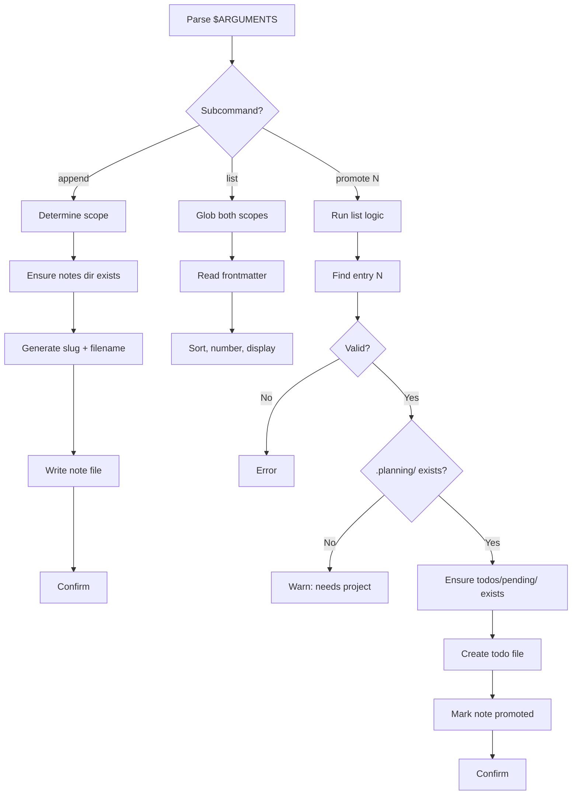

# Audit: /pbr:note

## Skill Overview
- Lines: 218 | CRITICAL markers: 1 (line 65, subcommand parsing) | STOP markers: 1 (line 8, do-not-read)
- Agents spawned: None (runs inline)
- Hook coverage: **None** -- note is not listed in `check-skill-workflow.js` switch statement (lines 114-132), so no `.active-skill` enforcement applies. No PreToolUse or PostToolUse hooks validate note behavior.

## Workflow Step Analysis

### Subcommand: append
| Step | Description | Enforcement | Skip Risk | Hook Coverage |
|------|-------------|-------------|-----------|---------------|
| 0 | Display banner | None | Low (cosmetic) | None |
| 1 | Determine scope (project vs global) | None | Low | None |
| 2 | Ensure notes directory exists | None | **HIGH** -- directory creation is the #1 skip-risk per MEMORY.md | None |
| 3 | Generate slug from note text | None | Low | None |
| 4 | Generate filename with dedup | None | Medium -- dedup logic could be skipped | None |
| 5 | Write file with frontmatter | None | Medium | None |
| 6 | Confirm with one line | None | Low | None |

### Subcommand: list
| Step | Description | Enforcement | Skip Risk | Hook Coverage |
|------|-------------|-------------|-----------|---------------|
| 1 | Glob project notes | None | Low | None |
| 2 | Glob global notes | None | Low | None |
| 3 | Read frontmatter | None | Medium -- LLM may read full files | None |
| 4 | Exclude promoted notes from count | None | Medium | None |
| 5 | Sort and number | None | Low | None |
| 6 | Cap at 10 if >20 | None | Medium | None |

### Subcommand: promote
| Step | Description | Enforcement | Skip Risk | Hook Coverage |
|------|-------------|-------------|-----------|---------------|
| 1 | Run list logic | None | Low | None |
| 2 | Find entry N | None | Low | None |
| 3 | Validate N | None | Low | None |
| 4 | Check `.planning/` exists | None | Medium | None |
| 5 | Ensure `.planning/todos/pending/` exists | None | **HIGH** -- directory creation | None |
| 6 | Generate todo ID (scan both pending+done) | None | Medium -- could miscount | None |
| 7 | Extract note text | None | Low | None |
| 8 | Create todo file | None | **HIGH** -- file creation | None |
| 9 | Mark source note as promoted | None | **HIGH** -- file mutation | None |
| 10 | Confirm | None | Low | None |

## Enforcement Gaps

1. **No `.active-skill` integration**: The note skill is not registered in `check-skill-workflow.js`. It cannot be enforced by any PreToolUse hook. Since it runs inline (no Task), this is less critical than agent-spawning skills, but it means the note skill could write anywhere on disk without constraint.
   - **Fix**: Add `'note'` to the switch in `check-skill-workflow.js` mapped to `checkReadOnlySkillRules` -- note should only write to `.planning/notes/` and `~/.claude/notes/`.

2. **No CRITICAL marker on directory creation (append Step 2, promote Step 5)**: Both `mkdir` for notes directory and `mkdir` for todos/pending are high skip-risk operations with no enforcement markers.
   - **Fix**: Add `**CRITICAL**` markers before Steps 2 and 5 in the respective subcommands.

3. **No CRITICAL marker on promote file creation (Step 8)**: Creating the todo file is the core action of promote. If skipped, the note is not promoted but Step 9 could still mark it as promoted, creating an inconsistent state.
   - **Fix**: Add `**CRITICAL**` marker and make Step 9 contingent on Step 8 success.

4. **Note filename format mismatch with explore skill**: The note skill uses `{YYYY-MM-DD}-{slug}.md` (line 78), but the explore skill's note output uses `{NNN}-{slug}.md` (line 295). These are incompatible naming conventions in the same directory.
   - **Fix**: Align both to the same format. The note skill's date-based format is more canonical; update explore's Output Formats section.

5. **No validation of `--global` stripping**: If `--global` appears mid-word (e.g., `my--globalidea`), the stripping logic is undefined. The skill says "strip from anywhere" but doesn't specify word-boundary matching.
   - **Fix**: Specify `--global` must be a standalone token (whitespace-bounded).

## User-Facing Workflow Gaps

1. **No recovery path for promote failure**: If the todo file write fails (Step 8), the error handling section only covers "Write failure" generically. The note could be left in an inconsistent state (partially promoted).
   - **Fix**: Add explicit rollback guidance -- if todo write fails, do NOT update the source note's promoted status.

2. **`list` with many notes is slow**: The skill reads frontmatter from every note file. With hundreds of notes across both scopes, this could be slow with no progress indication.
   - **Fix**: Add a "Reading N notes..." message for large collections (>10 files).

3. **No way to delete or archive notes**: The skill has append, list, and promote, but no way to remove or archive old notes. Over time, the notes directory will grow unbounded.
   - **Fix**: Consider adding a `clean` subcommand or mention that users can manually delete files.

## Agent Instruction Gaps

N/A -- this skill spawns no agents.

## Mermaid Workflow Flowchart

## Priority Fixes
- [ ] P1: Add CRITICAL markers on directory creation steps (append Step 2, promote Step 5) and todo file creation (promote Step 8)
- [ ] P2: Register note skill in `check-skill-workflow.js` to constrain writes to notes directories only
- [ ] P2: Fix note filename format mismatch between note skill and explore skill
- [ ] P3: Add rollback logic to promote -- do not mark as promoted if todo write fails
- [ ] P3: Specify `--global` as whitespace-bounded token
