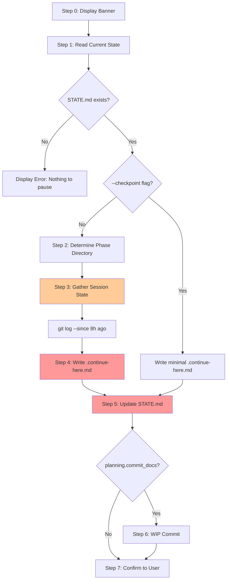

# Audit: /pbr:pause

## Skill Overview
- Lines: 249 | CRITICAL markers: 0 | STOP markers: 1 (boilerplate only)
- Agents spawned: none (inline skill)
- Hook coverage: check-state-sync.js (fires on STATE.md writes but only for SUMMARY/VERIFICATION triggers -- does NOT fire on pause STATE.md updates). validate-commit.js (validates WIP commit format). No hooks validate .continue-here.md creation.

## Workflow Step Analysis

| Step | Description | Enforcement | Skip Risk | Hook Coverage |
|------|-------------|-------------|-----------|---------------|
| 0 | Display banner | None | Low | None |
| 1 | Read current state (STATE.md, config.json, ROADMAP.md) | None | Low | None |
| 1-flag | Handle `--checkpoint` flag for lightweight dump | None | Medium | None |
| 2 | Determine current phase directory | None | Low | None |
| 3 | Gather session state (position, completed work, remaining, decisions, blockers, next steps) | None | **Medium** | None |
| 3-git | Run `git log --oneline -20 --since="8 hours ago"` | None | **Medium** | None |
| 4 | Write .continue-here.md to phase directory | **None** | **HIGH** | **None** |
| 5 | Update STATE.md Session Continuity section | **None** | **HIGH** | **None** |
| 6 | Commit as WIP (if planning.commit_docs: true) | None | **Medium** | validate-commit.js (format only) |
| 7 | Confirm to user | None | Low | None |

## Enforcement Gaps

1. **Step 4 (.continue-here.md write) has no CRITICAL marker.** This is THE core artifact of the pause skill. If skipped, `/pbr:resume` has nothing to work with. The file write involves reading a template (`continue-here.md.tmpl`), filling in variables, and writing to a specific path. This is a classic high-skip-risk pattern (template + variable substitution + write). **Fix:** Add CRITICAL marker: "You MUST write .continue-here.md. If this file is not created, /pbr:resume will not work."

2. **Step 5 (STATE.md update) has no CRITICAL marker.** The Session Continuity section update is what progress-tracker.js reads on the next SessionStart. Without it, the user loses the "Last Session" context injection. **Fix:** Add CRITICAL marker.

3. **No hook validates that .continue-here.md was actually created.** Unlike build artifacts (checked by check-subagent-output.js), pause artifacts have zero hook coverage. If the LLM skips the write, nothing catches it. **Fix:** Add a post-pause check -- either extend check-subagent-output.js or add a PostToolUse check that fires after the pause skill's active-skill period.

4. **Step 3 gathering is complex and partially skippable.** Six categories of information (position, completed work, remaining, decisions, blockers, next steps) must be gathered from multiple sources. The git log step is especially likely to be skipped. **Fix:** Add CRITICAL marker to the entire Step 3 with emphasis on the git log sub-step.

5. **Step 6 WIP commit has an ordering dependency on Steps 4-5.** The commit must come AFTER both writes, but there is no enforcement of this ordering. If the LLM commits before writing, the commit will be empty or incomplete. **Fix:** Add explicit ordering note: "Steps 4 and 5 MUST complete before Step 6."

6. **`--checkpoint` flag handling is undefined.** Step 1 says "Perform a lightweight state dump" but provides no template or format for the minimal .continue-here.md. The LLM must improvise. **Fix:** Define the minimal checkpoint format explicitly.

## User-Facing Workflow Gaps

1. **No indication if pause was incomplete.** If the LLM creates .continue-here.md but crashes before updating STATE.md, the user has no way to know. The confirmation banner (Step 7) is displayed only if all steps complete, but there is no partial-success handling. **Fix:** Display partial success if .continue-here.md was written but STATE.md was not updated.

2. **Phase directory determination (Step 2) can fail silently.** If STATE.md references a phase that does not exist in `.planning/phases/`, the skill falls back to "most recently modified phase directory." This fallback is not communicated to the user. **Fix:** Warn the user when falling back.

3. **Overwriting existing .continue-here.md is silent.** The edge case section says "Always REPLACE" but does not warn the user that a previous pause state is being overwritten. If the user pauses twice without resuming, the first pause state is lost. **Fix:** Display a note: "Replacing existing pause state from {date}."

4. **No validation that the template file exists.** Step 4 says "Read `skills/pause/templates/continue-here.md.tmpl`" but does not handle the case where the template is missing. **Fix:** Add fallback for missing template.

## Agent Instruction Gaps

N/A -- this skill does not spawn agents.

## Mermaid Workflow Flowchart

## Priority Fixes
- [ ] P1: Add CRITICAL marker to Step 4 (.continue-here.md write) -- core artifact
- [ ] P1: Add CRITICAL marker to Step 5 (STATE.md Session Continuity update)
- [ ] P2: Add post-pause hook validation (check .continue-here.md exists)
- [ ] P2: Add CRITICAL marker to Step 3 (session state gathering, esp. git log)
- [ ] P2: Define explicit minimal format for `--checkpoint` flag
- [ ] P3: Add explicit ordering enforcement: Steps 4-5 before Step 6
- [ ] P3: Warn user when overwriting existing .continue-here.md
