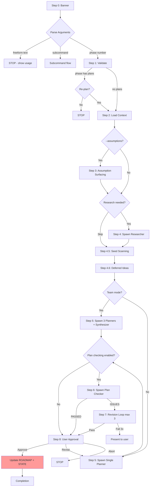

# Audit: /pbr:plan

## Skill Overview
- Lines: 688 | CRITICAL markers: 1 (line 69, freeform text guard) | STOP markers: 2 (lines 8, 71)
- Agents spawned: pbr:researcher (Step 4), pbr:planner (Step 5), pbr:plan-checker (Step 6), pbr:synthesizer (team mode)
- Hook coverage: validate-task.js (checkPlanExecutorGate blocks executor spawning during plan, checkActiveSkillIntegrity advisory), check-subagent-output.js (plan+researcher, planner output check)

## Workflow Step Analysis
| Step | Description | Enforcement | Skip Risk | Hook Coverage |
|------|-------------|-------------|-----------|---------------|
| 0 | Display banner | None | Low | None |
| Arg | Freeform text guard | CRITICAL (line 69) | Low | None |
| 1 | Parse and validate | None | Low | None |
| 1.6 | CONTEXT.md existence check | None | Medium | None |
| 2 | Load context | None | Low | None |
| 3 | Assumption surfacing (--assumptions) | None | Low | None |
| 4 | Phase research (conditional) | None | Low | check-subagent-output.js (researcher) |
| 4.5 | Seed scanning | None | Medium | None |
| 4.6 | Surface deferred ideas | None | Medium | None |
| 5 | Spawn planner | None | Low | check-subagent-output.js (planner), checkPlanExecutorGate |
| 5-team | Team mode (3 planners + synthesizer) | None | Medium | check-subagent-output.js (planner) |
| 6 | Plan validation (plan-checker) | None | Low | check-subagent-output.js (plan-checker) |
| 7 | Revision loop (max 3) | None | Low | None |
| 8 | User approval + state updates | None | **HIGH** | None |
| 8-roadmap | Update ROADMAP.md progress | None | **HIGH** | check-roadmap-sync.js (post-write) |
| 8-state | Update STATE.md | None | Medium | check-state-sync.js (post-write) |
| 8-chain | Auto-advance to build | None | Low | None |

## Enforcement Gaps

1. **No .active-skill write for plan skill.** The plan skill never writes `.planning/.active-skill` with `plan`. The `checkPlanExecutorGate` in validate-task.js relies on this file existing with value "plan" to block executor spawning. Without it, the gate is silently disabled.
   - **Fix**: Add `.active-skill` write at the start of Step 1, and cleanup on skill exit.

2. **Step 8 ROADMAP.md update lacks CRITICAL marker.** Line 478 says "REQUIRED -- do this BEFORE updating STATE.md" but has no CRITICAL/STOP marker. If skipped, ROADMAP.md progress table becomes stale. The post-write hook `check-roadmap-sync.js` catches this only AFTER the write happens -- it cannot catch a skipped write.
   - **Fix**: Add CRITICAL marker before ROADMAP.md update in Step 8.

3. **No hook validates planner output file naming.** Per CLAUDE.md memory: "Plan files MUST be named `PLAN-{NN}.md`... The `checkBuildExecutorGate` regex `/^PLAN.*\.md$/i` requires the filename to START with 'PLAN'." But check-subagent-output.js only checks that ANY file matching `/^PLAN.*\.md$/i` exists -- it does not validate the naming convention. If the planner produces `03-01-PLAN.md` instead of `PLAN-01.md`, the build gate passes but the file name violates convention.
   - **Fix**: Add naming validation in check-subagent-output.js for planner output.

4. **Seed scanning (Step 4.5) has no hook coverage.** Seeds could be malformed or contain contradictory instructions, but there is no validation of seed content before passing to planner.
   - **Fix**: Low priority -- seeds are user-created. Consider adding frontmatter validation.

5. **Dependency fingerprinting (Step 8 approval path) is complex and undone if skipped.** Lines 468-477 describe fingerprinting logic within the approval flow. If the orchestrator reaches "Approve" but skips fingerprinting, the build skill's staleness check falls back to timestamp comparison (less reliable).
   - **Fix**: Add CRITICAL marker to dependency fingerprinting block.

6. **Team mode (Step 5-team) has no unique hook coverage.** When 3 planners are spawned, check-subagent-output.js validates that PLAN files exist, but does not check that team output files (`team/architect-PLAN.md`, etc.) exist before the synthesizer is spawned.
   - **Fix**: Add team-mode output validation before synthesizer spawn.

7. **Subcommands (add/insert/remove) have no hook enforcement.** These modify ROADMAP.md and create/delete phase directories but have zero CRITICAL markers and no hook safety nets. Phase renumbering during `remove` is especially risky.
   - **Fix**: Add CRITICAL markers to subcommand file operations. Consider a pre-write hook for ROADMAP.md structural changes.

## User-Facing Workflow Gaps

1. **No feedback on plan-checker skip.** When `features.plan_checking: false`, the user gets no indication that validation was skipped. They may assume plans were validated.
   - **Fix**: Display "Plan checking skipped (depth: {depth})" when the step is skipped.

2. **Revision loop has no user visibility.** Step 7 references `skills/shared/revision-loop.md` but the user sees no progress during iterations. After 3 failures, the error message is clear, but mid-loop there is no indication of which iteration is running.
   - **Fix**: Display iteration counter: "Revision attempt {N}/3..."

3. **`/pbr:plan remove` with dependencies is risky.** Line 535 says "No other phases depend on this phase (or user confirms breaking dependencies)." The "or user confirms" path means a user can break the dependency graph with a single confirmation. There is no mechanism to automatically update dependent phases' plans.
   - **Fix**: When removing a phase with dependents, require updating or re-planning all dependent phases.

## Agent Instruction Gaps

1. **Planner receives no explicit instruction about PLAN file naming convention.** The planner agent definition (line 30) says "Produce executable plan files at `.planning/phases/{NN}-{phase-name}/{phase}-{NN}-PLAN.md`" which uses the `{phase}-{NN}-PLAN.md` pattern. But CLAUDE.md memory says files MUST be named `PLAN-{NN}.md`. These are contradictory.
   - **Fix**: Align planner agent definition with the required naming convention. Update planner.md line 30.

2. **Plan-checker has no explicit instruction about complexity attribute validation.** The planner assigns `complexity` to every task, but the plan-checker's 9 dimensions don't check for complexity attribute presence or correctness.
   - **Fix**: Add a D2 sub-check for `complexity` attribute presence.

3. **Gap closure prompt may produce plans with wrong numbering.** The gap closure planner (via `gap-closure-prompt.md.tmpl`) is told to "increment plan numbers from existing plans" but receives no explicit list of existing plan IDs to avoid collisions.
   - **Fix**: Include explicit list of existing plan IDs in the gap closure prompt.

## Mermaid Workflow Flowchart

## Priority Fixes
- [ ] P1: Write `.planning/.active-skill` with `plan` at Step 1 start (enables checkPlanExecutorGate)
- [ ] P1: Align planner agent PLAN file naming convention with `PLAN-{NN}.md` pattern
- [ ] P2: Add CRITICAL marker to Step 8 ROADMAP.md update
- [ ] P2: Add CRITICAL marker to dependency fingerprinting in Step 8
- [ ] P2: Add CRITICAL markers to subcommand file operations (add/insert/remove)
- [ ] P3: Display "Plan checking skipped" message when feature disabled
- [ ] P3: Add complexity attribute validation to plan-checker D2
