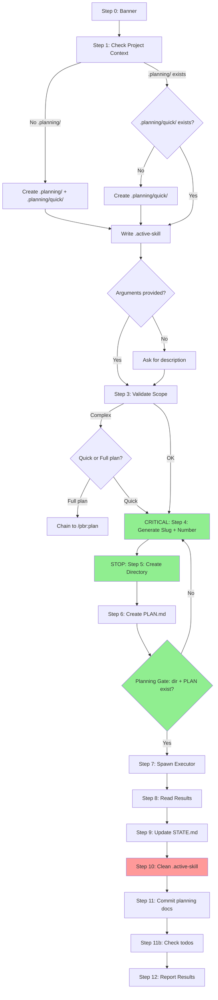

# Audit: /pbr:quick

## Skill Overview
- Lines: 381 | CRITICAL markers: 1 (line 95, Steps 4-6 gate) | STOP markers: 2 (lines 7, 112)
- Agents spawned: pbr:executor (Step 7)
- Hook coverage: validate-task.js (checkQuickExecutorGate blocks executor without PLAN.md), check-subagent-output.js (executor SUMMARY check)

## Workflow Step Analysis
| Step | Description | Enforcement | Skip Risk | Hook Coverage |
|------|-------------|-------------|-----------|---------------|
| 0 | Display banner | None | Low | None |
| 1 | Check project context | None | Medium | None |
| 1.2 | Create .planning/quick/ if missing | None | Medium | checkQuickExecutorGate (blocks if missing) |
| 1.3 | Write .active-skill | None | Medium | checkActiveSkillIntegrity (advisory) |
| 2 | Get task description | None | Low | None |
| 3 | Validate scope | None | Low | None |
| 4 | Generate slug + task number | CRITICAL (line 95) | Low | None |
| 5 | Create quick task directory | STOP (line 112) | Low | checkQuickExecutorGate |
| 6 | Create PLAN.md | None | Low | checkQuickExecutorGate |
| 6-gate | Planning gate verification | None | Medium | checkQuickExecutorGate |
| 7 | Spawn executor | None | Low | checkQuickExecutorGate |
| 7-pre | Pre-spawn plan check | None | Medium | checkQuickExecutorGate |
| 8 | Read results | None | Low | check-subagent-output.js |
| 9 | Update STATE.md | None | Medium | check-state-sync.js |
| 10 | Clean up .active-skill | None | **HIGH** | None |
| 11 | Commit planning docs | None | Medium | validate-commit.js |
| 11b | Check pending todos | None | Medium | None |
| 12 | Report results + artifact check | None | Medium | None |

## Enforcement Gaps

1. **Best-in-class enforcement for Steps 4-6.** The CRITICAL marker at line 95 plus the STOP marker at line 112 plus the checkQuickExecutorGate hook create triple-layer defense against the #1 failure mode (skipping directory/plan creation). This is the gold standard for PBR enforcement.

2. **Step 10 (.active-skill cleanup) has no enforcement.** If the skill crashes or aborts before Step 10, `.planning/.active-skill` contains `quick`, which could interfere with subsequent skills. There's no hook to clean up stale .active-skill files.
   - **Fix**: Add a session-end or skill-exit hook that cleans up stale `.active-skill` files. OR add a timeout-based staleness check.

3. **Step 9 STATE.md update has no CRITICAL marker.** If skipped, the quick task tracker table in STATE.md is incomplete. The artifact check in Step 12 catches missing STATE.md entries (line 244), but this is a prompt-based recovery, not hook-enforced.
   - **Fix**: Add CRITICAL marker to Step 9.

4. **Step 11 commit planning docs has no enforcement.** If `planning.commit_docs: true` but the commit is skipped, quick task artifacts remain uncommitted. No hook validates this.
   - **Fix**: Low priority -- the commit is optional based on config.

5. **Step 1 directory creation has no CRITICAL marker.** Lines 50-52 describe creating both `.planning/` and `.planning/quick/` when no project exists. If `.planning/` creation fails but `.planning/quick/` creation is attempted, you get an error. The checkQuickExecutorGate covers `.planning/quick/` existence but not `.planning/`.
   - **Fix**: Add error handling for `.planning/` creation failure.

6. **No validation of executor SUMMARY.md content quality.** check-subagent-output.js checks existence but not that the SUMMARY has valid frontmatter, task count, or commit hashes. The quick skill's Step 12 artifact check partially covers this (lines 241-247).
   - **Fix**: check-subagent-output.js already checks SUMMARY commits for build+executor (line 277). Extend to quick+executor.

## User-Facing Workflow Gaps

1. **No way to re-run a specific failed quick task.** The "partial" and "failed" outputs suggest `/pbr:quick` to retry, but this creates a NEW quick task rather than re-running the failed one. The user would need to manually copy the task description.
   - **Fix**: Add `/pbr:quick retry {NNN}` subcommand that re-uses the existing PLAN.md.

2. **Scope validation (Step 3) is subjective.** "More than ~5 files" and "significant architectural decisions" are LLM judgment calls. Two invocations of the same task might get different scope assessments.
   - **Fix**: Add objective heuristics: count file mentions in description, check for multi-directory paths.

3. **No preview of generated PLAN.md before executor spawns.** Unlike the plan skill which shows plans for approval, quick goes straight from PLAN.md generation to execution. If the generated plan is wrong, the executor wastes a full context window.
   - **Fix**: In interactive mode, briefly display the generated plan: "Generated plan with {N} tasks. Proceeding..." with option to review.

4. **Quick task numbering can collide.** If two concurrent sessions both run `/pbr:quick`, they scan `.planning/quick/` at the same time and may get the same NNN number. No locking mechanism.
   - **Fix**: Use a lock file or atomic directory creation to prevent collisions.

## Agent Instruction Gaps

1. **Executor prompt is minimal.** Lines 159-173 show a ~12-line prompt. Compared to build's ~50-line executor prompt (with context files, prior work, etc.), the quick executor lacks:
   - Project context file paths
   - CONTEXT.md reference (locked decisions)
   - Platform information
   This means the quick executor may make decisions that contradict locked decisions.
   - **Fix**: Include CONTEXT.md path and platform info in the quick executor prompt.

2. **Commit format uses `fix(quick-{NNN})` as default.** Line 169: "Commit format: fix(quick-{NNN}): {description} (or feat/refactor/test as appropriate)". Using `fix` as default may produce incorrect commit types for feature additions.
   - **Fix**: Determine commit type from task nature (the table at lines 329-336) and pass it explicitly.

3. **Executor receives no information about project tech stack.** Unlike build executors who get config, prior summaries, and context files, quick executors are told only "Execute now." They must infer the tech stack from the codebase.
   - **Fix**: Include tech stack hints from config.json or package.json in the prompt.

## Mermaid Workflow Flowchart

Note: Green nodes have CRITICAL/STOP enforcement + hook backup. Red node lacks enforcement.

## Priority Fixes
- [ ] P1: Add .active-skill cleanup to all exit paths (success, partial, failure, error) -- currently Step 10 is the only path
- [ ] P2: Extend check-subagent-output.js SUMMARY commit check to quick+executor (not just build+executor)
- [ ] P2: Include CONTEXT.md path and platform info in quick executor prompt
- [ ] P2: Add CRITICAL marker to Step 9 (STATE.md update)
- [ ] P3: Add `/pbr:quick retry {NNN}` subcommand for re-running failed tasks
- [ ] P3: Add brief plan preview before executor spawn in interactive mode
- [ ] P3: Fix concurrent numbering collision risk
