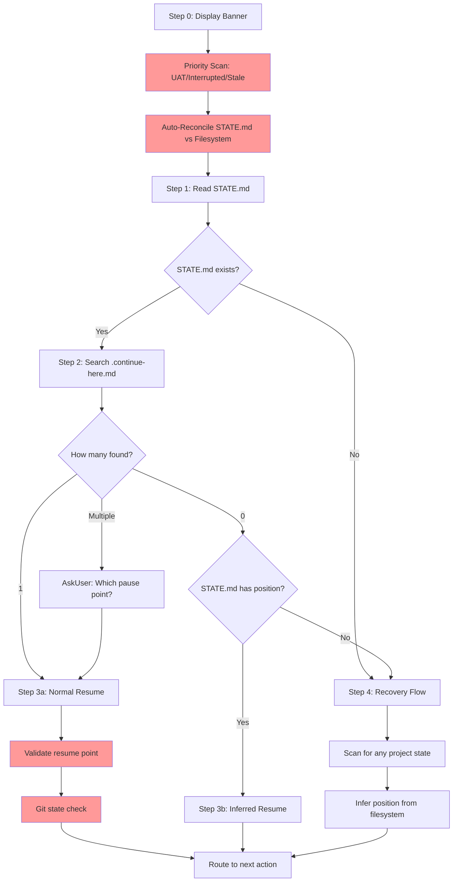

# Audit: /pbr:resume

## Skill Overview
- Lines: 402 | CRITICAL markers: 0 | STOP markers: 1 (boilerplate only)
- Agents spawned: none (inline skill)
- Hook coverage: progress-tracker.js (SessionStart) injects state including `.continue-here.md` detection. check-state-sync.js fires if resume writes STATE.md indirectly. No hooks validate resume-specific behavior.

## Workflow Step Analysis

| Step | Description | Enforcement | Skip Risk | Hook Coverage |
|------|-------------|-------------|-----------|---------------|
| 0 | Display banner | None | Low | None |
| Priority scan | UAT blockers, interrupted agents, stale .continue-here.md | None | **High** | None |
| Auto-reconcile | Compare STATE.md against filesystem, classify, repair | None | **High** | None |
| 1 | Read STATE.md | None | Low | None |
| 2 | Search for .continue-here.md files | None | Low | None |
| 3a | Normal resume (from .continue-here.md) | None | Low | None |
| 3a.4 | Validate resume point (check files, git log) | None | **High** | None |
| 3b | Inferred resume (from STATE.md only) | None | Medium | None |
| 4 | Recovery flow (no state) | None | Medium | None |
| Git state check | Run `git status --short` | None | **High** | None |
| Plan-summary consistency | Check SUMMARY.md status fields | None | **High** | None |
| Continuation freshness | Check if .continue-here.md is >7 days old | None | **Medium** | None |

## Enforcement Gaps

1. **Auto-reconcile STATE.md has no CRITICAL marker (lines 58-80).** This is the most important step in resume -- it catches corruption and drift. The 3-step process (detect, classify, repair) involves complex conditional logic and file writes. Under cognitive load, the LLM will skip directly to reading .continue-here.md. **Fix:** Add CRITICAL marker: "You MUST reconcile STATE.md against the filesystem before proceeding."

2. **Auto-reconcile can WRITE to STATE.md and events.jsonl (line 80) but the skill says "resume is read-only (except cleaning up stale state)" in anti-patterns.** This is contradictory. The skill modifies STATE.md for drift repair but claims to be read-only. The `allowed-tools` includes `Write` so it CAN write, but the anti-pattern instruction is confusing. **Fix:** Clarify that auto-reconcile is an exception to read-only.

3. **Priority scan (UAT blockers, interrupted agents) has no enforcement.** Three priority conditions are checked before the main flow, but they are just instructions in prose. The LLM will skip the priority hierarchy and go straight to Step 1. **Fix:** Add CRITICAL marker to priority scan with explicit: "Check ALL 3 priority conditions BEFORE proceeding to Step 1."

4. **Resume point validation (Step 3a.4) has no enforcement.** Four validation sub-steps (phase directory, plan files, git log commits, inconsistency warning) are listed but easily skipped. The user would get a resume from stale/invalid state. **Fix:** Add CRITICAL marker.

5. **Git state check (State Validation section) has no enforcement.** Running `git status --short` and warning about uncommitted changes is crucial for detecting interrupted builds, but it is in a separate "State Validation" section that the LLM may not reach. **Fix:** Integrate into the main flow with CRITICAL marker, not a separate section.

6. **No hook validates that resume actually reconciled STATE.md.** The auto-reconcile may silently fail or be skipped, and no PostToolUse hook checks whether STATE.md was updated. **Fix:** Consider a lightweight post-resume check in check-state-sync.js.

## User-Facing Workflow Gaps

1. **Multiple .continue-here.md files with >4 entries requires pagination.** The "Show earlier" option triggers a re-prompt, but there is no enforcement that the LLM will implement the pagination correctly. Edge case: 10+ pause files from a project with many phases.

2. **Stale .continue-here.md (>7 days) gets a warning but no option to discard it.** The user sees "This pause point is N days old" but is still routed to resume from it. **Fix:** Add an option: "Discard this pause point and use filesystem state instead."

3. **Recovery flow (Step 4) "best guess" may be wrong.** When no .continue-here.md or STATE.md exists, the skill infers position from SUMMARY.md files. If phases were partially deleted or moved (e.g., after a milestone), the inference could be incorrect. No confirmation is sought from the user before accepting the inferred position. **Fix:** Always ask user to confirm inferred position.

4. **Branch mismatch handling is weak.** The edge case section mentions warning about branch changes but does not provide a clear recovery path. The user is told to "switch branches or start fresh" but not how. **Fix:** Suggest specific git commands.

## Agent Instruction Gaps

N/A -- this skill does not spawn agents.

## Mermaid Workflow Flowchart

## Priority Fixes
- [ ] P1: Add CRITICAL marker to auto-reconcile STATE.md (lines 58-80) -- core correctness
- [ ] P1: Add CRITICAL marker to priority scan (UAT blockers, interrupted agents)
- [ ] P2: Add CRITICAL marker to resume point validation (Step 3a.4)
- [ ] P2: Add CRITICAL marker to git state check and integrate into main flow
- [ ] P2: Resolve read-only anti-pattern contradiction with auto-reconcile writes
- [ ] P3: Add option to discard stale (>7 day) .continue-here.md files
- [ ] P3: Require user confirmation for inferred position in recovery flow
