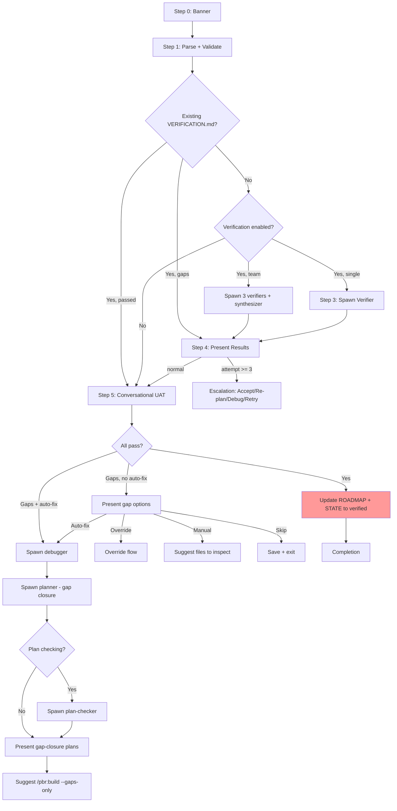

# Audit: /pbr:review

## Skill Overview
- Lines: 688 | CRITICAL markers: 0 | STOP markers: 1 (line 8)
- Agents spawned: pbr:verifier (Step 3), pbr:debugger (Step 6a), pbr:planner (Step 6b), pbr:plan-checker (Step 6c), pbr:synthesizer (team mode)
- Hook coverage: validate-task.js (checkReviewPlannerGate, checkReviewVerifierGate), check-subagent-output.js (verifier output check)

## Workflow Step Analysis
| Step | Description | Enforcement | Skip Risk | Hook Coverage |
|------|-------------|-------------|-----------|---------------|
| 0 | Display banner | None | Low | None |
| 1 | Parse and validate | None | Low | None |
| 1.6 | Delete .auto-verify signal | None | Medium | None |
| 2 | Check existing VERIFICATION.md | None | Low | None |
| 3 | Automated verification (verifier) | None | Low | checkReviewVerifierGate, check-subagent-output.js |
| 3-team | Team review (3 verifiers + synthesizer) | None | Medium | checkReviewVerifierGate |
| 4 | Present verification results | None | Low | None |
| 4-escalation | Escalation (attempt >= 3) | None | Low | None |
| 5 | Conversational UAT | None | Medium | None |
| 5.0 | Filter ineligible plans | None | Medium | None |
| 6-pass | Update ROADMAP + STATE (all pass) | None | **HIGH** | check-roadmap-sync.js, check-state-sync.js |
| 6-auto-fix-a | Spawn debugger | None | Low | check-subagent-output.js (debugger) |
| 6-auto-fix-b | Spawn planner (gap closure) | None | Low | checkReviewPlannerGate |
| 6-auto-fix-c | Spawn plan-checker | None | Low | check-subagent-output.js (plan-checker) |
| 6-gaps | Present gap options | None | Low | None |
| 6-override | Override flow | None | Medium | None |
| UAT-record | Append UAT to VERIFICATION.md | None | **HIGH** | None |

## Enforcement Gaps

1. **Zero CRITICAL markers.** Like build, this skill has no CRITICAL markers despite performing multiple state updates and spawning 3-4 different agent types.
   - **Fix**: Add CRITICAL markers to Step 6 ROADMAP.md update, STATE.md update, and UAT result recording.

2. **No .active-skill registration.** The review skill never writes `.planning/.active-skill` with `review`. The validate-task.js gates `checkReviewPlannerGate` and `checkReviewVerifierGate` both check for `activeSkill === 'review'`, so they are silently disabled without this file.
   - **Fix**: Write `.planning/.active-skill` with `review` at start of Step 1.

3. **UAT result recording (after Step 5) has no hook coverage.** The skill says to append UAT results to VERIFICATION.md, but if skipped, the verification report lacks user acceptance data. No hook validates that UAT results were recorded.
   - **Fix**: Add a post-completion check or CRITICAL marker for UAT recording.

4. **Override flow (Step 6 "Override") modifies VERIFICATION.md frontmatter with no validation.** Adding `overrides` entries to the YAML frontmatter is delicate -- malformed YAML could corrupt the file. No hook validates VERIFICATION.md frontmatter integrity after override writes.
   - **Fix**: Add frontmatter validation in check-plan-format.js for VERIFICATION.md writes.

5. **Team mode spawns 3 verifiers but checkReviewVerifierGate only validates SUMMARY.md existence once.** The gate doesn't distinguish between single-verifier and team-verifier flows. If one team verifier fails, the gate still passes as long as SUMMARY.md exists from a previous build.
   - **Fix**: Team mode should validate all 3 team output files before spawning synthesizer.

6. **Step 6 "Accept gaps" path updates ROADMAP to `verified*` but no hook validates this non-standard status.** check-roadmap-sync.js may not recognize `verified*` as a valid status value.
   - **Fix**: Verify that roadmap sync hooks accept `verified*` and `complete-with-gaps` statuses.

7. **Auto-advance at Step 6.5 chains to plan without clearing context.** Line 358: `Skill({ skill: "pbr:plan", args: "{N+1}" })` chains directly. The review skill's context (all verification data, UAT responses) remains in the window, reducing available context for planning.
   - **Fix**: The skill already suggests `/clear` in the manual path. Auto-advance should at minimum note the context pressure.

## User-Facing Workflow Gaps

1. **Conversational UAT (Step 5) has no progress indicator.** For phases with many plans and must-haves, the user has no idea how far through the walkthrough they are.
   - **Fix**: Display "Plan {X}/{Y}, Must-have {A}/{B}" progress counter.

2. **No way to pause UAT and resume later.** If the user needs to stop mid-UAT, all progress is lost. The skill has no checkpoint mechanism for UAT.
   - **Fix**: Write partial UAT results to VERIFICATION.md after each plan, not just at the end.

3. **Escalation path "Debug" just suggests a command.** Line 235: "Suggest `/pbr:debug` with the gap details as starting context." But the gap details are in the review skill's context -- switching to debug would lose them unless explicitly passed.
   - **Fix**: Write gap details to a file (e.g., `.planning/debug/review-gaps.md`) before suggesting debug.

4. **"Accept gaps" + "Accept all" path has no reversibility.** Once gaps are accepted and STATE.md updated to `complete-with-gaps`, there's no command to undo the acceptance.
   - **Fix**: Document that re-running `/pbr:review` will re-verify. Consider adding an "un-accept" flow.

## Agent Instruction Gaps

1. **Verifier prompt template uses `{For each PLAN.md...}` and `{For each SUMMARY.md...}` placeholders.** The orchestrator must iterate over all files and construct manifest tables. If any plan is missed in the manifest, the verifier won't check its must-haves.
   - **Fix**: Use `pbr-tools.js plan-index` to generate the complete list, reducing manual error.

2. **Debugger in auto-fix flow receives "inline the VERIFICATION.md content" instruction (line 383).** But the note says "provide file path; debugger reads via Read tool." This is contradictory -- the placeholder says inline but the note says provide path.
   - **Fix**: Resolve the contradiction. Path-based is more context-efficient.

3. **Gap planner receives existing PLAN files as context.** For large phases with many plans, inlining all existing PLANs could exhaust the planner's context window. No budget check is mentioned.
   - **Fix**: Use manifest table (paths + frontmatter only) instead of inlined content.

## Mermaid Workflow Flowchart

## Priority Fixes
- [ ] P1: Write `.planning/.active-skill` with `review` at Step 1 (enables all validate-task.js gates)
- [ ] P1: Add CRITICAL markers to Step 6 ROADMAP.md and STATE.md updates
- [ ] P2: Add CRITICAL marker to UAT result recording
- [ ] P2: Validate `verified*` and `complete-with-gaps` statuses in roadmap sync hooks
- [ ] P2: Resolve debugger prompt contradiction (inline vs. path)
- [ ] P3: Add UAT progress indicator
- [ ] P3: Write partial UAT results incrementally
- [ ] P3: Write gap details to file before suggesting /pbr:debug
