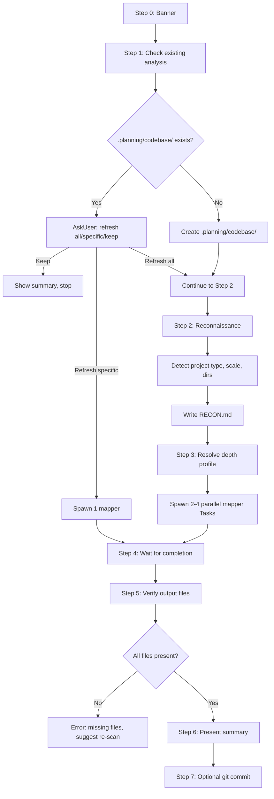

# Audit: /pbr:scan

## Skill Overview
- Lines: 305 | CRITICAL markers: 0 | STOP markers: 1 (line 8, do-not-read)
- Agents spawned: 2-4x `pbr:codebase-mapper` (parallel Tasks, count depends on depth profile)
- Hook coverage:
  - `check-skill-workflow.js` line 129: registered as read-only skill -- blocks writes outside `.planning/`
  - `check-subagent-output.js`: **No scan-specific validation** -- only checks `pbr:debugger`, `pbr:executor`, `pbr:verifier`, `pbr:planner` output. Codebase-mapper output is not validated.
  - `validate-task.js`: `codebase-mapper` listed as a valid agent

## Workflow Step Analysis

| Step | Description | Enforcement | Skip Risk | Hook Coverage |
|------|-------------|-------------|-----------|---------------|
| 0 | Display banner | None | Low | None |
| 1 | Check for existing analysis | None | Low | None |
| 1a | If exists: AskUser (refresh all/specific/keep) | None | Low -- user interaction | None |
| 1b | If not exists: create `.planning/codebase/` | None | **HIGH** -- directory creation | check-skill-workflow.js (write scope) |
| 2 | Initial reconnaissance (detect project type, scale, dirs) | None | Medium | None |
| 2a | Write RECON.md | None | Medium | None |
| 3 | Resolve depth profile via pbr-tools | None | Medium -- config failure possible | None |
| 3a | Spawn 2-4 parallel codebase-mapper Tasks | None | Medium | validate-task.js |
| 4 | Wait for agents to complete | None | Low -- automatic | None |
| 5 | Verify output files exist | None | Low -- explicit check | **None** -- this is manual prompt-based, not hook-enforced |
| 6 | Present summary | None | Low | None |
| 7 | Git integration (optional commit) | None | Low | None |

## Enforcement Gaps

1. **No CRITICAL marker on directory creation (Step 1b, lines 77-78)**: Creating `.planning/` and `.planning/codebase/` is the prerequisite for all subsequent writes. If skipped, all mapper agents fail.
   - **Fix**: Add `**CRITICAL**` marker before Step 1b directory creation.

2. **No hook validates codebase-mapper output**: `check-subagent-output.js` has validation for debugger, executor, verifier, and planner agents, but NOT codebase-mapper. If a mapper agent fails silently, the only check is the prompt-based Step 5 verification.
   - **Fix**: Add codebase-mapper to `check-subagent-output.js` with expected file patterns per focus area.

3. **No CRITICAL marker on RECON.md write (Step 2)**: RECON.md is input for all mapper agents. If the orchestrator skips it, agents lack baseline context.
   - **Fix**: Add `**CRITICAL**` marker before the RECON.md write instruction.

4. **No CRITICAL marker on spawning ALL mappers in parallel (Step 3a)**: The skill says "All should be spawned in a single response for maximum parallelism" (line 120) but has no enforcement. The LLM could spawn them sequentially, wasting context and time.
   - **Fix**: Add `**CRITICAL**` marker: "Spawn ALL mapper Tasks in a SINGLE response. Do NOT spawn one, wait, then spawn the next."

5. **Depth profile resolution happens twice in some flows**: Step 1a resolves depth (line 56) and Step 3 resolves it again (line 98). The skill notes "Skip re-resolving depth in Step 3 since it was already resolved here" (line 73) but this instruction is buried and easy to miss, causing a wasted Bash call.
   - **Fix**: Add a visible note at Step 3: "SKIP if already resolved in Step 1."

6. **Step 5 verification is prompt-only**: The skill lists expected files and error handling for missing files (lines 150-176), but this check depends entirely on the LLM executing it. No hook enforces post-completion verification.
   - **Fix**: Add a PostToolUse hook or extend `check-subagent-output.js` to check for expected mapper output files after each codebase-mapper Task completes.

7. **Monorepo detection (line 256-259) has no enforcement**: The edge case handling for monorepos depends on the LLM noticing multiple package.json files. If missed, the scan produces incorrect architecture analysis.
   - **Fix**: Low priority -- edge case detection is inherently heuristic. Could add to RECON.md as a required field: "Monorepo: yes/no".

## User-Facing Workflow Gaps

1. **No incremental progress during mapper execution**: The user sees "Spawning N mappers..." and then nothing until all complete. With 4 parallel agents, this could take several minutes.
   - **Fix**: The skill already has per-agent completion messages (Step 4, lines 138-146). The issue is that parallel Tasks complete together in practice. Consider adding estimated time.

2. **"Refresh specific area" doesn't show what's outdated**: When existing analysis exists (Step 1a), the user sees file modification dates but has no way to know WHICH areas are outdated without reading each file.
   - **Fix**: Show a brief status per area: "STACK.md (3 days old), CONCERNS.md (30 days old -- may be stale)".

3. **Concerns section display logic is complex and fragile (lines 199-208)**: Three conditions must ALL be true to show concerns. If any condition fails silently, the user gets no concerns even when they exist. The logic is spread across 4 lines of prose.
   - **Fix**: Simplify: just check if CONCERNS.md exists and has content. The mapper_areas check is redundant -- if concerns mapper wasn't spawned, CONCERNS.md won't exist.

4. **Git commit in scan uses `git add .planning/codebase/` (line 238)**: This stages ALL files in the directory, potentially including stale files from prior scans that weren't refreshed. Violates the universal anti-pattern "Do not use git add ." (though this is directory-scoped, not repo-wide).
   - **Fix**: Stage only the files created/updated in this scan session. Track which files were written.

## Agent Instruction Gaps

1. **Codebase-mapper receives RECON.md contents in prompt**: The mapper-prompt template includes `{recon_data}` (line 126), inlining RECON.md into the Task prompt. For large projects, RECON.md could be substantial, wasting mapper context. The universal anti-pattern says "Never inline large files into Task() prompts" (anti-pattern #2).
   - **Fix**: If RECON.md exceeds ~500 tokens, tell the mapper to read it from disk instead of inlining.

2. **Mapper has no explicit timeout or context budget signal**: The codebase-mapper agent says "Stop before 50% context usage" (line 91) but has no mechanism to signal when it's approaching the limit. For very large codebases, a mapper could silently truncate its analysis.
   - **Fix**: Add an instruction to write a `STATUS: partial` frontmatter field if analysis was truncated due to context limits.

3. **Mapper template reference is duplicated**: The skill references `skills/scan/templates/mapper-prompt.md.tmpl` (line 93, 122) which contains a "Reconnaissance Detection Reference" section. The RECON step (Step 2) should use this, but it's also supposed to be the mapper's input. The dual-use is confusing.
   - **Fix**: Split: RECON detection checklist should be a separate reference, not embedded in the mapper prompt template.

## Mermaid Workflow Flowchart

## Priority Fixes
- [ ] P1: Add CRITICAL markers on directory creation (Step 1b) and RECON.md write (Step 2)
- [ ] P1: Add codebase-mapper output validation to `check-subagent-output.js`
- [ ] P2: Add CRITICAL marker on parallel spawn requirement (Step 3a)
- [ ] P2: Add `STATUS: partial` frontmatter field for truncated mapper analysis
- [ ] P2: Avoid inlining large RECON.md -- tell mappers to read from disk
- [ ] P3: Track files written per session for precise git staging
- [ ] P3: Show per-area staleness in refresh prompt
