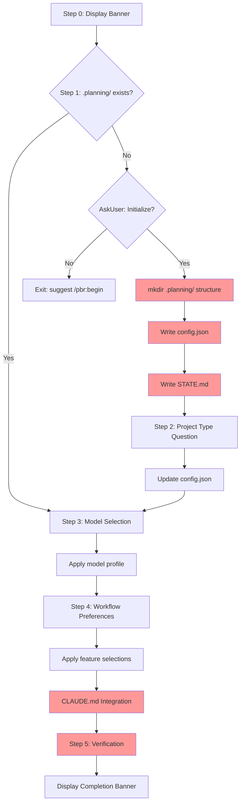

# Audit: /pbr:setup

## Skill Overview
- Lines: 276 | CRITICAL markers: 0 | STOP markers: 1 (boilerplate only)
- Agents spawned: none (inline skill)
- Hook coverage: progress-tracker.js (SessionStart injects state), check-state-sync.js (would fire on STATE.md write but setup writes it fresh, not as a SUMMARY/VERIFICATION trigger)

## Workflow Step Analysis

| Step | Description | Enforcement | Skip Risk | Hook Coverage |
|------|-------------|-------------|-----------|---------------|
| 0 | Display banner | None | Low | None |
| 1 | Detect project state, check `.planning/` | None | Low | None |
| 1a | If no `.planning/`: AskUserQuestion to initialize | None | Low (user interaction) | None |
| 1b | Create `.planning/` structure via `mkdir -p` | **None** | **Medium** | **None** |
| 1c | Create `config.json` with defaults | **None** | **Medium** | **None** |
| 1d | Create `STATE.md` with defaults | **None** | **Medium** | **None** |
| 2 | Project type question (new projects only) | None | Low (user interaction) | None |
| 2b | Update config.json based on project type | **None** | **Medium** | **None** |
| 3 | Model selection question | None | Low (user interaction) | None |
| 3b | Apply model profile to config.json | **None** | **Medium** | **None** |
| 4 | Workflow preferences question | None | Low (user interaction) | None |
| 4b | Apply feature selections to config.json | **None** | **Medium** | **None** |
| 4c | CLAUDE.md integration (append/create) | **None** | **High** | **None** |
| 5 | Verification (health check) | None | **High** | **None** |

## Enforcement Gaps

1. **No CRITICAL markers on directory/file creation (Steps 1b-1d).** The `mkdir -p` and file writes are the core purpose of this skill, yet there is nothing to prevent the LLM from skipping them and jumping to the user questions. Under cognitive load, the LLM may answer questions and display the completion banner without ever creating the files. **Fix:** Add `CRITICAL` markers before Steps 1b, 1c, and 1d.

2. **No hook validates setup output.** Unlike `/pbr:quick` and `/pbr:build` which have `check-subagent-output.js` validating artifacts, there is no PostToolUse or Stop hook that checks whether `.planning/config.json` and `.planning/STATE.md` were actually created after setup completes. **Fix:** Add a setup-specific check in `check-subagent-output.js` or a dedicated post-setup validator.

3. **Step 4b (CLAUDE.md integration) has high skip risk.** It's buried after multiple user interaction steps and involves conditional logic (check if CLAUDE.md exists, check if section already present, append vs create). This is a classic skip-under-load pattern. **Fix:** Add CRITICAL marker. Consider moving it earlier in the flow.

4. **Step 5 verification is vague and skippable.** "Run a quick health check" with 4 sub-items but no enforcement. The LLM will often skip verification and go straight to the completion banner. **Fix:** Add CRITICAL marker and make it explicit: "You MUST run these 4 checks before displaying the completion banner."

5. **Config.json is written multiple times.** Steps 1c, 2b, 3b, 4b all modify config.json incrementally. If the LLM skips intermediate steps, config will have stale defaults. No hook validates config completeness after setup. **Fix:** Consider a final config write that merges all selections, or add a post-setup config validation step.

## User-Facing Workflow Gaps

1. **No recovery if setup partially completes.** If the LLM creates `.planning/` but crashes before writing config.json, re-running `/pbr:setup` will detect the existing directory and skip to Step 3 (model selection). The user will have no config.json and no STATE.md. **Fix:** Step 1 "existing project" path should validate that config.json and STATE.md exist, not just `.planning/`.

2. **No idempotency guarantee.** Running `/pbr:setup` twice on a new project could create duplicate CLAUDE.md sections. Step 4b checks for existing "Plan-Build-Run" section but the check is prompt-level only -- no structural enforcement. **Fix:** Add explicit idempotency check.

3. **Step 5 health check suggests running `node ${CLAUDE_PLUGIN_ROOT}/scripts/progress-tracker.js` but this is a SessionStart hook, not a standalone health check tool.** This would produce confusing output if run directly. **Fix:** Suggest `pbr-tools.js state load` instead, or `/pbr:health`.

4. **No `.gitignore` guidance.** Setup does not mention whether `.planning/` should be gitignored. Users may accidentally commit large planning artifacts. **Fix:** Add a step or note about `.gitignore` configuration.

## Agent Instruction Gaps

N/A -- this skill does not spawn agents.

## Mermaid Workflow Flowchart

## Priority Fixes
- [ ] P1: Add CRITICAL markers to Steps 1b, 1c, 1d (directory and file creation)
- [ ] P1: Fix Step 1 existing-project detection to validate config.json + STATE.md exist, not just `.planning/`
- [ ] P2: Add CRITICAL marker to Step 4b (CLAUDE.md integration)
- [ ] P2: Add CRITICAL marker to Step 5 (verification) with explicit "MUST run before completion banner"
- [ ] P3: Add post-setup hook validation (check config.json + STATE.md exist)
- [ ] P3: Fix Step 5 health check command (progress-tracker.js is not a standalone tool)
- [ ] P3: Add `.gitignore` guidance step
