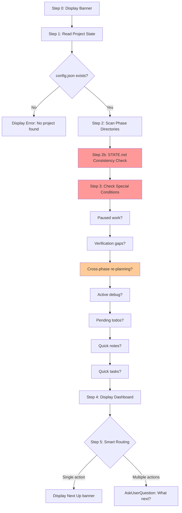

# Audit: /pbr:status

## Skill Overview
- Lines: 370 | CRITICAL markers: 0 | STOP markers: 1 (boilerplate only)
- Agents spawned: none (inline, read-only skill)
- Hook coverage: None directly. progress-tracker.js (SessionStart) provides initial state context but does not validate status skill behavior.

## Workflow Step Analysis

| Step | Description | Enforcement | Skip Risk | Hook Coverage |
|------|-------------|-------------|-----------|---------------|
| 0 | Display banner | None | Low | None |
| 1 | Read project state (STATE.md, config.json, ROADMAP.md, PROJECT.md, REQUIREMENTS.md) | None | Low (core purpose) | None |
| 2 | Scan phase directories for artifacts | None | Medium | None |
| 2b | Check STATE.md size and consistency | None | **High** | check-state-sync.js (partial -- only fires on SUMMARY/VERIFICATION writes, not on reads) |
| 3 | Check special conditions (paused work, gaps, cross-phase re-planning, debug, todos, notes, quick tasks) | None | **High** | None |
| 4 | Display status dashboard | None | Low (primary output) | None |
| 5 | Smart routing (suggest next action) | None | Medium | None |

## Enforcement Gaps

1. **Step 2b consistency check has no enforcement.** The discrepancy check between STATE.md and filesystem is entirely prompt-driven. Under cognitive load, the LLM will skip the cross-validation and just display whatever STATE.md says. This defeats the purpose of the check -- the user gets misleading status. **Fix:** Add CRITICAL marker: "You MUST compare STATE.md claims against filesystem reality before displaying the dashboard."

2. **Step 3 special conditions are an exhaustive checklist with high skip risk.** Seven sub-checks (paused work, verification gaps, cross-phase re-planning, debug sessions, pending todos, quick notes, quick tasks) are listed sequentially. The LLM routinely drops later items in long checklists. **Fix:** Add CRITICAL marker to Step 3. Consider restructuring as a numbered checklist with explicit "check ALL 7 conditions" instruction.

3. **Cross-phase re-planning check (Step 3) includes dependency fingerprint checking** -- a complex operation that requires reading plan frontmatter and comparing against SUMMARY.md files. This is the most likely sub-step to be skipped entirely. **Fix:** Either simplify this check or make it a separate CRITICAL sub-step.

4. **No hook catches incorrect status output.** Since status is read-only, there is no PostToolUse trigger. If the LLM produces an incorrect dashboard (wrong progress, missing warnings), nothing catches it. This is acceptable for a display-only skill but worth noting.

5. **The `pbr-tools.js state load` and `state check-progress` tooling shortcuts in Step 1 are "falls back gracefully" -- but there is no CRITICAL enforcement to actually use them.** The LLM may ignore the tooling shortcut and manually parse files, wasting context. **Fix:** Make the tooling shortcut the primary path with a CRITICAL marker.

## User-Facing Workflow Gaps

1. **Stale STATE.md gives wrong "Next Up" suggestion.** If STATE.md says "Phase 2, Building" but filesystem shows all plans complete, the smart routing (Step 5) will suggest `/pbr:build 2` instead of `/pbr:review 2`. The consistency check in Step 2b should catch this, but since it has no enforcement, users may get wrong routing.

2. **Decision tree (Step 5) has no fallback for ambiguous states.** If the project is in a state not covered by the 8-item decision tree (e.g., milestone audit exists but has mixed results), the LLM must improvise. **Fix:** Add a catch-all at the end: "If none of the above match, suggest `/pbr:health` for diagnostics."

3. **Large project handling (8+ phases) is a suggestion, not a requirement.** The instruction to "consider grouping" completed phases is too weak -- the LLM will display all phases in full detail, creating a wall of text. **Fix:** Make it a CRITICAL instruction: "If more than 8 phases, you MUST collapse completed phases."

4. **The skill says "DO NOT run any Bash commands" in Anti-Patterns but Step 1 suggests `node ${CLAUDE_PLUGIN_ROOT}/scripts/pbr-tools.js state load` which IS a Bash command.** This is contradictory. **Fix:** Clarify that the pbr-tools.js call is an exception, or remove it from the anti-patterns.

## Agent Instruction Gaps

N/A -- this skill does not spawn agents.

## Mermaid Workflow Flowchart

## Priority Fixes
- [ ] P1: Add CRITICAL marker to Step 2b (STATE.md consistency check) -- core correctness requirement
- [ ] P2: Add CRITICAL marker to Step 3 with explicit "check ALL 7 conditions"
- [ ] P2: Resolve Bash anti-pattern contradiction with pbr-tools.js usage in Step 1
- [ ] P2: Make large project collapsing (8+ phases) a CRITICAL requirement, not a suggestion
- [ ] P3: Add decision tree fallback for ambiguous states
- [ ] P3: Enforce pbr-tools.js as primary parsing path to save context
