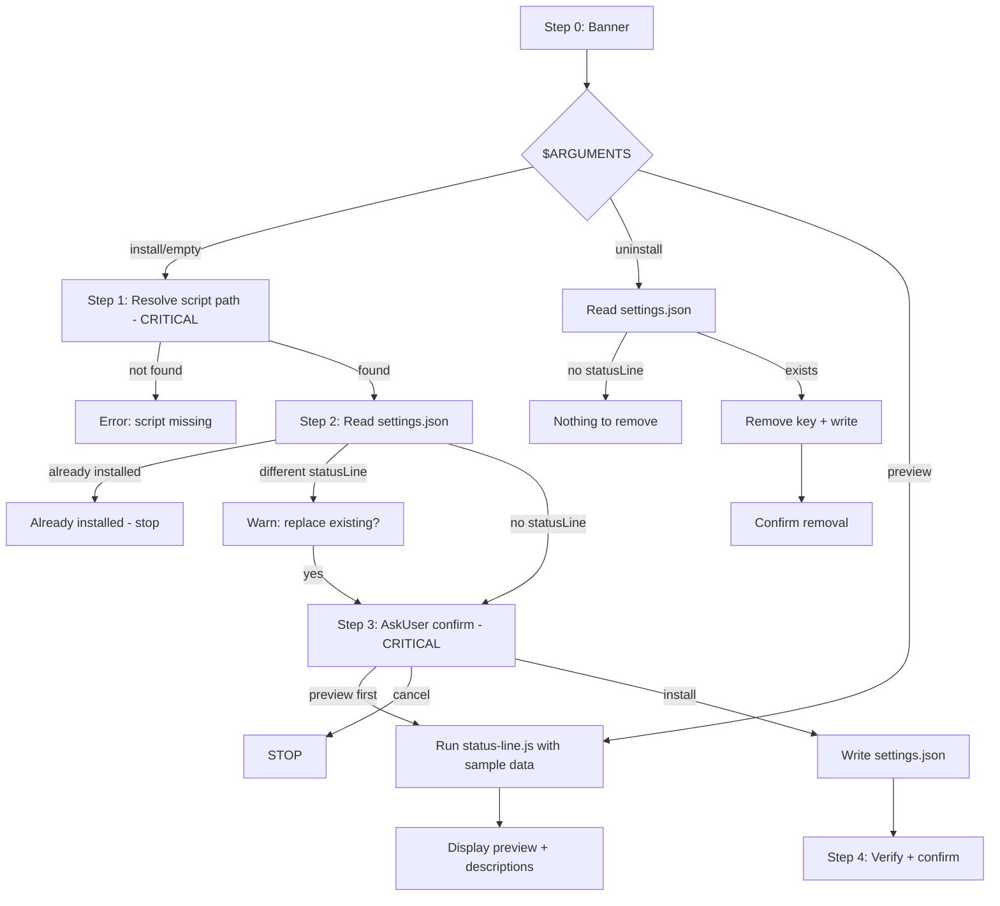

# Audit: /pbr:statusline

## Skill Overview
- Lines: 148 | CRITICAL markers: 2 (line 44: path resolution, line 79: JSON editing) | STOP markers: 1 (line 8, anti-re-read)
- Agents spawned: None
- Hook coverage: None — no hooks target this skill. Writes to `~/.claude/settings.json` (outside `.planning/`) so post-write-dispatch.js doesn't apply.
- Allowed tools: Read, Write, Bash, AskUserQuestion

## Workflow Step Analysis

### install subcommand
| Step | Description | Enforcement | Skip Risk | Hook Coverage |
|------|-------------|-------------|-----------|---------------|
| 0 | Display banner | None | Low | None |
| 1 | Resolve script path | CRITICAL (line 44) | Low — CRITICAL marker + verify step | None |
| 2 | Read current settings.json | None | Low | None |
| 3 | AskUser confirmation + write settings.json | CRITICAL (line 79, JSON editing) | Low — user gate + CRITICAL | None |
| 4 | Verify and confirm | None | Low | None |

### uninstall subcommand
| Step | Description | Enforcement | Skip Risk | Hook Coverage |
|------|-------------|-------------|-----------|---------------|
| 1 | Read settings.json | None | Low | None |
| 2 | Remove statusLine key | None | Low | None |
| 3 | Write + confirm | None | Low | None |

### preview subcommand
| Step | Description | Enforcement | Skip Risk | Hook Coverage |
|------|-------------|-------------|-----------|---------------|
| 1 | Run status-line.js with sample stdin | None | Low | None |
| 2 | Display output + section descriptions | None | Low | None |

## Enforcement Gaps

1. **settings.json corruption risk — no backup.** Step 3 reads, modifies, and writes `~/.claude/settings.json`. If the write fails midway or the LLM produces invalid JSON, the user's entire Claude Code settings are corrupted. No backup is taken.
   - **Fix (P1):** Add: "Before writing, copy settings.json to settings.json.bak. If write fails, restore from backup."

2. **No validation that written JSON is valid.** The CRITICAL marker on line 79 says "Use Read + Write, not sed" but doesn't enforce that the written JSON is parseable. The LLM could produce malformed JSON.
   - **Fix:** Add post-write verification: "After writing settings.json, read it back and JSON.parse() it. If parse fails, restore from backup and display error."

3. **No hook protects ~/.claude/settings.json writes.** All PBR hooks only monitor `.planning/` directory writes. A bug in this skill could silently corrupt settings.
   - **Fix (P2):** This is inherent to the design — hooks can only monitor tool calls, not validate external file writes. The backup approach (Gap #1) is the correct mitigation.

4. **Uninstall doesn't verify the status line is PBR's.** Step 1 of uninstall checks for `statusLine` key existence but doesn't verify it's the PBR status line. If another tool installed a status line, `/pbr:statusline uninstall` silently removes it.
   - **Fix (P3):** Before removing, check if the command contains `status-line.js` or `plan-build-run`. If not, warn: "The current status line was not installed by PBR. Remove anyway?"

## User-Facing Workflow Gaps

1. **Windows path handling.** Line 90 says "Use forward slashes even on Windows" but status-line.js uses `path.join()` which produces backslashes on Windows. The `node "SCRIPT_PATH"` command in settings.json may fail if backslashes aren't properly escaped in JSON.
   - **Fix:** Explicitly normalize: "Replace all backslashes with forward slashes in SCRIPT_PATH before writing to JSON."

2. **Preview doesn't use actual project state.** The preview (line 127) pipes hardcoded sample JSON, not actual project state. The user sees a generic preview, not what their status line will actually look like.
   - **Fix (P3):** Read `.planning/STATE.md` if it exists and use real values in the preview.

3. **No version/path awareness for plugin updates.** If the user installs the status line from a cached plugin at version X, then updates to version Y, the settings.json still points to the old path (`~/.claude/plugins/cache/.../X/scripts/...`). The status line breaks after update.
   - **Fix (P2):** Document this limitation. Or use a path that doesn't include the version number (symlink or wrapper script).

## Agent Instruction Gaps

N/A — no agents spawned.

## Mermaid Workflow Flowchart

## Priority Fixes
- [ ] P1: Add settings.json backup before write + restore on failure
- [ ] P1: Add post-write JSON validation (read-back and parse)
- [ ] P2: Normalize Windows paths to forward slashes before JSON write
- [ ] P2: Document or mitigate plugin version path breakage on updates
- [ ] P3: Verify status line ownership before uninstall
- [ ] P3: Use real project state in preview
