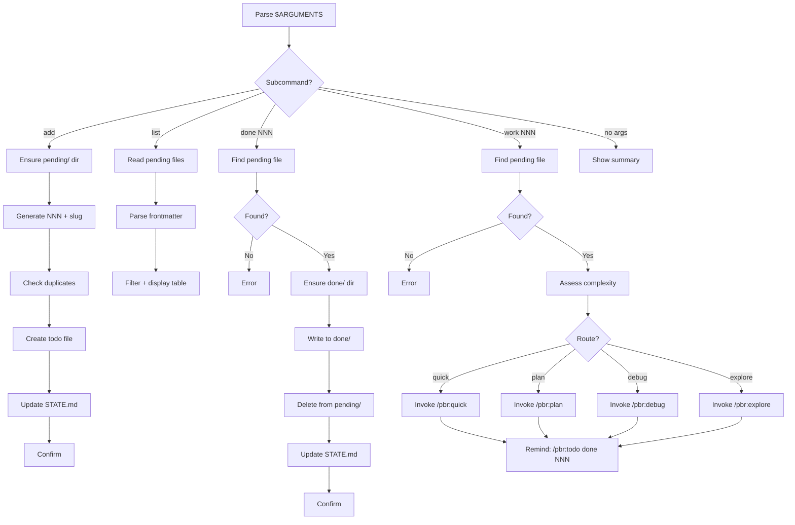

# Audit: /pbr:todo

## Skill Overview
- Lines: 261 | CRITICAL markers: 0 | STOP markers: 1 (line 8, do-not-read)
- Agents spawned: None directly (but `work` subcommand invokes other skills via Skill tool)
- Hook coverage: **None** -- todo is not listed in `check-skill-workflow.js` switch statement. No hooks validate todo-specific behavior.

## Workflow Step Analysis

### Subcommand: add
| Step | Description | Enforcement | Skip Risk | Hook Coverage |
|------|-------------|-------------|-----------|---------------|
| 1 | Ensure `.planning/todos/pending/` exists | None | **HIGH** -- directory creation | None |
| 2 | Generate NNN (scan both pending+done) | None | Medium -- could miscount | None |
| 3 | Generate slug | None | Low | None |
| 4 | Infer theme | None | Low | None |
| 5 | Check for duplicates via AskUserQuestion | None | Medium -- LLM may skip duplicate check | None |
| 6 | Create todo file | None | **HIGH** -- file creation is core action | None |
| 7 | Update STATE.md Pending Todos section | None | **HIGH** -- state sync | check-state-sync.js (indirect) |
| 8 | Confirm with branded output | None | Low | None |

### Subcommand: list
| Step | Description | Enforcement | Skip Risk | Hook Coverage |
|------|-------------|-------------|-----------|---------------|
| 1 | Read all pending files | None | Low | None |
| 2 | Parse frontmatter | None | Low | None |
| 3 | Filter by theme | None | Low | None |
| 4 | Display table | None | Low | None |
| 5 | Offer actions | None | Low | None |

### Subcommand: done
| Step | Description | Enforcement | Skip Risk | Hook Coverage |
|------|-------------|-------------|-----------|---------------|
| 1 | Find pending file by NNN | None | Low | None |
| 2 | If not found, show error | None | Low | None |
| 3 | Ensure `.planning/todos/done/` exists | None | **HIGH** -- directory creation | None |
| 4 | Read pending file | None | Low | None |
| 5 | Update frontmatter (status: done, completed date) | None | Medium | None |
| 6 | Write to done/ | None | Medium | None |
| 7 | Delete original from pending/ via Bash rm | None | **HIGH** -- destructive action | None |
| 8 | Update STATE.md | None | Medium | check-state-sync.js (indirect) |
| 9 | Confirm | None | Low | None |

### Subcommand: work
| Step | Description | Enforcement | Skip Risk | Hook Coverage |
|------|-------------|-------------|-----------|---------------|
| 1 | Find pending file by NNN | None | Low | None |
| 2 | If not found, error | None | Low | None |
| 3 | Read todo content | None | Low | None |
| 4 | Extract title and body | None | Low | None |
| 5 | Assess complexity and choose skill | None | Medium -- routing decision | None |
| 6 | Display branded output | None | Low | None |
| 7 | Invoke chosen skill via Skill tool | None | Medium | Delegated skill's hooks apply |
| 8 | Remind user to mark done | None | Medium -- easily skipped | None |

## Enforcement Gaps

1. **Zero CRITICAL markers in the entire skill**: The todo skill has no enforcement markers at all. Every step relies purely on the LLM following instructions. This is the highest-risk skill in this audit set.
   - **Fix**: Add CRITICAL markers on: `add` Step 1 (dir creation), `add` Step 6 (file creation), `done` Step 3 (dir creation), `done` Step 7 (file deletion).

2. **No `.active-skill` registration**: Not in `check-skill-workflow.js`, so no write constraints. The todo skill writes to `.planning/todos/` and STATE.md, but could theoretically write anywhere.
   - **Fix**: Add `'todo'` to the switch in `check-skill-workflow.js` with a custom rule that only allows writes to `.planning/todos/` and `.planning/STATE.md`.

3. **`done` deletes files via Bash `rm` with no safety net**: Step 7 uses Bash to delete the pending file. If the write to `done/` (Step 6) fails silently, the todo is lost. No transactional guarantee.
   - **Fix**: Add CRITICAL marker requiring verification that the done/ write succeeded BEFORE deleting from pending/. Consider using an ordering constraint: "HARD STOP -- verify done file exists before deleting pending file."

4. **`work` routing has no validation**: The complexity assessment (Step 5) is entirely LLM judgment with no hook to validate the routing decision. An incorrect route (e.g., routing a complex task to `/pbr:quick`) wastes a full context window.
   - **Fix**: This is inherently hard to hook-enforce, but the skill could add a CRITICAL marker requiring user confirmation of the routing choice before invoking.

5. **STATE.md update (Steps 7/8) has no ordering guarantee**: The STATE.md update in `add` and `done` is listed last but has no marker ensuring it runs. If the LLM stops after the confirmation message, STATE.md becomes stale.
   - **Fix**: Move STATE.md update before confirmation, or add CRITICAL marker.

## User-Facing Workflow Gaps

1. **`work` doesn't auto-close the todo**: After the delegated skill completes, the user must manually run `/pbr:todo done NNN`. If they forget, the todo stays pending forever despite being complete.
   - **Fix**: The `work` subcommand's Step 8 reminder is good, but consider adding a hook in `auto-continue.js` or `task-completed.js` that detects completed work and suggests closing.

2. **No `edit` subcommand**: Users cannot modify a todo's title, priority, or theme without manually editing the file. Common need when a todo's scope becomes clearer.
   - **Fix**: Consider adding an `edit <NNN>` subcommand.

3. **No priority management**: Todos default to P2 (line 46). There's no way to set priority on creation (`/pbr:todo add --p1 ...`) or change it later.
   - **Fix**: Support `--p1`/`--p2`/`--p3` flags in the `add` subcommand.

4. **`done` deletes pending file permanently**: If a todo is marked done by mistake, the user must manually recreate it. No undo mechanism.
   - **Fix**: The file moves to `done/` which serves as an archive, but the user is not informed they can recover from there.

## Agent Instruction Gaps

N/A -- this skill spawns no agents directly. The `work` subcommand delegates to other skills whose agents have their own instruction sets.

## Mermaid Workflow Flowchart

## Priority Fixes
- [ ] P1: Add CRITICAL markers on all directory creation steps and the delete-after-write sequence in `done`
- [ ] P1: Add ordering constraint in `done`: verify done/ file exists before deleting pending/ file
- [ ] P2: Register todo skill in `check-skill-workflow.js` to constrain write scope
- [ ] P2: Move STATE.md updates before confirmation output (or add CRITICAL markers)
- [ ] P3: Add user confirmation of routing choice in `work` subcommand
- [ ] P3: Inform user that `done/` serves as archive for recovery
